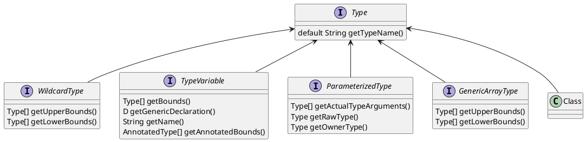

---

title: 7_java的type体系

date: 2018-09-14 12:53:00

categories: [语言,java,java基础]

tags: [java,todo]

---

Type接口是从JDK5开始引入的，将其引入主要是为了泛型。

<!--more-->

## 结构图

## 参数化泛型ParameterizedType

## TypeVariable

## 泛型数组GenericArrayType

## WildcardType

## Class

- Class为一个类
- Class对象: 正在JVM中运行的普通Java对象的类型和接口
- 当加载某个类时，JVM就会自动将这个类加载为 Class对象

