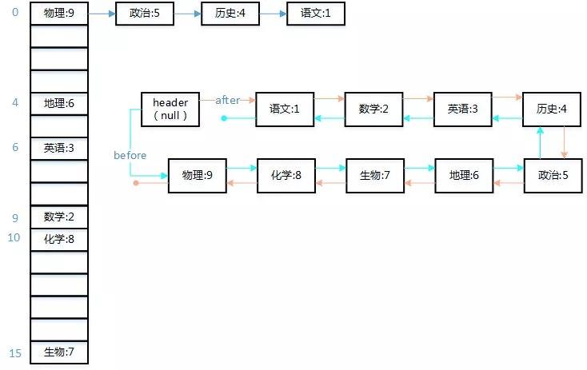

---

title: LinkedHashMap

date: 2016-03-19 22:27:07

categories: [集合]

tags: [集合,LinkedHashMap]

---


LinkedHashMap 也是一个HashMap,但是内部维持了一个双向链表，保存了记录的插入顺序。本文源代码参考值jdk1.8

<!--more-->

LinkedHashMap,见名知义，带链表的 HashMap, 所以LinkedHashMap是有序，LinkedHashMap作为HashMap的扩展，它改变了HashMap无序的特征。
它使用了一个双向的链表来会维护key-value对的次序，该链表维护了map的迭代顺序，该迭代顺序和key-value对的插入顺序保持一致。

## 数据结构



LinkedHashMap 改造了 `HashMap.Node<K,V>` ，添加了两个 `Entry<K,V>`，用于记录插入顺序，
`before` 和 `after`是构成双向链表的关键。

```java
    static class Entry<K,V> extends HashMap.Node<K,V> {
        Entry<K,V> before, after;
        Entry(int hash, K key, V value, Node<K,V> next) {
            super(hash, key, value, next);
        }
    }
```

## 重要参数

```java
/**
 * The head (eldest) of the doubly linked list.
 */
transient LinkedHashMap.Entry<K,V> head;

/**
 * The tail (youngest) of the doubly linked list.
 */
transient LinkedHashMap.Entry<K,V> tail;

/**
 * The iteration ordering method for this linked hash map: <tt>true</tt>
 * for access-order, <tt>false</tt> for insertion-order.
 *
 * @serial
 */
final boolean accessOrder;  //排序的规则，false按插入顺序排序，true访问顺序排序
```

## 重要方法

### 构造方法
LinkedHashMap的构造方法，都是通过调用父类的构造方法来实现，大部分accessOrder默认为false

> accessOrder: false按插入顺序排序，true访问顺序排序

```java
public LinkedHashMap(int initialCapacity, float loadFactor) {
    super(initialCapacity, loadFactor);
    accessOrder = false;
}
public LinkedHashMap(int initialCapacity) {
    super(initialCapacity);
    accessOrder = false;
}
public LinkedHashMap() {
    super();
    accessOrder = false;
}
public LinkedHashMap(Map<? extends K, ? extends V> m) {
    super(m);
    accessOrder = false;
}
public LinkedHashMap(int initialCapacity,
                         float loadFactor,
                         boolean accessOrder) {
    super(initialCapacity, loadFactor);
    this.accessOrder = accessOrder;
}
```

### put 方法

LinkedHashMap并没有重写任何put方法。但是其重写了与其相关的 newNode()、afterNodeAccess()、 afterNodeInsertion(). 

#### newNode()
在新建 `LinkedHashMap.Entry<K,V>` 之后，将新建的 Entry 连接到双向链表的最后。

```java
// 创建 LinkedHashMap.Entry<K,V>
Node<K,V> newNode(int hash, K key, V value, Node<K,V> e) {
    LinkedHashMap.Entry<K,V> p =
        new LinkedHashMap.Entry<K,V>(hash, key, value, e);
    linkNodeLast(p);
    return p;
}

// 将 Entry 连接到 双向链表最后
private void linkNodeLast(LinkedHashMap.Entry<K,V> p) {
    LinkedHashMap.Entry<K,V> last = tail;
    tail = p;
    if (last == null)
        head = p;
    else {
        p.before = last;
        last.after = p;
    }
}
```

#### afterNodeAccess()

在 `accessOrder`为 `true`的情况下:

> 在访问后，将访问的节点调整到双向链表的尾部

```java
    void afterNodeAccess(Node<K,V> e) { // move node to last
        LinkedHashMap.Entry<K,V> last;
        if (accessOrder && (last = tail) != e) {
            LinkedHashMap.Entry<K,V> p =
                (LinkedHashMap.Entry<K,V>)e, b = p.before, a = p.after;
            p.after = null;
            if (b == null)
                head = a;
            else
                b.after = a;
            if (a != null)
                a.before = b;
            else
                last = b;
            if (last == null)
                head = p;
            else {
                p.before = last;
                last.after = p;
            }
            tail = p;
            ++modCount;
        }
    }
```

#### afterNodeInsertion()

afterNodeInsertion方法是在哈希表中插入了一个新节点时调用的，它会把链表的头节点删除掉，删除的方式是通过调用HashMap的removeNode方法。

afterNodeInsertion方法一般是不生效的。但是如果需要用到 LRU 算法，则可以重写removeEldestEntry方法。LRU算法暂时没有研究。

```java
    void afterNodeInsertion(boolean evict) { // possibly remove eldest
        LinkedHashMap.Entry<K,V> first;
        if (evict && (first = head) != null && removeEldestEntry(first)) {
            K key = first.key;
            removeNode(hash(key), key, null, false, true);
        }
    }
    // 来自 hashMap，默认返回 false
    // 通常需要使用LruCache时，会重写该方法，在达到Cache的上限是返回true
    protected boolean removeEldestEntry(Map.Entry<K,V> eldest) {
        return false;
    }
```

### remove 方法
LinkedHashMap同样没有重写remove方法.仅仅重写了afterNodeRemoval()

#### afterNodeRemoval()
这个方法是当HashMap删除一个键值对时调用的，它会把在HashMap中删除的那个键值对一并从链表中删除，保证了哈希表和链表的一致性。

```java
    void afterNodeRemoval(Node<K,V> e) { // unlink
        LinkedHashMap.Entry<K,V> p =
            (LinkedHashMap.Entry<K,V>)e, b = p.before, a = p.after;
        p.before = p.after = null;
        if (b == null)
            head = a;
        else
            b.after = a;
        if (a == null)
            tail = b;
        else
            a.before = b;
    }
```

### get方法

获取对应的 value 时，若 `accessOrder`为 `true`，则执行afterNodeAccess方法

```java
    public V get(Object key) {
        Node<K,V> e;
        if ((e = getNode(hash(key), key)) == null)
            return null;
        if (accessOrder)
            afterNodeAccess(e);
        return e.value;
    }
```

### 遍历

重写 entrySet()

```java
public Set<Map.Entry<K,V>> entrySet() {
        Set<Map.Entry<K,V>> es;
        //返回LinkedEntrySet
        return (es = entrySet) == null ? (entrySet = new LinkedEntrySet()) : es;
    }
    final class LinkedEntrySet extends AbstractSet<Map.Entry<K,V>> {
        public final Iterator<Map.Entry<K,V>> iterator() {
            return new LinkedEntryIterator();
        }
}
```

```java
    final class LinkedEntryIterator extends LinkedHashIterator
        implements Iterator<Map.Entry<K,V>> {
        public final Map.Entry<K,V> next() { return nextNode(); }
    }

    abstract class LinkedHashIterator {
        //下一个节点
        LinkedHashMap.Entry<K,V> next;
        //当前节点
        LinkedHashMap.Entry<K,V> current;
        int expectedModCount;

        LinkedHashIterator() {
            //初始化时，next 为 LinkedHashMap内部维护的双向链表的扁头
            next = head;
            //记录当前modCount，以满足fail-fast
            expectedModCount = modCount;
            //当前节点为null
            current = null;
        }
        //判断是否还有next
        public final boolean hasNext() {
            //就是判断next是否为null，默认next是head  表头
            return next != null;
        }
        //nextNode() 就是迭代器里的next()方法 。
        //该方法的实现可以看出，迭代LinkedHashMap，就是从内部维护的双链表的表头开始循环输出。
        final LinkedHashMap.Entry<K,V> nextNode() {
            //记录要返回的e。
            LinkedHashMap.Entry<K,V> e = next;
            //判断fail-fast
            if (modCount != expectedModCount)
                throw new ConcurrentModificationException();
            //如果要返回的节点是null，异常
            if (e == null)
                throw new NoSuchElementException();
            //更新当前节点为e
            current = e;
            //更新下一个节点是e的后置节点
            next = e.after;
            //返回e
            return e;
        }
        //删除方法 最终还是调用了HashMap的removeNode方法
        public final void remove() {
            Node<K,V> p = current;
            if (p == null)
                throw new IllegalStateException();
            if (modCount != expectedModCount)
                throw new ConcurrentModificationException();
            current = null;
            K key = p.key;
            removeNode(hash(key), key, null, false, false);
            expectedModCount = modCount;
        }
    }
```

该方法的实现可以看出，迭代LinkedHashMap，就是从内部维护的双链表的表头开始循环输出

## 来源

https://blog.csdn.net/zxt0601/article/details/77429150