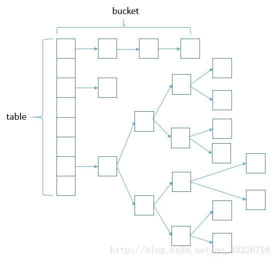

[TOC]

<!--more-->

## HashMap 数据结构


主体为table数组结构，数组的每一项元素是一个链表。

```java

```

## 关键点

基于map接口的非同步实现，不保证顺序，允许null key/value，默认大小16，按2倍扩增。

## put函数实现

1. 对key的hashCode()做hash，然后再计算index;
2. 如果没碰撞直接放到bucket里(table数组里)；
3. 如果碰撞了，以链表的形式插入在buckets中(数组中存储的是最后插入的元素)；
4. 如果碰撞导致链表过长(大于等于TREEIFY_THRESHOLD)，就把链表转换成红黑树；
5. 如果节点已经存在就替换old value(保证key的唯一性)
6. 如果bucket满了(超过load factor*current capacity)，就要resize。

## get函数实现

1. bucket里的第一个节点，直接命中；
2. 如果有冲突，则通过key.equals(k)去查找对应的entry。
	- 若为树，则在树中通过key.equals(k)查找，O(logn)；
	- 若为链表，则在链表中通过key.equals(k)查找，O(n)。

## index的计算

1. hash函数实现：高16bit不变，低16bit和高16bit做了一个异或
2. (n-1)&hash: n 表示table的大小，即是取hash的低（n-1）位作为index

## java8中解决冲突的改变

利用红黑树替换链表，将时间复杂度变为O(1)+O(logn)

## 面试题

1、hashmap中的键为自定义的类型。放入 HashMap 后，我们在外部把某一个 key 的属性进行更改，然后我们再用这个 key 从 HashMap 里取出元素，这时候 HashMap 会返回什么？

答：null


----

[Java HashMap工作原理及实现](http://yikun.github.io/2015/04/01/Java-HashMap%E5%B7%A5%E4%BD%9C%E5%8E%9F%E7%90%86%E5%8F%8A%E5%AE%9E%E7%8E%B0/)

