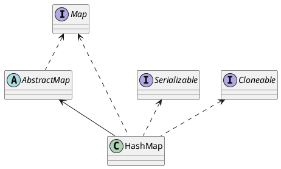
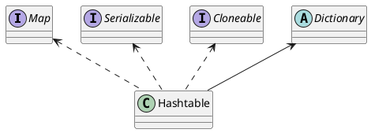

[TOC]

Hashtable 是java一开始发布时就提供的键值映射的数据结构，而HashMap产生于JDK1.2。
虽然Hashtable比HashMap出现的早一些，但是现在Hashtable基本上已经被弃用了。
另外，Hashtable没有遵循驼峰式命名。

<!--more-->

## 继承关系

## hashtable 结构

结构与 hashmap 一样：一个数组 + 链表。

## put方法

1. 判断value是否为空，为空则抛出异常；
2. 计算key的hash值，并根据hash值获得key在table数组中的位置index，如果table[index]元素不为空，则进行迭代，如果遇到相同的key，则直接替换，并返回旧value；
3. 否则，我们可以将其插入到table[index]位置。

## get方法

1. 通过hash()方法求得key的哈希值
2. 根据hash值得到index索引
3. 然后迭代链表，返回匹配的key的对应的value；
4. 如果找不到，则返回null。

## 与hashMap的区别

他们的主要区别体现在 线程安全性和性能上

1. HashMap 接受 key/value(null/null),而Hashtable不能接受
2. Hashtable 在主要方法上添加了 synchronized 注解，因此Hashtable是同步的。而HashMap不同步
3. 由于同步的原因，Hashtable 的性能比 HashMap 低

----

[Java集合学习3：Hashtable的实现原理](http://tracylihui.github.io/2015/07/01/Java%E9%9B%86%E5%90%88%E5%AD%A6%E4%B9%A03%EF%BC%9AHashtable%E7%9A%84%E5%AE%9E%E7%8E%B0%E5%8E%9F%E7%90%86/)

https://blog.csdn.net/wangxing233/article/details/79452946
https://www.cnblogs.com/skywang12345/p/3310887.html