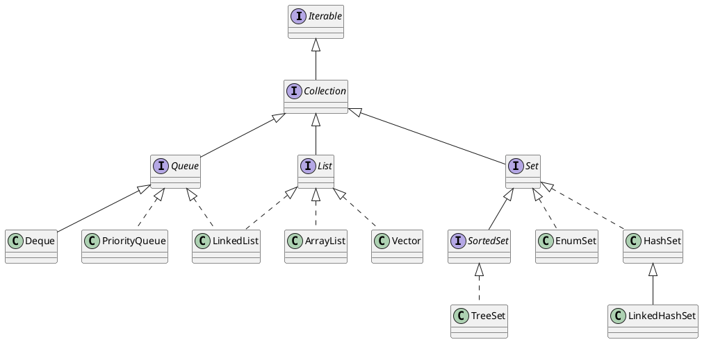
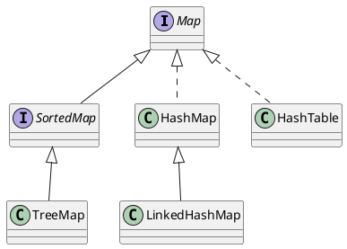

[TOC]

<!--more-->

## Collection类的子类

### set
无序集合，元素不可重复

### queue
队列，先进先出原则

### list
有序集合，可重复

1. LinkedList 是基于链表的数据结构，arrayList是基于动态数组的数据结构。
2. 对于随机访问get和set方法，ArrayList优于 LinkedList。ArrayList引索方便
3. 对于经常删除和新增操作的情况，LinkedList 更占优势。因为 LinkedList 只需修改前后两个数据的链接就行了。而ArrayList需要将整个数组向前移动。

## map 

Map也属于集合系统，但和Collection接口没关系。Map是key对value的映射集合，其中key列就是一个集合。key不能重复，但是value可以重复。HashMap、TreeMap和HashTable是三个主要的实现类。
SortedSet和SortedMap接口对元素按指定规则排序，SortedMap是对key列进行排序。

## 线程安全的集合

1. Vector
2. HashTable
3. CopyOnWriteArrayList
4. concurrentHashMap
4. concurrent工具包

