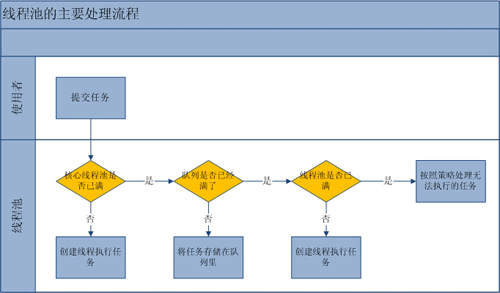

[TOC]

<!--more-->

# 1基础部分

## 线程池的作用

- 避免频繁地创建和销毁线程，节省系统资源。
- 控制并发的数目。

## 实现原理

提交任务后的执行流程

1. 判断核心线程池是否空闲。如空闲，直接创建线程运行任务。否则，下一步。
2. 判断工作队列是否已满。如果没满，将任务放入队列中。如满，下一步
3. 判断线程池是否达到最大线程数。如没有，创建线程执行任务。如满，下一步
4. 交给饱和策略处理。

## 4种任务队列

1. ArrayBlockingQueue， 基于数组结构的有界阻塞队列。FIFO排序
2. LinkedBlockQueue， 基于链表的无界阻塞队列。FIFO
3. SynchronousQueue， 直接提交的阻塞队列。
4. PriorityBlockingQueue， 具有优先级的无线阻塞队列。

## 饱和策略

1. AbortPolicy： 直接抛出异常
2. CallerRunsPolicy： 使用调用者所在线程运行任务
3. DiscardOldestPolicy： 丢弃最近一项任务，并执行当前任务。
4. DiscardPolicy： 不处理，直接丢弃。
5. 自定义 RejectedExecutionHandler，如记录日志等

## 线程池的关闭

shutdown： 线程池状态被置为ShutDown，此时不在接收新的任务。允许执行完以前提交的任务。执行完成后，关闭线程池。

shutdownNow： 线程池状态变为STOP，阻止正在运行的线程阻止等待任务启动并试图停止当前正在执行的任务。

## 线程池的配置

CPU密集型： 配置尽量少的线程。
IO密集型： 尽量配置较多的线程。

依赖数据库的类型： 尽量配置较多的线程。

