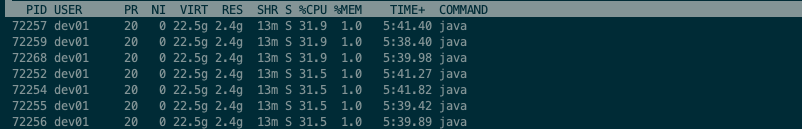
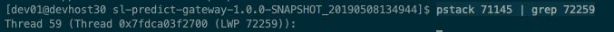

---

title: 查找最耗cpu的线程

date: 2019-05-10 17:06:00

categories: [语言,java,性能调优]

tags: [java,性能调优]

---
性能调优

<!--more-->

## 获取线程id ?

1. top 

查出最耗cpu的进程

2. top -p 71145 -H

显示该进程中 各线程的cpu、内存等详情

3. pstack 71145 | grep 72259 

查出线程 Id

4. 通过 72259 找不到 jstack 信息。。。。我很蒙蔽

## 来源

https://www.rowkey.me/blog/2016/11/02/java-profile/

[jvisualvm远程监控 Visual GC](https://www.cnblogs.com/zongyl/p/9599693.html)