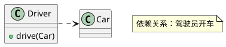
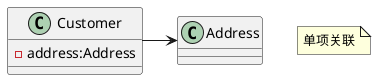
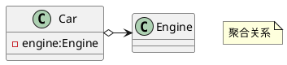
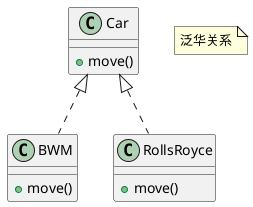

---

title: uml图例

date: 2018-09-02 23:30:00

categories: [语言,uml]

tags: [uml]

---

<!--more-->

## 依赖关系

```puml
@startuml

note "依赖关系：驾驶员开车" as N1

class Driver{
+ drive(Car)
}

Driver .right.> Car

@enduml
```

## 泛化关系 即继承

```puml
@startuml

note "泛华关系" as N1

class BWM{
+ move()
}

class Car{
+ move()
}

class RollsRoyce{
+ move()
}

BWM -up-|> Car
RollsRoyce -up-|> Car

@enduml
```

## 单向关联

```puml
@startuml

note "单项关联" as N1

class Customer{
- address:Address
}

class Address{
}

Customer -right-> Address

@enduml
```

## 聚合关系

```puml
@startuml

note "聚合关系" as N1

class Car{
- engine:Engine
}

class Engine{
}

Car o-right-> Engine

@enduml
```

## 实现关系

```puml
@startuml

note "泛华关系" as N1

class BWM{
+ move()
}

class Car{
+ move()
}

class RollsRoyce{
+ move()
}

BWM .up.|> Car
RollsRoyce .up.|> Car

@enduml
```