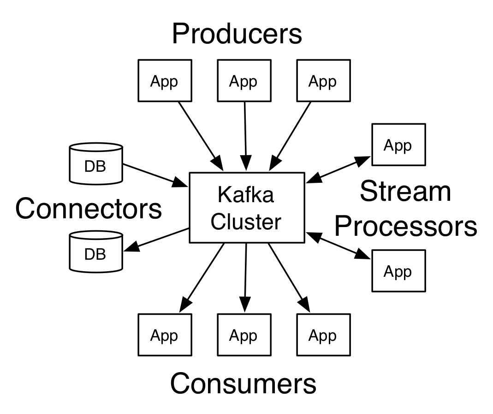
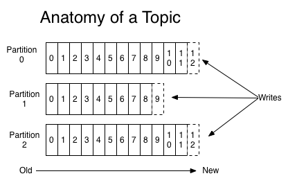
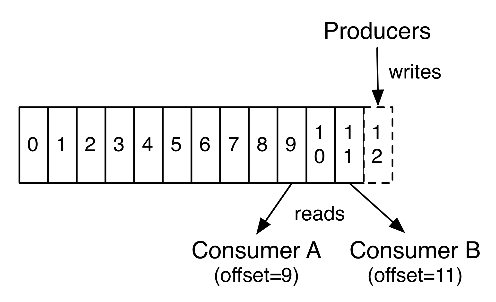
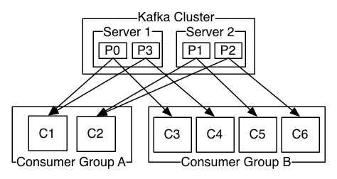

---

title: kafaka架构和应用(翻译)

date: 2018-09-28 14:04:00

categories: [kafka]

tags: [kafka]

---

kafka 是一个分布式流媒体系统(streaming platform)。

<!--more-->

一个 streaming platform 拥有3种能力:

- 发布、订阅 记录流，类似于消息队列和企业消息系统。
- 存储记录流，并具备容错和持久能力
- 当记录流产生时，能够对他们进行处理

kafka 主要用于两类应用:

- 在不同系统或者应用之间，构建实时流数据管道用获取可靠数据
- 构建实时流处理应用，用于转换或者响应流数据

## 基本概念

- kafka 是以集群的方式运行在一个或者多个服务器上。可以跨多个数据中心。
- kafka 以 topic 的形式储存记录流。
- 每一个记录包含 一个key、一个value 和 一个时间戳

## 4类API

- Producer API: 允许应用将流记录发布到一个或多个kafka主题中
- Consumer API: 允许应用订阅一个或者多个kafka主题，并处理产生给它们的记录流
- Streams API: 允许应用作为一个流处理器, 消费来自一个或多个主题的输入流，产生送送至一个或多个主题的输出流，有效地将输入流转换为输出流。
- Connector API: 允许构建和运行可重用的生产者和消费者，其能够将kafka、存在的应用或数据库连接在一起。如 建立一个连接到关系型数据库的connector，能够捕捉每一个改变并将其存入表中。

在Kafka中，客户端和服务器之间的通信通过一个简单、高性能、语言无关的TCP协议完成。该协议版本化，并保持与旧版本的向后兼容性。我们为卡夫卡提供Java客户端，但客户端可以用多种语言提供。

## Topics and Logs

topic 代表发布的流记录的类别。在kafka中，topics通常拥有多个订阅者，也就是说 一个 topic 可以拥有 零个、一个或者多个消费者。

对于每一个topic，kafka集群维护着如下的分区日志:

每一个分区都是一个有序的、不可变的记录序列，记录被连续地追加到结构化提交日志中。
每个分区中的记录都被分配了一个序列ID号(offset)，该序列ID号唯一地标识分区内的每个记录。

无论记录是否被消费，所有已发布的记录会持久地保存在卡夫卡集群中，这个保存周期取决于配置的周期。
例如，如果保留策略设置为两天，那么在发布记录后的两天内，它可以用于消费，两天之后将被丢弃以释放空间。kafka的性能相对于数据大小是有效不变的，所以长时间存储数据不是问题。

事实上，每个消费者保存的唯一元数据是消费者在日志中的offset或者position。
这个偏移值是由消费者控制的：通常，消费者在读取记录时向后逐个偏移，但实际上，由于位置是由消费者控制的，所以它可以按照任何顺序使用记录。
比如，一个消费者可以将offset设为旧值 达到重新处理过期的数据 或者 直接跳过部分记录直接读取最近的记录。

这些特征的组合使得kafka集群消费者非常cheap: 他们可以随意的获取数据但不会影响其他的消费者。比如您可以使用命令行工具跟踪任何主题的内容，而不必更改任何现有消费者所消费的内容。

日志中的分区有多种用途: 

- 分区允许日志大小能够超出单个服务器所能提供的大小。每个分区必须位于单个服务器中，但是一个主题可以有多个分区，因此他可以处理任意大小的数据。
- 分区能够并行处理。

## Distribution

日志的分区分布在Kafka集群中的服务器上，每个服务器处理数据和请求分区。每个分区可以配置具体的容错份数。

每个分区都有一个“领导者”和零个或多个“追随者”。领导者处理所有的读写请求，而追随者被动复制的领导者。如果领导者失败，其中的一个追随者将自动成为新的领导者。每个服务器充当一些分区的领导者和其他人的追随者，因此集群内的负载很好地平衡。

## geo 复制

Kafka MirrorMaker 为您的集群提供地理复制支持。使用MirrorMaker，消息能够跨多个数据中心或云区域复制。您可以在主动/被动场景中使用此选项进行备份和恢复；或者在主动/主动场景中使用此选项来将数据放置得更靠近用户，或者支持数据局部性需求。

## 生产者

生产者将数据发布到指定的topic中。生产者可以决定将哪些记录分配到某一topic种的指定分区中。这可以通过特定的算法实现，如根据记录的某个key的hash值来确定某个分区。

## 消费者

消费者可以进行分组得到消费者组，发布到主题的某条记录，会被传递给订阅该主题的消费者组的某一个消费者实例。消费者实例可以在单独的进程中，也可以在单独的服务器中。

如果所有的消费者实例拥有相同的消费者组，那么记录将会在使用者实例中进行有效的均衡负载。
如果所有的消费者实例拥有不同的消费者组，那么记录会被广播给所有的消费者进程(???为什么是所有的).

如上图所示，kafka集群中包含 2两个服务器(共管理4个分区(P0-P3)) 和 2组 消费者组。 消费者组A有2个消费者实例，消费者组B有4个。

一般情况下，topic有少量的消费者组，一个组一个“逻辑订阅者”。为了可扩展性和容错性，每个组由许多的消费者实例组成。这仅仅是发布订阅语义，其中订阅服务器是一组消费者而不是单个进程。

kafka消费方式的实现: 在消费者实例中划分日志中的分区，每个消费者实例专门处理分配给自己的分区。这个组的成员状态检测是由kafka自己动态处理的。
如果一个组加入了一个新的实例，新实例会接管其他成员的部分分区；如果某个实例挂了，他的分区会被其他的实例接管。

kafka仅提供一个分区内的记录的总订单(order)，无法获取一个主题下所有分区的总和。
Per-partition ordering combined with the ability to partition data by key is sufficient for most applications。
如果需要记录上的总订单，那么可以使用只有一个分区的主题来实现，尽管这将意味着每个消费者组只有一个消费者进程。

## 多租户

可以将kafka部署为多租户解决方案。多租户是通过配置哪些主题可以产生或消耗数据来实现的。也有对配额的操作支持。
管理员可以在请求上定义和执行配额，以控制客户端使用的代理资源。有关详细信息，[请参阅安全文档](https://kafka.apache.org/documentation/#security)

## 保证
kafka提供了一下保证:

- 生产者向特定主题分区发送的消息将按照发送的顺序添加。也就是说，如果记录M1和记录M2由相同的生产者发送，并且首先发送M1，那么M1将具有比M2更低的偏移量，并且更早出现在日志中。
- 一个消费者实例 根据记录在日志中的顺序查看数据。
- 对于具有复制因子N的主题，我们将容忍多达N-1服务器故障而不丢失提交到日志的任何记录。

## kafka 作为 消息系统

kafka的流概念如何与传统的企业消息系统相比较？

消息传递传统上有两种模式：队列和发布订阅。在队列中，消费者池可以从服务器读取，并且每个记录都转到其中之一；在发布-订阅中，该记录被广播到所有消费者。
这两种模式各有其优点和缺点。
队列的优势在于，它允许您在多个消费者实例上划分数据处理，从而可以扩展处理。不幸的是，一旦一个进程读取了它的数据，这个数据就消失了，队列就无法多用户订阅。
发布-订阅允许将数据广播到多个进程，但是由于每个消息都发送到每个订阅者，因此无法扩展处理。

kafka的消费者组概念概括了这两个概念。与队列一样，消费者组允许您将处理划分为一组进程（消费者组的成员）。与发布订阅一样，kafka允许您向多个消费者组广播消息。

kafka模型的优点是，每个主题都具有这些属性——它可以扩展处理，而且是多订阅用户——不需要选择一个或者另一个。

kafka比传统的消息传递系统具有更强的排序保证。

传统队列在服务器上按顺序保留记录，如果多个消费者从队列中消费，则服务器按照记录的存储顺序分发记录。
然而，尽管服务器按顺序分发记录，但是记录是异步地传递给使用者的，因此它们可能按顺序到达不同的使用者。这实际上意味着在并行消费的存在下记录的顺序丢失。
消息传递系统通常通过具有“独占消费者”的概念来解决这个问题，该概念只允许一个进程从队列中消费，但这当然意味着在处理中没有并行性。

kafka做得更好。通过具有主题中的并行性（分区）的概念，Kafka能够在消费进程池上提供排序保证和负载平衡。
这是通过将主题中的分区分配给使用者组中的使用者来实现的，以便每个分区都恰好被组中的一个使用者所使用。通过这样做，我们确保消费者是该分区的唯一读取器，并按顺序消耗数据。
由于有许多分区，这仍然平衡了许多消费者实例的负载。但是注意，消费者组中的消费者实例不能多于分区。

## kafka 作为 存储系统

任何'允许发布消息与消费消息解耦'的消息队列实际上都充当in-flight消息的存储系统。kafka的不同之处在于它是一个非常好的存储系统。

写入kafka的数据可以被写入磁盘并被复制（用于容错）。Kafka中的生产者可以通过 接收数据写入和复制完成的通知 来保证数据的完整性。 

kafka 使用扩展性良好的磁盘结构——无论服务器上有50KB或50TB的持久数据，kafka都将获得相同的性能。

由于拥有良好的存储结构和允许客户机控制其读取位置，可以将Kafka看作一种专用的分布式文件系统，专门用于高性能、低延迟的提交日志存储、复制和传播。

有关kafka的提交日志存储和复制设计的详细信息， [请阅读此页](https://kafka.apache.org/documentation/#design)

## kafka 流处理

仅仅读取、写入和存储数据流是不够的，其目的是实现对流的实时处理。

在Kafka中，流处理器是指从输入主题获取连续的数据流，对该输入执行一些处理，并生成连续的数据流输出到其他主题。

例如，一个应用程序可能会接收销售和出货信息的输入流，然后对这些数据进行重新排序和价格调整，最后将结果以流的形式输出。

可以直接使用生产者API和消费者API来进行简单的数据处理。然而，对于更复杂的转换，卡夫卡提供了一个完全集成的流API。
流API允许构建执行较复杂处理的应用程序，这些处从而实现流聚合功能或者join功能。

这个工具帮助解决此类应用程序面临的难题：处理无序数据、代码更改后重新处理输入(reprocessing input as code changes)、执行有状态计算等。

流API建立在Kafka提供的核心原始功能之上：它使用生产者API和消费者API进行输入，使用Kafka进行有状态存储，并且在流处理器实例之间使用相同的组机制进行容错。

## 把碎片拼在一起 

消息传递、存储和流处理的这种组合可能看起来不寻常，但对于Kafka作为流平台的角色来说，这是至关重要的。

分布式文件系统（如HDFS）允许存储静态文件以进行批量处理。实际上，这样的系统允许存储和处理过去的历史数据。

传统的企业消息系统允许处理订阅后到达的未来消息。以这种方式构建的应用程序在到达时处理未来的数据。

Kafka结合了这两种能力，并且这种组合对于Kafka作为流式应用程序以及流式数据管道的平台的使用都是至关重要的。

通过结合存储和低延迟订阅，流式应用程序可以以相同的方式处理过去和将来的数据。也就是说，单个应用程序可以处理历史存储的数据，但是当到达最后一条记录时，它不会结束，而是可以在将来数据到达时继续处理。这是包含批处理和消息驱动应用程序的流处理的一般概念。

同样地，对于流式数据流水线，对实时事件的订阅的组合使得能够将Kafka用于非常低延迟的流水线；but the ability to store data reliably make it possible to use it for critical data where the delivery of data must be guaranteed or for integration with offline systems that load data only periodically or may go down for extended periods of time for maintenance
流处理设施使得在数据到达时转换数据成为可能。

## 其他资料
https://blog.csdn.net/wjacketcn/article/details/50912878
https://kafka.apache.org/intro