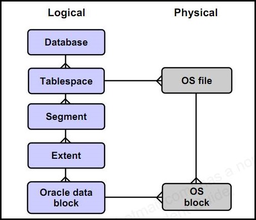
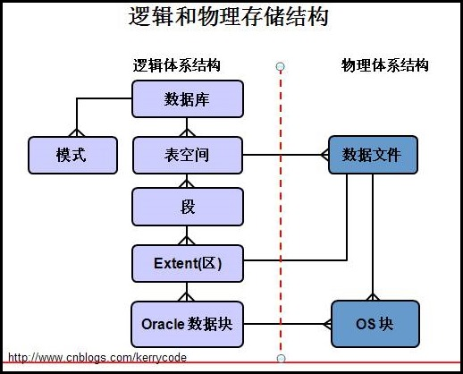

---

title: 表空间

date: 2018-09-21 34:00

categories: [oracle]

tags: [oracle]

---

在ORACLE数据库中，所有数据从逻辑结构上看都是存放在表空间当中，当然表空间下还有段、区、块等逻辑结构。从物理结构上看是放在数据文件中。一个表空间可由多个数据文件组成。

<!--more-->

## 概念

### 结构图





### 基本的表空间

系统中默认创建的几个表空间：

- SYSTEM
- SYSAUX
- USERS
- UNDOTBS1
- EXAMPLE
- TEMP

系统中必须的表空间有那几个？

答案： SYSTEM、SYSAUX、TEMP、UNDO， 像USERS、EXAMPLE等表空间是可有可无的。

### 表空间的分类

- 永久表空间              存放永久性数据，如表，索引等。
- 临时表空间              不能存放永久性对象，用于保存数据库排序，分组时产生的临时数据。
- UNDO表空间             保存数据修改前的镜象。

### 表空间的管理

表空间的管理方式：

- 字典管理：全库所有的空间分配都放在数据字典中。容易引起字典争用，而导致性能问题。

- 本地管理：空间分配不放在数据字典，而在每个数据文件头部的第3到第8个块的位图块，来管理空间分配。


## 创建表空间

```oraclesqlplus
-- 创建
CREATE TABLESPACE TBS_TR_DATA
DATAFILE '/oradata/rTBS_TR_DATA_001.dbf'
SIZE 64G 
EXTENT MANAGEMENT LOCAL
SEGMENT SPACE MANAGEMENT AUTO ONLINE;

-- 更改
ALTER TABLESPACE TBS_TR_DATA
ADD DATAFILE '/oradata/rTBS_TR_DATA_002.dbf'
SIZE 64G
AUTOEXTEND OFF;
```
 
## 表空间管理

### 表空间信息

查看表空间

```oraclesqlplus
-- 包含数据库中所有表空间的描述信息
SELECT * FROM DBA_TABLESPACES;
-- 包含当前用户的表空间的描叙信息
SELECT * FROM USER_TABLESPACES;
-- 包含从控制文件中获取的表空间名称和编号信息
SELECT * FROM V$TABLESPACE;
```

查看数据文件

```oraclesqlplus

--包含数据文件以及所属的表空间的描述信息
SELECT * FROM DBA_DATA_FILES;
--包含临时数据文件以及所属的表空间的描述信息
SELECT * FROM DBA_TEMP_FILES;
--包含从控制文件中获取的数据文件的基本信息，包括它所属的表空间名称、编号等
SELECT * FROM V$DATAFILE;
--包含所有临时数据文件的基本信息
SELECT * FROM V$TEMPFILE;
```

#### 查看默认的TEMP表空间

数据库维度

```oraclesqlplus
SELECT PROPERTY_NAME, PROPERTY_VALUE
FROM DATABASE_PROPERTIES
WHERE PROPERTY_NAME='DEFAULT_TEMP_TABLESPACE';
```

```
PROPERTY_NAME                        PROPERTY_VALUE    
------------------------------ ----------------------------
DEFAULT_TEMP_TABLESPACE                  TEMP
``` 

用户维度

```oraclesqlplus
SELECT USERNAME, TEMPORARY_TABLESPACE FROM DBA_USERS
```

#### 查看默认的永久表空间

如果创建用户时，不指定其永久表空间，则会使用默认的表空间。

```oraclesqlplus
SELECT PROPERTY_NAME, PROPERTY_VALUE FROM DATABASE_PROPERTIES;
```

```
PROPERTY_NAME PROPERTY_VALUE 
------------------------------ ------------------
DEFAULT_TEMP_TABLESPACE              TEMP
DEFAULT_PERMANENT_TABLESPACE         USERS
``` 

#### 查看默认的表空间类型

如果不指定表空间类型，就会默认使用DEFAULT_TBS_TYPE参数指定的表空间类型。

```oraclesqlplus
SELECT PROPERTY_NAME, PROPERTY_VALUE
FROM DATABASE_PROPERTIES
WHERE PROPERTY_NAME='DEFAULT_TBS_TYPE';
```
 
```
PROPERTY_NAME                    PROPERTY_VALUE    
------------------------------ ------------------    
DEFAULT_TBS_TYPE                     SMALLFILE
```

#### 查看表空间情况

```oraclesqlplus
SELECT * FROM DBA_TABLESPACES
```

#### 查看表空间的数据文件

永久表空间/UNDO表空间

```oraclesqlplus
SELECT * FROM DBA_DATA_FILES;
```

临时表空间

```oraclesqlplus
SELECT * FROM V$TEMPFILE;
```

#### 查看表空间使用情况

SQL 1

```oraclesqlplus
SELECT A.TABLESPACE_NAME                     AS TABLESPACE_NAME, 
        ROUND(A.BYTES/(1024*1024*1024),2)    AS "TOTAL(G)"     , 
        ROUND(B.BYTES/(1024*1024*1024),2)    AS "USED(G)"      , 
        ROUND(C.BYTES/(1024*1024*1024),2)    AS "FREE(G)"      , 
        ROUND((B.BYTES * 100) / A.BYTES,2)   AS "% USED"       , 
        ROUND((C.BYTES * 100) / A.BYTES,2)   AS "% FREE" 
FROM SYS.SM$TS_AVAIL A, SYS.SM$TS_USED B, SYS.SM$TS_FREE C 
WHERE A.TABLESPACE_NAME = B.TABLESPACE_NAME 
AND A.TABLESPACE_NAME = C.TABLESPACE_NAME;
```

计算表空间使用情况(考虑了数据文件自动增长情况)

```oraclesqlplus
SELECT UPPER(F.TABLESPACE_NAME) AS "表空间名称", 
        ROUND(D.AVAILB_BYTES ,2) AS "表空间大小(G)", 
        ROUND(D.MAX_BYTES,2) AS "最终表空间大小(G)", 
        ROUND((D.AVAILB_BYTES - F.USED_BYTES),2) AS "已使用空间(G)", 
        TO_CHAR(ROUND((D.AVAILB_BYTES - F.USED_BYTES) / D.AVAILB_BYTES * 100, 
            2), '999.99') AS "使用比", 
        ROUND(F.USED_BYTES, 6) AS "空闲空间(G)", 
        F.MAX_BYTES AS "最大块(M)" 
 FROM (
           SELECT TABLESPACE_NAME, 
                   ROUND(SUM(BYTES) / (1024 * 1024 * 1024), 6) USED_BYTES, 
                   ROUND(MAX(BYTES) / (1024 * 1024 * 1024), 6) MAX_BYTES 
           FROM SYS.DBA_FREE_SPACE 
           GROUP BY TABLESPACE_NAME) F, 
         (SELECT DD.TABLESPACE_NAME, 
                   ROUND(SUM(DD.BYTES) / (1024 * 1024 * 1024), 6) AVAILB_BYTES, 
               ROUND(SUM(DECODE(DD.MAXBYTES, 0, DD.BYTES, DD.MAXBYTES))/(1024*1024*1024),6) MAX_BYTES 
          FROM SYS.DBA_DATA_FILES DD 
          GROUP BY DD.TABLESPACE_NAME) D 
         WHERE D.TABLESPACE_NAME = F.TABLESPACE_NAME 
 ORDER BY 4 DESC
```

### 默认表空间

在ORACLE 9i数据库中，创建数据库用户时，如果没有指定默认的永久性表空间，则系统使用SYSTME表空间分别作为该用户的默认永久表空间，默认的临时表空间为TEMP。
在ORACLE 10/11g中，如果不指定默认永久性表空间，则是USERS.默认的临时表空间为TEMP，当然前提是你没有修改过默认永久表空间值或指定用户的默认永久性表空间。
ORACLE允许使用自定义的表空间作为默认永久性表空间。

数据库的默认永久表空间

```oraclesqlplus
SELECT * FROM database_properties 
WHERE PROPERTY_NAME = 'DEFAULT_PERMANENT_TABLESPACE';
```

你可以使用`ALTER DATABASE DEFAULT TABLESPACE`语句可以设置数据库的默认永久性表空间，这样建立用户时，默认将使用指定的表空间。

修改数据库级别-永久表空间

```oraclesqlplus
ALTER DATABASE DEFAULT TABLESPACE USER;
```

修改数据库级别-临时表空间

```oraclesqlplus
ALTER DATABASE DEFAULT TEMPORARY TABLESPACE TEMP;
```

修改用户级别-表空间

```oraclesqlplus
ALTER USER USERNAM DEFAULT TABLESPACE NEW_TABLESPACE_NAME
```

查看用户对应的默认表空间

```oraclesqlplus
SELECT USERNAME, DEFAULT_TABLESPACE FROM DBA_USERS
```

注意事项：

1：如果我们在创建用户时指定了默认表空间为DEFAULT_PERMANENT_TABLESPACE的值，那么在修改默认表空间后，之前用户的默认表空间也会发生改变。

eg:

```oraclesqlplus
SELECT * FROM database_properties
 WHERE PROPERTY_NAME IN( 'DEFAULT_PERMANENT_TABLESPACE','DEFAULT_TEMP_TABLESPACE');
```

```text
PROPERTY_NAME                  PROPERTY_VALUE                                     DESCRIPTION
---------------- -------------------------------- ------------------------------------------------------------
DEFAULT_TEMP_TABLESPACE        TEMP                                       Name of default temporary tablespace
DEFAULT_PERMANENT_TABLESPACE   USERS                                      Name of default permanent tablespace
```
 
```oraclesqlplus
CREATE USER U1 IDENTIFIED BY U1 DEFAULT TABLESPACE USERS; 
SELECT USERNAME, DEFAULT_TABLESPACE, TEMPORARY_TABLESPACE FROM DBA_USERS WHERE USERNAME ='U1';
```   

```text
USERNAME                       DEFAULT_TABLESPACE             TEMPORARY_TABLESPACE
------------------------------ ------------------------------ ------------------------------
U1   
```

```oraclesqlplus
ALTER DATABASE DEFAULT TABLESPACE TEST1;
-- Database altered
```    
  
修改了默认永久性表空间后，此时查看用户U1的DEFAULT_TABLESPACE值，发现其值也改为了TEST1，证实了结论1的正确性。
  
```oraclesqlplus
SELECT USERNAME, DEFAULT_TABLESPACE, TEMPORARY_TABLESPACE FROM DBA_USERS WHERE USERNAME ='U1';
```
  
```text
USERNAME                       DEFAULT_TABLESPACE             TEMPORARY_TABLESPACE
------------------------------ ------------------------------ ------------------------------
U1                             TEST1                          TEMP
```  
  
2：如果我们在创建用户时没有指定用户表空间，那么默认也会使用DB的默认表空间，这时候如果我们修改了DB的默认表空间，用户的表空间也会发生改变。

将数据库的默认表空间切换为USERS

```oraclesqlplus
ALTER DATABASE  DEFAULT TABLESPACE USERS;
-- Database altered
CREATE USER U2 IDENTIFIED BY U2;
-- User created
SELECT USERNAME, DEFAULT_TABLESPACE, TEMPORARY_TABLESPACE FROM DBA_USERS WHERE USERNAME ='U1';
```
 
```text
USERNAME                       DEFAULT_TABLESPACE             TEMPORARY_TABLESPACE
------------------------------ ------------------------------ ------------------------------
U1                             USERS                          TEMP
```

```oraclesqlplus
ALTER DATABASE DEFAULT TABLESPACE TEST1;
-- Database altered
SELECT USERNAME, DEFAULT_TABLESPACE, TEMPORARY_TABLESPACE FROM DBA_USERS WHERE USERNAME ='U1';
```    
  
```text
USERNAME                       DEFAULT_TABLESPACE             TEMPORARY_TABLESPACE
------------------------------ ------------------------------ ------------------------------
U1                             TEST1                          TEMP
```

3: 如果我们在创建用户指定用户的表空间是其他的表空间，那么我们修改DB的默认表空间不会影响用户的表空间。

eg:

```oraclesqlplus
CREATE USER U3 IDENTIFIED BY U3 DEFAULT TABLESPACE TEST2;
-- User created
SELECT USERNAME, DEFAULT_TABLESPACE, TEMPORARY_TABLESPACE FROM DBA_USERS WHERE USERNAME='U3';
```
 
```text
USERNAME                       DEFAULT_TABLESPACE             TEMPORARY_TABLESPACE
------------------------------ ------------------------------ ------------------------------
U3                             TEST2                          TEMP
```
  
```oraclesqlplus
ALTER DATABASE DEFAULT TABLESPACE USERS;
-- Database altered
SELECT USERNAME, DEFAULT_TABLESPACE, TEMPORARY_TABLESPACE FROM DBA_USERS WHERE USERNAME='U3';
```  

```text
USERNAME                       DEFAULT_TABLESPACE             TEMPORARY_TABLESPACE
------------------------------ ------------------------------ ------------------------------
U3                             TEST2                          TEMP
```    
  
4: DB的默认表空间不能删除，除非将默认表空间指向其他表空间之后才可以删除。

5: 如果用户的默认表空间指向其他的表空间，当这个表空间被drop 之后，用户的默认表空间会自动指向DB的默认表空间。

### 删除表空间

除了SYSTEM表空间外，数据库中的任何表空间可以删除。删除表空间时，ORACLE仅仅是在控制文件和数据字典中删除与表空间和数据文件相关的信息。
默认情况下，ORACLE并不会在操作操作系统中删除相应的数据文件，因此在成功执行删除表空间的操作后，需要手动删除该表空间在操作系统中对应的数据文件。
如果在删除表空间的同时要删除对应的数据文件，则必须显示的指定`INCLUDING CONTENTS AND DATAFILES`子句。
注意:当前的数据库级的默认表空间不能删除，用户级的可以删除.否则会报错：`ORA-129 Can not drop the default permanent tablespace`

```oraclesqlplus
DROP TABLESPACE 表空间名 [INCLUDING CONTENTS [AND DATAFILES] [CASCADE CONSTRAINTS]]
DROP TABLESPACE URER01 INCLUDING CONTENTS;
```

如果在表空间中包含数据库对象，则必须在DROP TABLESPACE语句中显示的指定`INCLUDING CONTENTS`. 如果要再删除表空间USER的同时删除它所对应的数据文件，则可以使用下面的语句

```oraclesqlplus
DROP TABLESPACE USER01 INCLUDING CONTENTS AND DATAFILES;
```

注意：删除表空间时，CONTENTS与DATAFILES选项错位，会报如下错误：

```oraclesqlplus
DROP TABLESPACE TBS_STAGE_DAT INCLUDING DATAFILES AND CONTENTS
-- ORA-01911：contents keyword expected
```

### 调整表空间

#### 增加数据文件

如果发现某个表空间存储空间不足时，可以为表空间添加新的数据文件，扩展表空间大小。但是一般建议预先估计表空间所需的存储空间大小，然后为它建立若干适当大小的数据文件。

例子：

```oraclesqlplus
-- 添加文件 不能自动扩展
ALTER TABLESPACE TBS_TR_IND
ADD DATAFILE '/oradata/rTBS_TR_IND_002.dbf'
SIZE 32G
AUTOEXTEND OFF;
-- 添加文件 自动扩展大小
ALTER TABLESPACE TBS_EDS_DAT
ADD DATAFILE 'G:\datafile\TBS_EDS_DAT01.DBF'
SIZE 100M
AUTOEXTEND ON
NEXT 10M
MAXSIZE 20480M;
-- REUSE
ALTER TABLESPACE temp01
ADD TMPFILE 'D:\ORACLEDATA\temp01_02.dbf' SIZE 10M REUSE;
```
 
在添加新的数据文件时，如果同名的操作系统已经存在，ALTER TABLESPACE语句将失败。如果要覆盖同名的操作系统文件时，则必须在后面显示的指定REUSE子句。


ORACLE支持的数据文件大小是由它的db_block_size和db_block的数量决定的。其中db_block(ORACLE块)的数量是一个定值2**22-1(4194303).数据文件大小容量=块数量*块大小。下面列表说明不同数据块数据库所能支持的最大物理文件大小:

```text
数据块的大小        物理文件的最大值M  物理文件的最大值G
=============================================================================
2KB                       8191M                                   8G
4KB                       16383M                                 16G
8KB                       32767M                                 32G
16KB                      65535M                                 64G
32KB                      131072M                               128G
64KB                      262144M                               256G
```

#### 调整数据文件大小

重置数据文件的大小

```oraclesqlplus
ALTER DATABASE DATAFILE '/database/oracle/oradata/gsp/tbs_dm_data_002.dbf'
RESIZE 500M;
```

#### 删除数据文件

```oraclesqlplus
ALTER TABLESPACE TEST
DROP DATAFILE '/database/oracle/oradata/gsp/tbs_dm_data_002.dbf'
```

##### 删除以前的数据文件，则必须先关闭数据库，手动删除文件，否则会报错。


```text
SQL> shutdown immediate

数据库已经关闭。
已经卸载数据库。
ORACLE 例程已经关闭。
  
SQL> startup
  
ORACLE 例程已经启动。
Total System Global Area 612368384 bytes
Fixed Size 1250428 bytes
Variable Size 104860548 bytes
Database Buffers 499122176 bytes
Redo Buffers 7135232 bytes
数据库装载完毕。
数据库已经打开。
``` 

#### 移动数据文件

连接数据库并查看数据文件位置

````oraclesqlplus
conn sysdba/manage as sysdba;

select TABLESPACE_NAME,FILE_NAME,BYTES/1024/1024 "MB" from dba_data_files;
```` 

把要移动数据文件的表空间脱机

```oraclesqlplus
ALTER TABLESPACE TBS_EDS_DAT OFFLINE NORMAL ;
```
        
移动物理数据文件后，修改控制文件的记录指针。

```oraclesqlplus
-- 指定的文件位置一定要文件
alter database rename file '/u01/app/oracle/oradata/ocp/users01.dbf' to '/u02/users01.dbf';
```
  
表空间联机
  
```oraclesqlplus
ALTER TABLESPACE TBS_DM_DAT ONLINE;
```  

#### 数据文件脱机

ALTER DATABASE DATAFILE '/database/oracle/oradata/gsp/tbs_dm_data_002.dbf' OFFLINE;

#### 数据文件联机

ALTER DATABASE DATAFILE '/database/oracle/oradata/gsp/tbs_dm_data_002.dbf' ONLINE;

## 维护表空间

### 变更表空间状态

表空间状态有下面几种状态：online、offline、read only、read write。

若要查看表空间的状态，可以通过下面SQL语句来查看。

```text
SQL> SELECT TABLESPACE_NAME, CONTENTS, STATUS FROM DBA_TABLESPACES;
 
TABLESPACE_NAME                CONTENTS  STATUS
------------------------------ --------- ---------
SYSTEM                         PERMANENT ONLINE
UNDOTBS1                       UNDO      ONLINE
SYSAUX                         PERMANENT ONLINE
TEMP                           TEMPORARY ONLINE
USERS                          PERMANENT ONLINE
EXAMPLE                        PERMANENT ONLINE
TBS_DM_DATA                    PERMANENT READ ONLY

7 rows selected
    
            
SQL> SELECT FILE#, STATUS, ENABLED FROM V$DATAFILE;
    
FILE# STATUS  ENABLED
---------- ------- ----------
1 SYSTEM  READ WRITE
2 ONLINE  READ WRITE
3 ONLINE  READ WRITE
4 ONLINE  READ WRITE
5 ONLINE  READ WRITE
6 OFFLINE READ ONLY
7 OFFLINE READ ONLY
```
 
#### 表空间脱机

```oraclesqlplus
ALTER TABLESPACE TBS_DM_DAT OFFLINE IMMEDIATE;
```

设置脱机状态，可以使用下面4个参数来控制脱机方式

- NORMAL 该参数表示将表空间以正常方式切换到脱机状态，在进入脱机状态过程中，ORACLE会执行一次检查点， 将SGA区中与该表空间相关的脏缓存块写入数据文件中，然后再关闭表空间的所有数据文件。如果在这过程中没有发生任何错误，则可以使用NORMAL参数，这也是默认的方式。
- TEMPORARY 该参数将表空间以临时方式切换到脱机状态。这时ORACLE在执行检查点时并不会检查各个数据文件的状态，即使某些数据文件处于不可用状态，ORACLE也会忽略这些错误。这样将表空间设置为联机状态时，可能需要进行数据恢复。
- IMMEDIATE 该参数将表空间以立即方式切换到脱机状态，这时ORACLE不会执行检查点，也不会检查数据文件是否可用。而是直接将属于表空间的数据文件设置为脱机状态。下一次将表空间恢复为联机状态时必须进行数据库恢复。
- FOR RECOVER 该参数将表空间以用于恢复方式切换到脱机状态，如果要对表空间进行基于时间的恢复，可以使用这个参数将表空间切换到脱机状态。

如果数据库运行在非归档模式下(NOARCHIVELOG),由于无法保留恢复表空间所需要的重做数据，所以不能将表空间以立即方式切换到脱机状态。如果表空间脱机了，则查询表空间下的表，会报错误：ORA-00376 此时无法读取文件 以及 ORA-01110：数据文件x......

注意：脱机（offline）一般用于数据库的联机备份，数据恢复等维护操作。有些表空间不能OFFLINE，如：SYSTEM,UNDO等

- SYSTEM 不能offline，也不能read only
- 当前的UNDO表空空间，不能offline,也不能read only
- 当前的临时表空间不能offline,也不能read only
- SYSAUX可以offline 不能read only

#### 表空间联机

```oraclesqlplus
ALTER TABLESPACE TBS_DM_DAT ONLINE;
```

#### 表空间只读

```oraclesqlplus
ALTER TABLESPACE TBS_DM_DAT READ ONLY;
```

#### 表空间读写

```oraclesqlplus
ALTER TABLESPACE TBS_DM_DAT READ WRITE;
```

#### 表空间改名

在ORACLE 10g 之前，表空间的名称是不能被修改的。
在ORACLE 11G中，通过ALTER TABLESPACE 语句中使用RENAME子句，数据库管理员可以修改表空间的名称。

```oraclesqlplus
CREATE TABLESPACE TBS_DM_DAT 
DATAFILE 'E:\APP\KERRY\ORADATA\ORCL\TBS_DM_DAT.DBF'
SIZE 50M
EXTENT MANAGEMENT LOCAL
SEGMENT SPACE MANAGEMENT AUTO ONLINE
```
 
```oraclesqlplus
ALTER TABLESPACE TBS_DM_DAT RENAME TO TBS_DM_DATA;

SELECT TABLESPACE_NAME FROM DBA_TABLESPACES WHERE TABLESPACE_NAME = 'TBS_DM_DATA';
``` 

```text
LESPACE_NAME
---------------------------
_DM_DATA
```    

#### 开启自动扩展

```oraclesqlplus
ALTER DATABASE DATAFILE '/database/oracle/oradata/gsp/tbs_dm_data_002.dbf' AUTOEXTEND ON;
```

#### 关闭自动扩展

```oraclesqlplus
ALTER DATABASE DATAFILE '/database/oracle/oradata/gsp/tbs_dm_data_002.dbf' AUTOEXTEND OFF;
```

### 表空间配额

表空间不足与用户配额不足是两种不同的概念。表空间的大小是指实际的用户表空间的大小，而配额大小指的是用户指定使用表空间的的大小。两者的解决方式亦不相同

#### 查看用户表空间配额

```oraclesqlplus
--查看所有用户表空间的配额情况 
SELECT * FROM DBA_TS_QUOTAS;
  
--查看当前用户表空间的配额情况   
SELECT * FROM USER_TS_QUOTAS;

```

下面是DBA_TS_QUOTAS描述
```text
Name            Type         Nullable Default Comments                                         
--------------- ------------ -------- ------- ------------------------------------------------ 
TABLESPACE_NAME VARCHAR2(30)                  Tablespace name                                  
USERNAME        VARCHAR2(30)                  User with resource rights on the tablespace      
BYTES           NUMBER       Y                Number of bytes charged to the user              
MAX_BYTES       NUMBER       Y                User's quota in bytes.  NULL if no limit         
BLOCKS          NUMBER       Y                Number of ORACLE blocks charged to the user      
MAX_BLOCKS      NUMBER       Y                User's quota in ORACLE blocks.  NULL if no limit 
DROPPED         VARCHAR2(3)  Y                Whether the tablespace has been dropped  
```

MAX_BYTES=-1表示没有配额限制，

#### 管理用户表空间配额

用户表空间限额的创建与更改：

1.创建用户时，指定限额

eg：

```oraclesqlplus
CREATE USER TEST IDENTIFIED BY TEST
DEFAULT TABLESPACE TS_TEST
TEMPORARY TABLESPACE TEMP
QUOTA 3M ON TS_TEST
PASSWORD EXPIRE;
```

2.取消限额

这种方式是全局性的.

```oraclesqlplus
GRANT UNLIMITED TABLESPACE TO SCOTT;
```

或者针对特定的表空间的.

```oraclesqlplus
ALTER USER SCOTT QUOTA UNIMITED ON TBS_EDS_DAT;
SELECT * FROM SESSION_PRIVS WHERE PRIVILEGE='UNLIMITED TABLESPACE'
REVOKE UNLIMITED TABLESPACE FROM SCOTT;
```

3. 可以分配自然也可以回收了:

```oraclesqlplus
revoke unlimited tablespace from TEST;
-- 或者
alter user skate quota 0 on TB;
```

表空间大小不足问题的解决：使用“ALTER TABLESPACE tablespace_name ADD DATAFILE filename SIZE size_of_file”命令向指定的数据增加表空间，根据具体的情况可以增加一个或多个表空间。


## 来源

http://www.cnblogs.com/kerrycode/p/3418694.html
