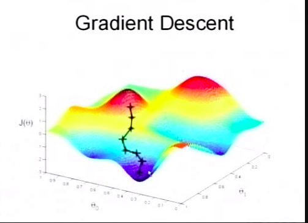

主要用于获取 特定的参数，使得损失函数变得最小。

- 损失函数:

$$
J(\theta)=\frac{1}{2m}\sum_{i=1}^{m}(h_{\theta}(x^{(i)}-y^{(i)})^2
$$

## 迭代过程

**下图显示梯度下降的过程**

**更新函数：**

$$
$\theta_j:=\theta_j-\alpha\frac{\partial}{\partial \theta_j}J(\theta) $
$$

其中 $\alpha$ 表示学习速率，$\alpha$ 过大会导致错失最小值，$\alpha$ 过小会导致更新速度变慢

**简化偏导**

$$
\frac{\partial}{\partial \theta_j}J(\theta) = \frac{\partial}{\partial \theta_j}\frac{1}{2}(h_{\theta}(x)-y)^2
​           =2*\frac{1}{2}(h_{\theta}(x)-y)* \frac{\partial}{\partial \theta_j}(h_{\theta}(x)-y)
​           =(h_{\theta}(x)-y)* \frac{\partial}{\partial \theta_j}(\sum_{i=1}^{n}\theta_{i}x_{i}-y)
​	       =(h_{\theta}(x)-y)* x_{j}
$$

**单训练样本更新函数**

$$\theta_j:=\theta_j+\alpha*(y^{(i)}-h_{\theta}(x^{(i)}))* x^{(i)}_{j}$$

**多训练样本更新函数**

$$\theta_j:=\theta_j+\alpha*\sum_{i=1}^{m}(y^{(i)}-h_{\theta}(x^{(i)}))* x^{(i)}_{j}$$

