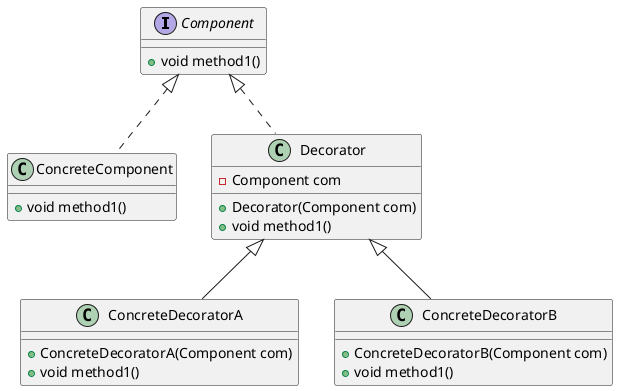

---

title: 装饰器模式

date: 2018-11-22 15:59:00

categories: [设计模式]

tags: [设计模式]

---

装饰模式又名包装(Wrapper)模式，允许向一个现有的对象添加新的功能，同时又不改变其结构。

<!--more-->

## 图示

## 例子
spring 多次读取 Request Body。

## 参考

[装饰模式](https://design-patterns.readthedocs.io/zh_CN/latest/structural_patterns/decorator.html)
[装饰模式](https://www.cnblogs.com/java-my-life/archive/2012/04/20/2455726.html)
[菜鸟-装饰模式](http://www.runoob.com/design-pattern/decorator-pattern.html)
