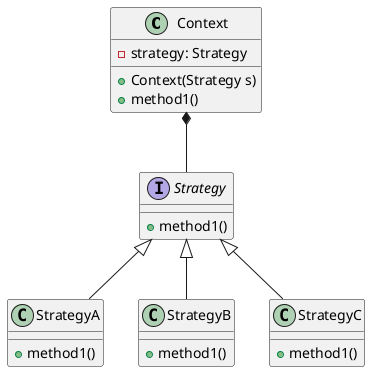

---

title: 命令模式

date: 2018-09-02 22:49:00

categories: [设计模式,行为型]

tags: [设计模式,行为型]

---

将来自客户端的请求封装为一个对象，从而让你可以使用不同的请求对客户端进行参数化。他可以实现 行为请求者 和 行为实现者 的解耦。

<!--more-->

## 例子一



```java
/**
* 调用者 持有一个命令对象, 可以在需要时通过命令对象完成相应逻辑
*/
class Invoker {
	private Command command;
	public void setCommand(Command command) {
		this.command = command;
	}
	public void action(){
		this.command.execute();
	}
}
/** 
* 抽象命令,定义了一系列的命令操作，如: execute(), undo(),redo()等
*/
abstract class Command {
	public abstract void execute();
}

/**
* 命令的具体实现，它绑定了 接受者 和 命令操作 的关系，将 execute() 的实现委托给了 接受者的 action() 实现 
*/ 
class ConcreteCommand extends Command {
	private Receiver receiver;
	public ConcreteCommand(Receiver receiver){
		this.receiver = receiver;
	}
	@Override
	public void execute() {
		this.receiver.doSomething();
	}
}

/**
* 命令的接受者，实现具体的业务逻辑
*/
class Receiver {
	public void doSomething(){
		System.out.println("接受者-业务逻辑处理");
	}
}
 
public class Client {
	public static void main(String[] args){
		Receiver receiver = new Receiver();
		Command command = new ConcreteCommand(receiver); 
		//客户端通过调用者来执行命令
		Invoker invoker = new Invoker();
		invoker.setCommand(command);
		invoker.action();
	}
}
```

## 例子二

```java
//命令接口
public interface Order {
   void execute();
}

//创建一个请求类。
public class Stock {
   
   private String name = "ABC";
   private int quantity = 10;
 
   public void buy(){
      System.out.println("Stock [ Name: "+name+", 
         Quantity: " + quantity +" ] bought");
   }
   public void sell(){
      System.out.println("Stock [ Name: "+name+", 
         Quantity: " + quantity +" ] sold");
   }
}

//创建实现了 Order 接口的实体类。
public class BuyStock implements Order {
   private Stock abcStock;
 
   public BuyStock(Stock abcStock){
      this.abcStock = abcStock;
   }
   @Override
   public void execute() {
      abcStock.buy();
   }
}
//创建实现了 Order 接口的实体类。
public class SellStock implements Order {
   private Stock abcStock;
 
   public SellStock(Stock abcStock){
      this.abcStock = abcStock;
   }
   @Override
   public void execute() {
      abcStock.sell();
   }
}

//创建命令调用类。
public class Broker {
   private List<Order> orderList = new ArrayList<Order>(); 
 
   public void takeOrder(Order order){
      orderList.add(order);      
   }
 
   public void placeOrders(){
      for (Order order : orderList) {
         order.execute();
      }
      orderList.clear();
   }
}
//使用 Broker 类来接受并执行命令。
public class CommandPatternDemo {
   public static void main(String[] args) {
      Stock abcStock = new Stock();
 
      BuyStock buyStockOrder = new BuyStock(abcStock);
      SellStock sellStockOrder = new SellStock(abcStock);
 
      Broker broker = new Broker();
      broker.takeOrder(buyStockOrder);
      broker.takeOrder(sellStockOrder);
 
      broker.placeOrders();
   }
}
```