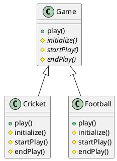

---

title: 模板方法

date: 2018-08-15 20:28:00

categories: [设计模式,行为型]

tags: [设计模式]

---

模板方法是基于继承的代码复用的一种行为型模式。

<!--more-->

## 概念

定义一个操作中算法的框架，将一些步骤延迟到子类中实现。

模板方法模式中的方法一般包含 模板方法 和 基本方法。

### 模板方法

模板方法 是 将多个基本方法 组合成一个完整的算法的 一个方法。
一个抽象类中可以拥有多个模板方法。每个模板方法都可以调用多个具体方法。

### 基本方法

基本方法又可以分为三类: 具体方法 、抽象方法 和 钩子方法

具体方法：抽象类申明并实现
抽象方法：抽象类申明，子类实现
钩子方法：一个钩子方法由抽象类声明并实现，而子类会加以扩展。通常抽象类给出的实现是一个空实现，作为方法的默认实现

其实不太理解 为什么要区分 具体方法和钩子方法？？

## 作用

提高代码复用性

## uml图



## 代码

## 创建一个抽象类，

它的模板方法被设置为 final。

```java
public abstract class Game {
   abstract void initialize();
   abstract void startPlay();
   abstract void endPlay();
 
   //模板
   public final void play(){
 
      //初始化游戏
      initialize();
 
      //开始游戏
      startPlay();
 
      //结束游戏
      endPlay();
   }
}
```

## 创建扩展了上述抽象类。

```java
public class Cricket extends Game {
 
   @Override
   void endPlay() {
      System.out.println("Cricket Game Finished!");
   }
 
   @Override
   void initialize() {
      System.out.println("Cricket Game Initialized! Start playing.");
   }
 
   @Override
   void startPlay() {
      System.out.println("Cricket Game Started. Enjoy the game!");
   }
}

public class Football extends Game {
 
   @Override
   void endPlay() {
      System.out.println("Football Game Finished!");
   }
 
   @Override
   void initialize() {
      System.out.println("Football Game Initialized! Start playing.");
   }
 
   @Override
   void startPlay() {
      System.out.println("Football Game Started. Enjoy the game!");
   }
}
```

## demo

使用 Game 的模板方法 play() 来演示游戏的定义方式。

```java
public class TemplatePatternDemo {
   public static void main(String[] args) {
 
      Game game = new Cricket();
      game.play();
      System.out.println();
      game = new Football();
      game.play();      
   }
}
```
