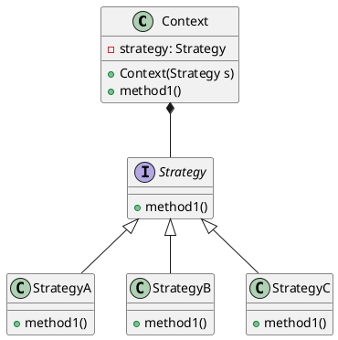

---

title: 策略模式

date: 2018-08-15 22:46:48

categories: [设计模式,行为型]

tags: [设计模式,行为型]

---

在编写机器学习算法组件时，原先使用 if...else 或者 case 方式来指定具体调用哪种算法。这种方式十分累赘。

策略模式能很好的解决这种场景。

<!--more-->

## 介绍

### 主要解决

在有多种算法相似的情况下，使用 if...else 所带来的复杂性和难维护性

### 关键代码

定义一个接口，每一个算法组件去实现这个唯一的接口。

### 优缺点

**优点**:

1. 算法可以自由切换。 
2. 避免使用多重条件判断。 
3. 扩展性良好。

**缺点**:

1. 策略类会增多。如果一个系统的策略多于四个，就需要考虑使用策略工厂混合模式。
2. 所有策略类都需要对外暴露。

### 使用场景：

1. 针对同一类型问题的多种处理方式，仅仅是具体行为有差别时； 
2. 需要安全地封装多种同一类型的操作时； 
3. 出现同一抽象类有多个子类，而又需要使用 if-else 或者 switch-case 来选择具体子类时。


### uml图 



### 代码实例

#### 创建接口

```java
public interface Strategy {
   public int doOperation(int num1, int num2);
}
```

#### 实现接口

```java
public class StrategyA implements Strategy{
   @Override
   public int doOperation(int num1, int num2) {
      return num1 + num2;
   }
}

public class StrategyB implements Strategy{
   @Override
   public int doOperation(int num1, int num2) {
      return num1 - num2;
   }
}

public class StrategyC implements Strategy{
   @Override
   public int doOperation(int num1, int num2) {
      return num1 * num2;
   }
}
```

#### 创建 Context 类

```java
public class Context {
   private Strategy strategy;
 
   public Context(Strategy strategy){
      this.strategy = strategy;
   }
 
   public int executeStrategy(int num1, int num2){
      return strategy.doOperation(num1, num2);
   }
}

```


#### 正式使用
 
使用 Context 来查看当它改变策略 Strategy 时的行为变化。

```java
public class Demo {
   public static void main(String[] args) {
      Context context = new Context(new StrategyA());    
      System.out.println(context.executeStrategy(10, 5));
 
      context = new Context(new StrategyB());      
      System.out.println(context.executeStrategy(10, 5));
 
      context = new Context(new StrategyC());    
      System.out.println(context.executeStrategy(10, 5));
   }
}
```

### 策略工厂混合

如果 策略类超出4个以上，可以考虑使用结合工厂模式。


```java
public class StrategyFactory{
    @Autowired
    //利用spring的自动注入 将所有 Strategy 的子类 放入 strategyMap 中，key为 bean 的 name
    private Map<String,Strategy> strategyMap = new HashMap<>();
    
    
    public Strategy getStrategy(String beanName){
       return strategyMap.get(beanName);
    }
}
```

使用实例:

```java

public class Demo {
   public static void main(String[] args) { 
    
      Context context = new Context(StrategyFactory.getStrategy("strategyA"));    
      System.out.println("10 + 5 = " + context.executeStrategy(10, 5));
 
      context = new Context(StrategyFactory.getStrategy("strategyB"));      
      System.out.println("10 - 5 = " + context.executeStrategy(10, 5));
 
      context = new Context(StrategyFactory.getStrategy("strategyC"));    
      System.out.println("10 * 5 = " + context.executeStrategy(10, 5));
   }
}

```