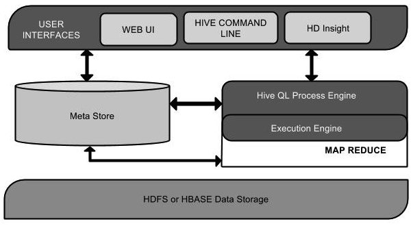

Apache Hive™是一个数据仓库软件。他的主要用途是 `使用sql语法` 读取、编写和管理 驻留在分布式存储中的大型数据集。

<!--more-->

- Hive 提供标准的 [sql功能](https://cwiki.apache.org/confluence/display/Hive/Apache+Hive+SQL+Conformance)，
包含 [sql2003](https://en.wikipedia.org/wiki/SQL:2003)、 [sql2011](https://en.wikipedia.org/wiki/SQL:2011)和 [sql2016](https://en.wikipedia.org/wiki/SQL:20163)。
- 用户可以自定义 UDFs、UDAFs 和 UDTFs 来扩展 hive sql。
- hive 最好的工作场景是 传统的数据仓库任务，hive并不适合: OLTP、实时查询 和 行级更新。

## 架构

图片来自 https://www.yiibai.com/hive/ 

- user-interface：提供 用户 与 hive 的交互界面.
- MetaStore：Hive选择各自的数据库服务器，用以储存表，数据库，列模式或元数据表，它们的数据类型和HDFS映射。		
- HiveQL处理引擎：HiveQL 类似于 SQL 的查询上 MetaStore 模式信息。这是传统的方式进行 MapReduce 程序的替代品之一。相反，使用Java编写的MapReduce程序，可以编写为MapReduce工作，并处理它的查询。
- 执行引擎：HiveQL处理引擎和MapReduce的结合部分是由Hive执行引擎。执行引擎处理查询并产生结果和MapReduce的结果一样。它采用MapReduce方法。
- HDFS 或 HBASE：Hadoop的分布式文件系统或者HBASE数据存储技术是用于将数据存储到文件系统。原文出自【易百教程】，商业转载请联系作者获得授权，非商业请保留原文链接：https://www.yiibai.com/hive/

