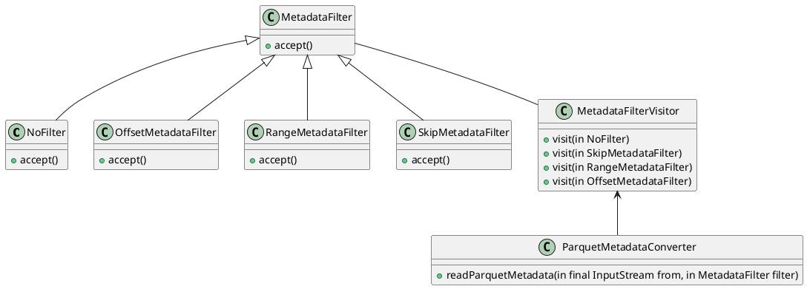

---

title: parquetMetaData

date: 2019-03-13 19:22:00

categories: [hadoop生态,parquet]

tags: [parquet]

---

parquetMetaData 结构

<!--more-->

```puml
@startuml
class NoFilter{
  + accept()
}

class OffsetMetadataFilter{
  + accept()
}

class RangeMetadataFilter{
  + accept()
}

class SkipMetadataFilter{
  + accept()
}


class MetadataFilter{
  + accept()
}

MetadataFilter <|-- NoFilter
MetadataFilter <|-- OffsetMetadataFilter
MetadataFilter <|-- RangeMetadataFilter
MetadataFilter <|-- SkipMetadataFilter


class MetadataFilterVisitor{
  + visit(in NoFilter)
  + visit(in SkipMetadataFilter)
  + visit(in RangeMetadataFilter)
  + visit(in OffsetMetadataFilter)
}

MetadataFilter -- MetadataFilterVisitor

class ParquetMetadataConverter{
  + readParquetMetadata(in final InputStream from, in MetadataFilter filter)
}


MetadataFilterVisitor <-- ParquetMetadataConverter


@enduml
```