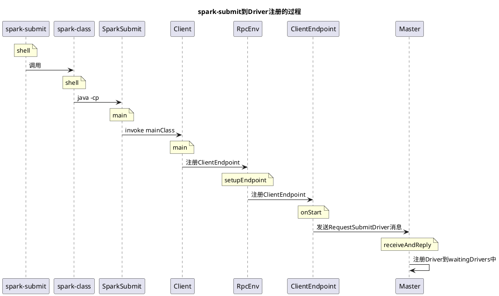

# spark-submit的提交过程 

介绍在Standalone模式下，从命令行使用spark-submit提交任务开始，到将Driver提交到Master的过程。

## 一、spark-submit提交任务

下面是Spark doc中的一个命令行提交的例子，也是我们分析任务调度的起点 

```sh
./bin/spark-submit \
  --class org.apache.spark.examples.SparkPi \
  --master spark:xxxx \
  --deploy-mode cluster \
  --supervise \
  --executor-memory 20G \
  --total-executor-core 100 \
  /path/to/examples.jar \
  1000
```

注意，上图中的deploy-mode为**cluster**，spark-submit脚本的过程可参见 上一篇文章《spark0-spark_submit脚本执行逻辑》。

最终运行为：

```bash
/opt/jdk1.8/bin/java \
  -Dhdp.version=2.6.0.3-8 \
  -cp /usr/hdp/current/spark2-historyserver/conf/:/usr/hdp/2.6.0.3-8/spark2/jars/*:/usr/hdp/current/hadoop-client/conf/ \
  org.apache.spark.deploy.SparkSubmit \
  --class org.apache.spark.examples.SparkPi \
  --master spark:xxxx \
  --deploy-mode cluster \
  --supervise \
  --executor-memory 20G \
  --total-executor-core 100 \
  /path/to/examples.jar \
  1000

```

## 二、org.apache.spark.deploy.SparkSubmit

shell中调用了 SparkSubmit 的main函数，main函数主要逻辑:
处理传入的配置信息并设置为环境变量(Driver、RestSubmissionClient或Client通过环境变量读取此配置)、使用类加载器加载配置的jar等。

```scala
    // 解析执行下面的四个参数: 需要注意的是 childMainClass。
    // childMainClass 根据spark的模式 会分为多种情况: 
    // - org.apache.spark.deploy.Client 
    // - org.apache.spark.deploy.yarn.Client
    // - org.apache.spark.deploy.rest.RestSubmissionClient
    // - 用户自定义的app类
    //
    // 在本例子中为 org.apache.spark.deploy.Client 
    val (childArgs, childClasspath, sysProps, childMainClass) = prepareSubmitEnvironment(args)
 
    //声明doRunMain()方法
    def doRunMain(): Unit = {
      if (args.proxyUser != null) {
        val proxyUser = UserGroupInformation.createProxyUser(args.proxyUser,
          UserGroupInformation.getCurrentUser())
        try {
          proxyUser.doAs(new PrivilegedExceptionAction[Unit]() {
            override def run(): Unit = {
              runMain(childArgs, childClasspath, sysProps, childMainClass, args.verbose)
            }
          })
        } catch {
         //忽略
        }
      } else {
        // 一般默认走这里
        runMain(childArgs, childClasspath, sysProps, childMainClass, args.verbose)
      }
    }

    if (args.isStandaloneCluster && args.useRest) {
      try {
        printStream.println("Running Spark using the REST application submission protocol.")
        doRunMain()
      } catch {
       //忽略
      }
    // In all other modes, just run the main class as prepared
    } else {
      doRunMain()
    }
```

通过反射启动**childMainClass**:

在例子中 childMainClass 代表 `org.apache.spark.deploy.Client`

```scala
private def runMain(
      childArgs: Seq[String],
      childClasspath: Seq[String],
      sysProps: Map[String, String],
      childMainClass: String,
      verbose: Boolean): Unit = {
   //...
    val loader =
      if (sysProps.getOrElse("spark.driver.userClassPathFirst", "false").toBoolean) {
        new ChildFirstURLClassLoader(new Array[URL](0),
          Thread.currentThread.getContextClassLoader)
      } else {
        new MutableURLClassLoader(new Array[URL](0),
          Thread.currentThread.getContextClassLoader)
      }
    Thread.currentThread.setContextClassLoader(loader)

    // 将jar 以 URL 的形式加入 loader
    for (jar <- childClasspath) {
      addJarToClasspath(jar, loader)
    }
    // 环境变量
    for ((key, value) <- sysProps) {
      System.setProperty(key, value)
    }
    // 反射 主类 并启动 主类
    var mainClass: Class[_] = null
    try {
      mainClass = Utils.classForName(childMainClass)
    } catch {
      //忽略
    }
    // 忽略
    
    val mainMethod = mainClass.getMethod("main", new Array[String](0).getClass)
    if (!Modifier.isStatic(mainMethod.getModifiers)) {
      throw new IllegalStateException("The main method in the given main class must be static")
    }
    //忽略
    
    // 反射启动主类
    try {
      mainMethod.invoke(null, childArgs.toArray)
    } catch {
      // 忽略
    }
  }
```


## 三、SparkSubmit发送消息 向 master 注册 Driver

SparkSubmit的反射子类(childMainClass)根据不同模式 会有多种类型

- org.apache.spark.deploy.Client
- org.apache.spark.deploy.yarn.Client
- org.apache.spark.deploy.rest.RestSubmissionClient
- 用户自定义的app类

这里 我们选择StandaloneCluster模式进行说明，SparkSubmit使用反射运行`org.apache.spark.deploy.Client.main()`
Client的main方法先处理传入的参数，然后创建RpcEnv对象。
如下: 

```scala
object Client {
  def main(args: Array[String]) {
    //....
    
    val conf = new SparkConf()
    val driverArgs = new ClientArguments(args)
    if (!conf.contains("spark.rpc.askTimeout")) {
      conf.set("spark.rpc.askTimeout", "10s")
    }
    Logger.getRootLogger.setLevel(driverArgs.logLevel)
	//创建PRC_ENV
    val rpcEnv =
      RpcEnv.create("driverClient", Utils.localHostName(), 0, conf, new SecurityManager(conf))
    // 获取与Master通信的EndPoint
    val masterEndpoints = driverArgs.masters.map(RpcAddress.fromSparkURL).
      map(rpcEnv.setupEndpointRef(_, Master.ENDPOINT_NAME))
	//注册ClientEndpoint
    rpcEnv.setupEndpoint("client", new ClientEndpoint(rpcEnv, driverArgs, masterEndpoints, conf))

    rpcEnv.awaitTermination()
  }
}
```

ClientEndpoint 的 onStart()方法会 发送消息给Master，注册Driver

```scala
override def onStart(): Unit = {
    driverArgs.cmd match {
      case "launch" =>
        //Spark使用**DriverWrapper**启动用户APP的main函数，而不是直接启动，
        // 这是为了Driver程序和启动Driver的Worker程序共命运(源码注释中称为**share fate**).
        // 即如果此Worker挂了，对应的Driver也会停止。
        val mainClass = "org.apache.spark.deploy.worker.DriverWrapper"

        val classPathConf = "spark.driver.extraClassPath"
        val classPathEntries = sys.props.get(classPathConf).toSeq.flatMap { cp =>
          cp.split(java.io.File.pathSeparator)
        }

        val libraryPathConf = "spark.driver.extraLibraryPath"
        val libraryPathEntries = sys.props.get(libraryPathConf).toSeq.flatMap { cp =>
          cp.split(java.io.File.pathSeparator)
        }

        val extraJavaOptsConf = "spark.driver.extraJavaOptions"
        val extraJavaOpts = sys.props.get(extraJavaOptsConf)
          .map(Utils.splitCommandString).getOrElse(Seq.empty)
        val sparkJavaOpts = Utils.sparkJavaOpts(conf)
        val javaOpts = sparkJavaOpts ++ extraJavaOpts
        // 运行命令
        //  这里的mainClass为org.apache.spark.deploy.worker.DriverWrapper
        val command = new Command(mainClass,
          Seq("{{WORKER_URL}}", "{{USER_JAR}}", driverArgs.mainClass) ++ driverArgs.driverOptions,
          sys.env, classPathEntries, libraryPathEntries, javaOpts)

        val driverDescription = new DriverDescription(
          driverArgs.jarUrl,
          driverArgs.memory,
          driverArgs.cores,
          driverArgs.supervise,
          command)
        // 给Master发送RequestSubmitDriver消息，注册Driver
        ayncSendToMasterAndForwardReply[SubmitDriverResponse](
          RequestSubmitDriver(driverDescription))

      case "kill" =>
        val driverId = driverArgs.driverId
        ayncSendToMasterAndForwardReply[KillDriverResponse](RequestKillDriver(driverId))
    }
  }
```

如上所示**Driver信息**的主要包含 jarUrl、memory、cores、command和supervisor。
信息除了command外均容易理解，查看Command的内容

```Scala
private[spark] case class Command(
    mainClass: String, // DriverWrapper
    arguments: Seq[String], 
    environment: Map[String, String],
    classPathEntries: Seq[String],
    libraryPathEntries: Seq[String],
    javaOpts: Seq[String]) {
} 
```

至此，Client提交 Driver 流程结束了。

## 四、Master处理RequestSubmitDriver消息

Master(`org.apache.spark.deploy.master.Master`)的receiveAndReply方法接收Client发送的消息**RequestSubmitDriver**，将收到的Driver注册到waitingDrivers。

```scala
override def receiveAndReply(context: RpcCallContext): PartialFunction[Any, Unit] = {
    case RegisterWorker(
        id, workerHost, workerPort, workerRef, cores, memory, workerWebUiUrl) =>

    case RequestSubmitDriver(description) =>
      if (state != RecoveryState.ALIVE) {
        // 判断 Master 的运行状态，非 ALIVE 则 报错。
        val msg = s"${Utils.BACKUP_STANDALONE_MASTER_PREFIX}: $state. " +
          "Can only accept driver submissions in ALIVE state."
        context.reply(SubmitDriverResponse(self, false, None, msg))
      } else {
        logInfo("Driver submitted " + description.command.mainClass)
        val driver = createDriver(description)
        // 持久化Driver 用于master recovery 时恢复Driver
        persistenceEngine.addDriver(driver)
        // 注册 Driver
        waitingDrivers += driver
        drivers.add(driver)
        // launch Driver 和 Executor，这个下一章分析
        schedule()
        context.reply(SubmitDriverResponse(self, true, Some(driver.id),
          s"Driver successfully submitted as ${driver.id}"))
      }

    case RequestKillDriver(driverId) =>
     //...

    case RequestDriverStatus(driverId) =>
     //...

    case RequestMasterState =>
     //...

    case BoundPortsRequest =>
     //...

    case RequestExecutors(appId, requestedTotal) =>
     //...

    case KillExecutors(appId, executorIds) =>
     //...
  }
```

## 五、总结

介绍了deploy-mode=cluster模式下，从命令行提交任务，到Master端接收并注册Driver的过程，完整流程如下 





