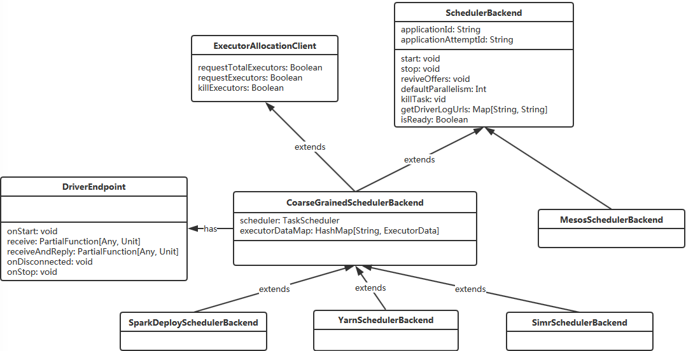

# 启动用户编写的App

上一篇讲到了Worker进程使用**java.lang.ProcessBuilder**执行**java -cp**命令启动用户编写的程序。

```bash
java -cp $SPARK_ASSEMBLY_JAR \
  -Xms1024M -Xmx1024M -Dakka.loglevel=WARNING \
  -Dspark.executor.memory=512m \
  -Dspark.driver.supervise=false \
  -Dspark.submit.deployMode=cluster \
  -Dspark.app.name=org.apache.spark.examples.SparkPi \
  -Dspark.rpc.askTimeout=10 \
  -Dspark.master=$MasterUrl -XX:MaxPermSize=256m \
  org.apache.spark.deploy.worker.DriverWrapper \
  $WorkerUrl \
  /path/to/example.jar \
  org.apache.spark.examples.SparkPi \
  1000
```

通过 DriverWrapper 来启动 用户编写的应用程序(本文为sparkPi程序):

```scala
object DriverWrapper {
  def main(args: Array[String]) {
    args.toList match {
      case workerUrl :: userJar :: mainClass :: extraArgs =>
        val conf = new SparkConf()
        val rpcEnv = RpcEnv.create("Driver",
          Utils.localHostName(), 0, conf, new SecurityManager(conf))
        rpcEnv.setupEndpoint("workerWatcher", new WorkerWatcher(rpcEnv, workerUrl))

        val currentLoader = Thread.currentThread.getContextClassLoader
        val userJarUrl = new File(userJar).toURI().toURL()
        val loader =
          if (sys.props.getOrElse("spark.driver.userClassPathFirst", "false").toBoolean) {
            new ChildFirstURLClassLoader(Array(userJarUrl), currentLoader)
          } else {
            new MutableURLClassLoader(Array(userJarUrl), currentLoader)
          }
        Thread.currentThread.setContextClassLoader(loader)

        // Delegate to supplied main class
        val clazz = Utils.classForName(mainClass)
        val mainMethod = clazz.getMethod("main", classOf[Array[String]])
        mainMethod.invoke(null, extraArgs.toArray[String])

        rpcEnv.shutdown()

      case _ =>
        // scalastyle:off println
        System.err.println("Usage: DriverWrapper <workerUrl> <userJar> <driverMainClass> [options]")
        // scalastyle:on println
        System.exit(-1)
    }
  }
}
```

## SparkPi程序

SparkPi程序 代码如下:

```scala
import scala.math.random
import org.apache.spark._

/** Computes an approximation to pi */
object SparkPi {
  def main(args: Array[String]) {
    if (args.length == 0) {
      System.err.println("Usage: SparkPi <master> [<slices>]")
      System.exit(1)
    }
    val spark = new SparkContext(args(0), "SparkPi",
      System.getenv("SPARK_HOME"), SparkContext.jarOfClass(this.getClass))
    val slices = if (args.length > 1) args(1).toInt else 2
    val n = 100000 * slices
    val count = spark.parallelize(1 to n, slices).map { i =>
      val x = random * 2 - 1
      val y = random * 2 - 1
      if (x*x + y*y < 1) 1 else 0
    }.reduce(_ + _)
    println("Pi is roughly " + 4.0 * count / n)
    spark.stop()
  }
}
```

## SparkContext初始化

该类全类名 org.apache.spark.SparkContext。下面的SparkContext初始化的主要代码过程。


```scala
class SparkContext(config: SparkConf) extends Logging {
  // 将所有参数整合，clone 出一个完整的SparkConf对象(SparkConf会加载所有的以"spark."开头的系统变量),
  // 然后用该SparkConf对象构造SparkContext
  private[spark] def this(
      master: String, 
      appName: String, 
      sparkHome: String, 
      jars: Seq[String]) =
    this(master, appName, sparkHome, jars, Map())
 // SparkContext的初始化主要在 try 代码块中
  try{
	//校验逻辑和基本配置设置省略
      
    // "_jobProgressListener" should be set up before creating SparkEnv because when creating
    // "SparkEnv", some messages will be posted to "listenerBus" and we should not miss them.
    _jobProgressListener = new JobProgressListener(_conf)
    listenerBus.addListener(jobProgressListener)

    // 该env中包含 serializer, RpcEnv, block manager, map output tracker, etc
    _env = createSparkEnv(_conf, isLocal, listenerBus)
    // 所有线程能够通过 SparkEnv.get()获取相关信息
    SparkEnv.set(_env)
      
    // If running the REPL, register the repl's output dir with the file server.
    _conf.getOption("spark.repl.class.outputDir").foreach { path =>
      val replUri = _env.rpcEnv.fileServer.addDirectory("/classes", new File(path))
      _conf.set("spark.repl.class.uri", replUri)
    }
    //该类用于监控 job and stage progress
    _statusTracker = new SparkStatusTracker(this)
    
    _progressBar =
      if (_conf.getBoolean("spark.ui.showConsoleProgress", true) && !log.isInfoEnabled) {
        Some(new ConsoleProgressBar(this))
      } else {
        None
      }
    // 创建spark-Ui
    _ui =
      if (conf.getBoolean("spark.ui.enabled", true)) {
        Some(SparkUI.createLiveUI(this, _conf, listenerBus, _jobProgressListener,
          _env.securityManager, appName, startTime = startTime))
      } else {
        // For tests, do not enable the UI
        None
      }
    // Bind the UI before starting the task scheduler to communicate
    // the bound port to the cluster manager properly
    _ui.foreach(_.bind())

    _hadoopConfiguration = SparkHadoopUtil.get.newConfiguration(_conf)

    // 将 jar 添加到 rpc.env.fileServer
    if (jars != null) {
      jars.foreach(addJar)
    }
    if (files != null) {
      files.foreach(addFile)
    }
      
    //校验逻辑和基本配置设置省略
    //...
      
    // register "HeartbeatReceiver" before "createTaskScheduler" because Executor will
    // retrieve "HeartbeatReceiver" in the constructor. (SPARK-6640)
    _heartbeatReceiver = env.rpcEnv.setupEndpoint(
      HeartbeatReceiver.ENDPOINT_NAME, new HeartbeatReceiver(this))

    // Create and start the scheduler
    // 在下面的章节会详情讲解TaskScheduler的创建
    val (sched, ts) = SparkContext.createTaskScheduler(this, master, deployMode)
    _schedulerBackend = sched
    _taskScheduler = ts
    _dagScheduler = new DAGScheduler(this)
    _heartbeatReceiver.ask[Boolean](TaskSchedulerIsSet)

    // start TaskScheduler after taskScheduler sets DAGScheduler reference in DAGScheduler's
    // constructor
    _taskScheduler.start()
    
    _applicationId = _taskScheduler.applicationId()
    _applicationAttemptId = taskScheduler.applicationAttemptId()
    _conf.set("spark.app.id", _applicationId)
    if (_conf.getBoolean("spark.ui.reverseProxy", false)) {
      System.setProperty("spark.ui.proxyBase", "/proxy/" + _applicationId)
    }
    _ui.foreach(_.setAppId(_applicationId))
      
    //  blockManager进行初始化
    _env.blockManager.initialize(_applicationId)

    // 启动 metricsSystem
    _env.metricsSystem.start()
    _env.metricsSystem.getServletHandlers.foreach(handler => ui.foreach(_.attachHandler(handler)))

    // 忽略
    // ...

    // 创建executor分配管理器
    val dynamicAllocationEnabled = Utils.isDynamicAllocationEnabled(_conf)
    _executorAllocationManager =
      if (dynamicAllocationEnabled) {
        schedulerBackend match {
          case b: ExecutorAllocationClient =>
            Some(new ExecutorAllocationManager(
              schedulerBackend.asInstanceOf[ExecutorAllocationClient], listenerBus, _conf))
          case _ =>
            None
        }
      } else {
        None
      }
    _executorAllocationManager.foreach(_.start())

    // 创建 cleaner for RDD, shuffle, and broadcast state
    _cleaner =
      if (_conf.getBoolean("spark.cleaner.referenceTracking", true)) {
        Some(new ContextCleaner(this))
      } else {
        None
      }
    _cleaner.foreach(_.start())
    //设置并启动监听总线ListenerBus
    setupAndStartListenerBus()
    //task scheduler准备完毕，更新SparkEnv和将SparkContext标记为激活
    postEnvironmentUpdate()
    //发送应用启动时间
    postApplicationStart()

    // Post init
    _taskScheduler.postStartHook()
    //注册dagScheduler.metricsSource
    _env.metricsSystem.registerSource(_dagScheduler.metricsSource)
    //注册BlockManagerSource
    _env.metricsSystem.registerSource(new BlockManagerSource(_env.blockManager))
    //注册executorAllocationManagerSource
    _executorAllocationManager.foreach { e =>
      _env.metricsSystem.registerSource(e.executorAllocationManagerSource)
    }

    // Make sure the context is stopped if the user forgets about it. This avoids leaving
    // unfinished event logs around after the JVM exits cleanly. It doesn't help if the JVM
    // is killed, though.
    logDebug("Adding shutdown hook") // force eager creation of logger
    _shutdownHookRef = ShutdownHookManager.addShutdownHook(
      ShutdownHookManager.SPARK_CONTEXT_SHUTDOWN_PRIORITY) { () =>
      logInfo("Invoking stop() from shutdown hook")
      stop()
    }
  } catch {
    case NonFatal(e) =>
      logError("Error initializing SparkContext.", e)
      try {
        stop()
      } catch {
        case NonFatal(inner) =>
          logError("Error stopping SparkContext after init error.", inner)
      } finally {
        throw e
      }
  }
```

## TaskScheduler的创建与启动

上文中有这一段代码，在该章节详细讲解。

```scala
val (sched, ts) = SparkContext.createTaskScheduler(this, master, deployMode)
_schedulerBackend = sched
_taskScheduler = ts
_dagScheduler = new DAGScheduler(this)
_heartbeatReceiver.ask[Boolean](TaskSchedulerIsSet)

_taskScheduler.start()
```


### TaskScheduler的创建

全路径 org.apache.spark.SparkContext 下的 createTaskScheduler 方法

**TaskSchedulerImpl**: 继承自TaskScheduler

- 作用在Driver中: 将DAGScheduler生成的task，使用SchedulerBackend和DriverEndpoint发送给Executor。

```scala
// 返回 SchedulerBackend, TaskScheduler
private def createTaskScheduler(
      sc: SparkContext,
      master: String,
      deployMode: String): (SchedulerBackend, TaskScheduler) = {
    import SparkMasterRegex._

    master match {
      //忽略其他case
      case SPARK_REGEX(sparkUrl) =>
        val scheduler = new TaskSchedulerImpl(sc)
        val masterUrls = sparkUrl.split(",").map("spark://" + _)
        val backend = new StandaloneSchedulerBackend(scheduler, sc, masterUrls)
        scheduler.initialize(backend)
        (backend, scheduler)
    }
  }
```

**TaskScheduler的初始化:** 

全路径 org.apache.spark.scheduler.TaskSchedulerImpl

```scala
  def initialize(backend: SchedulerBackend) {
    this.backend = backend
    schedulableBuilder = {
      schedulingMode match {
        //先入先出
        case SchedulingMode.FIFO =>
          new FIFOSchedulableBuilder(rootPool)
        //公平策略
        case SchedulingMode.FAIR =>
          new FairSchedulableBuilder(rootPool, conf)
        case _ =>
          throw new IllegalArgumentException(s"Unsupported $SCHEDULER_MODE_PROPERTY: " +
          s"$schedulingMode")
      }
    }
    schedulableBuilder.buildPools()
  }
```

### TaskScheduler的启动

全路径 org.apache.spark.scheduler.TaskSchedulerImpl 下的 start 方法

```scala
override def start() {
  //本文为 StandaloneSchedulerBackend 
  backend.start()

  if (!isLocal && conf.getBoolean("spark.speculation", false)) {
    logInfo("Starting speculative execution thread")
    speculationScheduler.scheduleWithFixedDelay(new Runnable {
      override def run(): Unit = Utils.tryOrStopSparkContext(sc) {
        checkSpeculatableTasks()
      }
    }, SPECULATION_INTERVAL_MS, SPECULATION_INTERVAL_MS, TimeUnit.MILLISECONDS)
  }
}
```

**StandaloneSchedulerBackend**:

- 调用父类**CoarseGrainedSchedulerBackend**的start方法创建**DriverEndPoint**
- 创建 **AppClient** 并向 Master 注册。

```scala
override def start() {
    //向RpcEnv注册DriverEndpoint:用于提交task到Executor，接收Executor返回的计算结果
    super.start()
    
    //忽略相关变量赋值
    
    //生成APP的完整描述信息
    val appDesc = ApplicationDescription(sc.appName, maxCores, sc.executorMemory, command,
      webUrl, sc.eventLogDir, sc.eventLogCodec, coresPerExecutor, initialExecutorLimit)
    //用于和 Spark standalone cluster manager 建立连接
    client = new StandaloneAppClient(sc.env.rpcEnv, masters, appDesc, this, conf)
    //注册ClientEndpoint，ClientEndpoint的生命周期方法onStart中会和Master通信，注册APP
    client.start()
    launcherBackend.setState(SparkAppHandle.State.SUBMITTED)
    waitForRegistration()
    launcherBackend.setState(SparkAppHandle.State.RUNNING)
  }
```


## SchedulerBackend接口

SchedulerBackend有几个实现类，分别针对不同的资源管理器，如下 




1. **ExecutorAllocationClient**: 负责向资源管理器申请Executor。
2. **DriverEndpoint**: 底层提交task到Executor，接收Executor返回的计算结果。
3. **CoarseGrainedSchedulerBackend**: 粗粒度的SchedulerBackend实现，使用集合executorDataMap维护和Executor通信的RpcEndpointRef，主要实现有SparkDeploySchedulerBackend、YarnSchedulerBackend、SimrSchedulerBackend。
4. **SparkDeploySchedulerBackend**: 用于和Standalone资源管理器及Executor通信，其他实现YarnSchedulerBackend**、**MesosSchedulerBackend等分别对应Yarn和Mesos。


## 总结

最后，完整流程如下 。

**注**：图中的 SparkDeploySchedulerBackend 应该为 StandaloneSchedulerBackend。


注释：

①，Driver端注册**DriverEndpoint**到RpcEnv的流程，之后DriverEndpoint用于和Executor通信，包括send task和接收返回的计算结果。

②，Driver向Master注册APP的流程。

