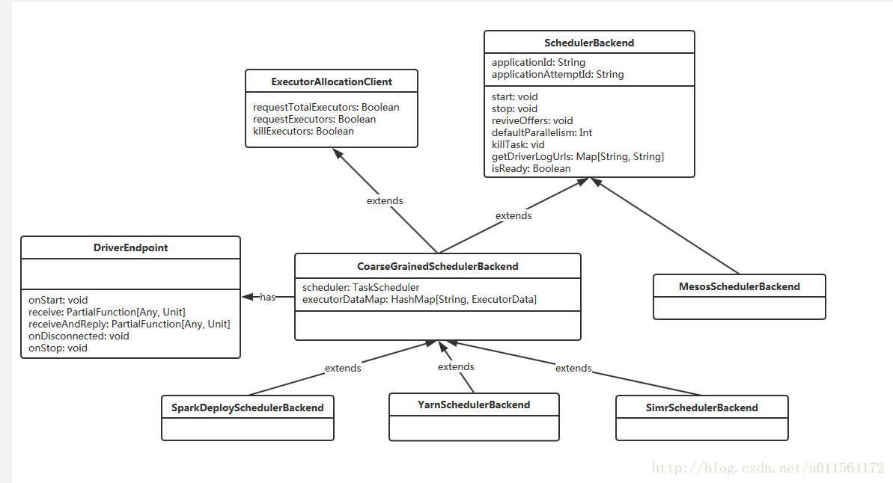
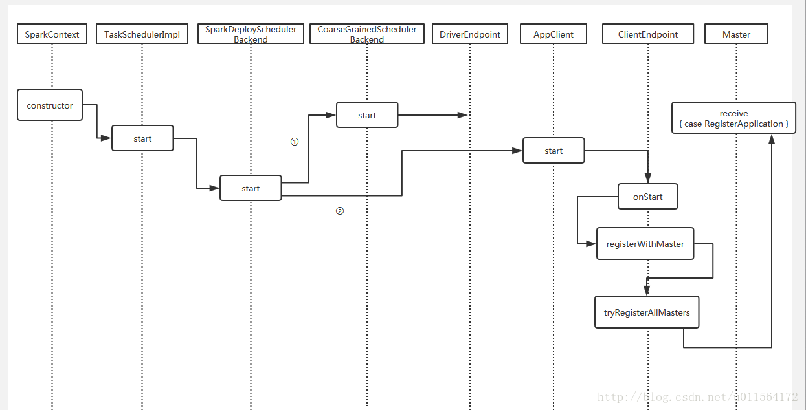

# 注册App

上一篇讲到了Worker进程使用**java.lang.ProcessBuilder**执行**java -cp**命令启动用户编写的程序。

## 简介

执行用户程序的main方法，初始化SparkContext，SparkContext初始化过程中其中主要涉及到三个对象，**AppClient**、**SparkDeploySchedulerBackend**和**TaskScheduler**，这三个对象完成了本篇的Register APP过程，以及后续讲到的和Executor的交互，主要为提交task和接收Executor返回的计算结果。

## 一、SparkDeploySchedulerBackend

**SparkDeploySchedulerBackend**是SchedulerBackend的实现类，作用于Driver内，维护了和Executor的通信，配合**TaskScheduler**提交任务到Executor，以及接收Executor的计算结果。SchedulerBackend有几个实现类，分别针对不同的资源管理器，如下 



1. **ExecutorAllocationClient**: 负责向资源管理器申请Executor。
2. **DriverEndpoint**: 底层提交task到Executor，接收Executor返回的计算结果。
3. **CoarseGrainedSchedulerBackend**: 粗粒度的SchedulerBackend实现，使用集合executorDataMap维护和Executor通信的RpcEndpointRef，主要实现有SparkDeploySchedulerBackend、YarnSchedulerBackend、SimrSchedulerBackend。
4. **SparkDeploySchedulerBackend**: 用于和Standalone资源管理器及Executor通信，其他实现YarnSchedulerBackend**、**MesosSchedulerBackend等分别对应Yarn和Mesos。

## 二、TaskScheduler

TaskScheduler的主要作用是，将DAGScheduler生成的task，使用SchedulerBackend和DriverEndpoint发送给Executor，跟这篇文章相关的是，Register App的行为始于其实现类TaskSchedulerImpl的start方法，

```
TaskScheduler

成员变量：
  def rootPool: Pool
  def schedulingMode: SchedulingMode
  def defaultParallelism(): Int
  def applicationId(): String = appId
  def applicationAttemptId(): Option[String]
方法
  def start(): Unit
  def postStartHook():Unit
  def stop(): Unit
  def submitTasks(taskSet: TaskSet): Unit
  def cancelTasks(stageId: Int, interruptThread: Boolean): Unit
  def setDAGScheduler(dagScheduler: DAGScheduler): Unit
  def executorLost(executorId: String, reason: ExecutorLossReason): Unit
  def executorHeartbeatReceived(
      execId: String,
      accumUpdates: Array[(Long, Seq[AccumulatorV2[_, _]])],
      blockManagerId: BlockManagerId): Boolean
```


## 三、Register App

#### 3.1 什么是Register App

打开Standalone模式下的管理页面，会看到Workers、Running Applications等信息。 

其中的**Running Applications**和**Completed Applications**分别是正在运行的程序和已完成程序。

**Register App流程**是指，Driver运行时，将管理页面所示的信息注册到Master的过程。

#### 3.2 流程

上一篇讲到了使用**java -cp**命令启动用户编写的程序，我们使用的例子是SparkPi，如下 

```scala
import scala.math.random
import org.apache.spark._

/** Computes an approximation to pi */
object SparkPi {
  def main(args: Array[String]) {
    if (args.length == 0) {
      System.err.println("Usage: SparkPi <master> [<slices>]")
      System.exit(1)
    }
    val spark = new SparkContext(args(0), "SparkPi",
      System.getenv("SPARK_HOME"), SparkContext.jarOfClass(this.getClass))
    val slices = if (args.length > 1) args(1).toInt else 2
    val n = 100000 * slices
    val count = spark.parallelize(1 to n, slices).map { i =>
      val x = random * 2 - 1
      val y = random * 2 - 1
      if (x*x + y*y < 1) 1 else 0
    }.reduce(_ + _)
    println("Pi is roughly " + 4.0 * count / n)
    spark.stop()
  }
}
```

**Register App** 行为始于上图中的SparkContext初始化，可以参考[SparkContext初始化过程](http://blog.csdn.net/u011564172/article/details/54927873)，在其初始化时，会创建**SparkDeploySchedulerBackend**和**TaskScheduler**对象，并调用TaskScheduler的start方法正式开始Register App的流程，如下 

```scala
//根据资源管理器类型，创建对应的SchedulerBackend、TaskScheduler
//Standalone模式 为 SparkDeploySchedulerBackend
val (sched,ts) =SaprkContext.createTaskScheduler(this,master)
_schedulerBackend = sched
_taskScheduler = ts
_dagScheduler = new DAGScheduler(this)
_heartbeatReceiver.ask[Boolean](TaskSchedulerIsSet)
//启动TaskScheduler、SchedulerBackend 注册APP
_taskScheduler.start()
```

接下来调用 SparkDeploySchedulerBackend 的 start 方法，其 start 方法调用父类CoarseGrainedSchedulerBackend的start方法，父类的start方法中注册**DriverEndpoint**到RpcEnv，DriverEndpoint用于提交task到Executor，接收Executor返回的计算结果。 
此外，SparkDeploySchedulerBackend的start方法会初始化AppClient，并执行其start方法，start方法中注册**ClientEndpoint**，ClientEndpoint的生命周期方法onStart中会和Master通信，注册APP。

看下Master端对APP的注册 

```scala
private def registerApplication(app: ApplicationInfo): Unit = {
    val appAddress = app.driver.address
    if (addressToApp.contains(appAddress)) {
      logInfo("Attempted to re-register application at same address: " + appAddress)
      return
    }

    applicationMetricsSystem.registerSource(app.appSource)
    // 注册 App
    apps += app
    idToApp(app.id) = app
    endpointToApp(app.driver) = app
    addressToApp(appAddress) = app
    waitingApps += app
    if (reverseProxy) {
      webUi.addProxyTargets(app.id, app.desc.appUiUrl)
    }
  }
```

最后，完整流程如下 



注释：

①，Driver端注册**DriverEndpoint**到RpcEnv的流程，之后DriverEndpoint用于和Executor通信，包括send task和接收返回的计算结果。

②，Driver向Master注册APP的流程。

