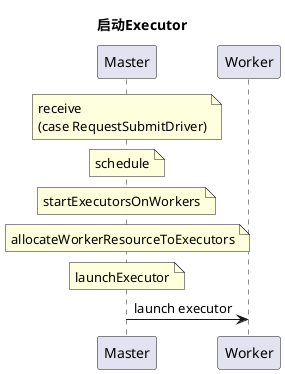

# 启动Executor

## 一、回顾

在《1、提交driver》已经介绍过，org.apache.spark.deploy.master.Master 的 receiveAndReply方法接收Client发送的消息RequestSubmitDriver。

前面已经介绍了schedule()中launchDriver的流程，即《2、启动driver》。

```scala
override def receiveAndReply(context: RpcCallContext): PartialFunction[Any, Unit] = {
    case RequestSubmitDriver(description) =>
      if (state != RecoveryState.ALIVE) {
        val msg = s"${Utils.BACKUP_STANDALONE_MASTER_PREFIX}: $state. " +
          "Can only accept driver submissions in ALIVE state."
        context.reply(SubmitDriverResponse(self, false, None, msg))
      } else {
        logInfo("Driver submitted " + description.command.mainClass)
        val driver = createDriver(description)
        // 持久化Driver 用于master recovery 时恢复Driver
        persistenceEngine.addDriver(driver)
        // 注册 Driver
        waitingDrivers += driver
        drivers.add(driver)
        // launch Driver 和 Executor
        schedule()
        context.reply(SubmitDriverResponse(self, true, Some(driver.id),
          s"Driver successfully submitted as ${driver.id}"))
      }
    ...
  }
```

本篇继续介绍schedule()方法另一个部分，**Launch Executor**

```scala
private def schedule(): Unit = {
  if (state != RecoveryState.ALIVE) {
    return
  }
  // 打乱Worker顺序，避免Driver过度集中
  val shuffledAliveWorkers = Random.shuffle(workers.toSeq.filter(_.state == WorkerState.ALIVE))
  val numWorkersAlive = shuffledAliveWorkers.size
  var curPos = 0
  // 遍历Worker。如果Work节点剩余内存和core足够，启动Driver
  // deploy-mode=cluster模式下，注册的Driver信息都在waitingDrivers中
  for (driver <- waitingDrivers.toList) { // iterate over a copy of waitingDrivers
    var launched = false
    var numWorkersVisited = 0
    while (numWorkersVisited < numWorkersAlive && !launched) {
      val worker = shuffledAliveWorkers(curPos)
      numWorkersVisited += 1
      if (worker.memoryFree >= driver.desc.mem && worker.coresFree >= driver.desc.cores) {
        //启动Driver  
        launchDriver(worker, driver)
        waitingDrivers -= driver
        launched = true
      }
      curPos = (curPos + 1) % numWorkersAlive
    }
  }
  //启动 Executor
  startExecutorsOnWorkers()
}
```

## 二、启动Executor前的准备

查看**startExecutorsOnWorkers**方法 

```scala
private def startExecutorsOnWorkers(): Unit = {
    // waitingApps 就是 《3、注册App》注册的 ApplicationInfo ，主要是core和memory
    // 该过程就是简单的FIFO
    for (app <- waitingApps if app.coresLeft > 0) {
      val coresPerExecutor: Option[Int] = app.desc.coresPerExecutor
      // 选出剩余core和memory满足Executor启动参数的work
      val usableWorkers = workers.toArray.filter(_.state == WorkerState.ALIVE)
        .filter(worker => worker.memoryFree >= app.desc.memoryPerExecutorMB &&
          worker.coresFree >= coresPerExecutor.getOrElse(1))
        .sortBy(_.coresFree).reverse
      //spark Executor资源调度
      //assignedCores 为每个Worker分配的core数
      val assignedCores = scheduleExecutorsOnWorkers(app, usableWorkers, spreadOutApps)

      // 根据分配好的assignedCores，在相应的worker节点启动Executor
      for (pos <- 0 until usableWorkers.length if assignedCores(pos) > 0) {
        allocateWorkerResourceToExecutors(
          app, assignedCores(pos), coresPerExecutor, usableWorkers(pos))
      }
    }
  }
```

如上图注释，waitingApps信息主要是我们通过命令行传入的core和memory信息，startExecutorsOnWorkers方法的职责是调度**waitingApps**，即将core和memory分配到具体的Worker，[Spark 任务调度之Register App](http://blog.csdn.net/u011564172/article/details/69062339)介绍了Driver注册app的流程。 

**scheduleExecutorsOnWorkers**方法中，可以使用**spreadOutApps**算法分配资源，即Executor分布在尽可能多的Worker节点上，相反，也支持Executor聚集在某些Worker节点上，通过参数**spark.deploy.spreadOut**配置，默认为true，如下 

```scala
 private val spreadOutApps = conf.getBoolean("spark.deploy.spreadOut", true)
```

## 三、Launch Executor

**startExecutorsOnWorkers**方法中，最后调用allocateWorkerResourceToExecutors方法，如下 

```scala
 private def allocateWorkerResourceToExecutors(
      app: ApplicationInfo,
      assignedCores: Int,
      coresPerExecutor: Option[Int],
      worker: WorkerInfo): Unit = {
    // 计算Executor总数，总数= 分配的总core数 / 一个Executor所需的core数
    // 如果Executor所需的core没有指定，这总core数仅分配给一个Executor
    val numExecutors = coresPerExecutor.map { assignedCores / _ }.getOrElse(1)
    val coresToAssign = coresPerExecutor.getOrElse(assignedCores)
    for (i <- 1 to numExecutors) {
      val exec = app.addExecutor(worker, coresToAssign)
      // 启动
      launchExecutor(worker, exec)
      app.state = ApplicationState.RUNNING
    }
  }
```

上图最后处调用**launchExecutor**方法，如下 

```scala
private def launchExecutor(worker: WorkerInfo, exec: ExecutorDesc): Unit = {
    logInfo("Launching executor " + exec.fullId + " on worker " + worker.id)
    worker.addExecutor(exec)
    //给Worker发送LaunchExecutor信息
    worker.endpoint.send(LaunchExecutor(masterUrl,
      exec.application.id, exec.id, exec.application.desc, exec.cores, exec.memory))
    //给Driver发送Executor信息，用于Driver的4040端口显示
    exec.application.driver.send(
      ExecutorAdded(exec.id, worker.id, worker.hostPort, exec.cores, exec.memory))
  }
```

如上图注释，给Worker节点发送LaunchExecutor消息，Worker节点收到消息，Launch Executor部分就结束了，下一部分具体讲Executor在Worker节点的启动，最后，Worker接收LaunchExecutor消息对应代码如下:

```scala
 case LaunchExecutor(masterUrl, appId, execId, appDesc, cores_, memory_) =>
      if (masterUrl != activeMasterUrl) {
        logWarning("Invalid Master (" + masterUrl + ") attempted to launch executor.")
      } else {
        try {
          logInfo("Asked to launch executor %s/%d for %s".format(appId, execId, appDesc.name))

          // 创建Executor运行目录
          val executorDir = new File(workDir, appId + "/" + execId)
          if (!executorDir.mkdirs()) {
            throw new IOException("Failed to create directory " + executorDir)
          }
            
          val appLocalDirs = appDirectories.getOrElse(appId,
            Utils.getOrCreateLocalRootDirs(conf).map { dir =>
              val appDir = Utils.createDirectory(dir, namePrefix = "executor")
              Utils.chmod700(appDir)
              appDir.getAbsolutePath()
            }.toSeq)
          appDirectories(appId) = appLocalDirs
          // 构造Executor
          val manager = new ExecutorRunner(
            appId,
            execId,
            appDesc.copy(command = Worker.maybeUpdateSSLSettings(appDesc.command, conf)),
            cores_,
            memory_,
            self,
            workerId,
            host,
            webUi.boundPort,
            publicAddress,
            sparkHome,
            executorDir,
            workerUri,
            conf,
            appLocalDirs, ExecutorState.RUNNING)
          executors(appId + "/" + execId) = manager
          //启动Executor
          manager.start()
          coresUsed += cores_
          memoryUsed += memory_
          sendToMaster(ExecutorStateChanged(appId, execId, manager.state, None, None))
        } catch {
         ...
        }
      }
```


# 总结

介绍Master节点Launch Executor的过程，分两步

1. **schedule waitingApps**
2. **launch Executor**

流程如下 

