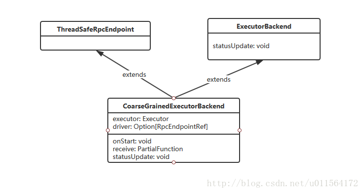
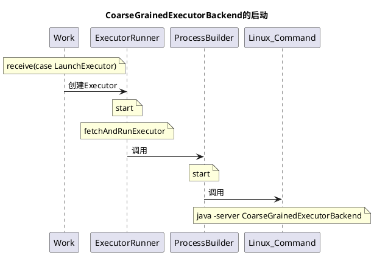

# 启动CoarseGrainedExecutorBackend进程

**Executor**负责计算任务，即执行task，而Executor对象的创建及维护是由`CoarseGrainedExecutorBackend`负责的，CoarseGrainedExecutorBackend在spark运行期是一个单独的进程.

##一、CoarseGrainedExecutorBackend类



1. `CoarseGrainedExecutorBackend`是**RpcEndpoint**的子类，能够和Driver进行RPC通信。
2. `CoarseGrainedExecutorBackend`维护了两个属性executor和driver，executor负责运行task，driver负责和Driver通信。
3. ExecutorBackend有抽象方法statusUpdate，负责将Executor的计算结果返回给Driver。

最后，CoarseGrainedExecutorBackend是spark运行期的一个进程，Executor运行在该进程内。


## 二、启动过程


### 2.1 uml



### 2.2 详细过程

在Worker进程收到LauncherExecutor消息后，Worker 会将消息封装为**ExecutorRunner**对象，调用其start方法。

```scala
 override def receive: PartialFunction[Any, Unit] = synchronized {
    case LaunchExecutor(masterUrl, appId, execId, appDesc, cores_, memory_) =>
      if (masterUrl != activeMasterUrl) {
        logWarning("Invalid Master (" + masterUrl + ") attempted to launch executor.")
      } else {
        try {
         ....
          val manager = new ExecutorRunner(
            appId,
            execId,
            appDesc.copy(command = Worker.maybeUpdateSSLSettings(appDesc.command, conf)),
            cores_,
            memory_,
            self,
            workerId,
            host,
            webUi.boundPort,
            publicAddress,
            sparkHome,
            executorDir,
            workerUri,
            conf,
            appLocalDirs, ExecutorState.RUNNING)
          executors(appId + "/" + execId) = manager
          manager.start()
          coresUsed += cores_
          memoryUsed += memory_
          sendToMaster(ExecutorStateChanged(appId, execId, manager.state, None, None))
        } catch {
         ....
        }
      }
     ......
 }
```

start方法启动线程，调用ExecutorRunner的fetchAndRunExecutor方法，

```scala
  private[worker] def start() {
    workerThread = new Thread("ExecutorRunner for " + fullId) {
      override def run() { fetchAndRunExecutor() }
    }
    workerThread.start()
    shutdownHook = ShutdownHookManager.addShutdownHook { () =>
      if (state == ExecutorState.RUNNING) {
        state = ExecutorState.FAILED
      }
      killProcess(Some("Worker shutting down")) }
  }
```

fetchAndRunExecutor方法中将收到的信息拼接为Linux命令，然后使用**ProcessBuilder**执行Linux命令启动CoarseGrainedExecutorBackend

```scala
  private def fetchAndRunExecutor() {
    try {
      // Launch the process
      val builder = CommandUtils.buildProcessBuilder(appDesc.command, new SecurityManager(conf),
        memory, sparkHome.getAbsolutePath, substituteVariables)
      val command = builder.command()
      val formattedCommand = command.asScala.mkString("\"", "\" \"", "\"")
      logInfo(s"Launch command: $formattedCommand")

      builder.directory(executorDir)
      builder.environment.put("SPARK_EXECUTOR_DIRS", appLocalDirs.mkString(File.pathSeparator))
      // In case we are running this from within the Spark Shell, avoid creating a "scala"
      // parent process for the executor command
      builder.environment.put("SPARK_LAUNCH_WITH_SCALA", "0")

      // Add webUI log urls
      val baseUrl =
        if (conf.getBoolean("spark.ui.reverseProxy", false)) {
          s"/proxy/$workerId/logPage/?appId=$appId&executorId=$execId&logType="
        } else {
          s"http://$publicAddress:$webUiPort/logPage/?appId=$appId&executorId=$execId&logType="
        }
      builder.environment.put("SPARK_LOG_URL_STDERR", s"${baseUrl}stderr")
      builder.environment.put("SPARK_LOG_URL_STDOUT", s"${baseUrl}stdout")

      process = builder.start()
      val header = "Spark Executor Command: %s\n%s\n\n".format(
        formattedCommand, "=" * 40)

      // Redirect its stdout and stderr to files
      val stdout = new File(executorDir, "stdout")
      stdoutAppender = FileAppender(process.getInputStream, stdout, conf)

      val stderr = new File(executorDir, "stderr")
      Files.write(header, stderr, StandardCharsets.UTF_8)
      stderrAppender = FileAppender(process.getErrorStream, stderr, conf)

      // Wait for it to exit; executor may exit with code 0 (when driver instructs it to shutdown)
      // or with nonzero exit code
      val exitCode = process.waitFor()
      state = ExecutorState.EXITED
      val message = "Command exited with code " + exitCode
      worker.send(ExecutorStateChanged(appId, execId, state, Some(message), Some(exitCode)))
    } catch {
      case interrupted: InterruptedException =>
        logInfo("Runner thread for executor " + fullId + " interrupted")
        state = ExecutorState.KILLED
        killProcess(None)
      case e: Exception =>
        logError("Error running executor", e)
        state = ExecutorState.FAILED
        killProcess(Some(e.toString))
    }
  }
```

ProcessBuilder执行的Linux命令大致如下

```
./jdk-8u161-linux-x64.tar.gz/jdk1.8.0_161/bin/java 
-server -Xmx4096m 
-Djava.io.tmpdir=/home/hadoop/tmp/nm-local-dir/usercache/xxxxx/appcache/application_1519271509270_0745/container_1519271509270_0745_01_000003/tmp 
'-Dspark.ui.port=0' 
'-Dspark.driver.port=37011' 
-Dspark.yarn.app.container.log.dir=/home/hadoop/hadoop-2.7.3/logs/userlogs/application_1519271509270_0745/container_1519271509270_0745_01_000003 
-XX:OnOutOfMemoryError='kill %p' 
org.apache.spark.executor.CoarseGrainedExecutorBackend 
--driver-url spark://CoarseGrainedScheduler@10.100.1.131:37011 
--executor-id 2 
--hostname slave131 
--cores 8 
--app-id application_1519271509270_0745 
--user-class-path file:/home/hadoop/tmp/nm-local-dir/usercache/xxxxx/appcache/application_1519271509270_0745/container_1519271509270_0745_01_000003/__app__.jar 
1>/home/hadoop/hadoop-2.7.3/logs/userlogs/application_1519271509270_0745/container_1519271509270_0745_01_000003/stdout 
2>/home/hadoop/hadoop-2.7.3/logs/userlogs/application_1519271509270_0745/container_1519271509270_0745_01_000003/stderr
```

java命令会调用CoarseGrainedExecutorBackend的main方法，main方法中处理命令行传入的参数，将参赛传给run方法，然后run方法中创建RpcEnv，并注册CoarseGrainedExecutorBackend

```scala
private def run(
      driverUrl: String,
      executorId: String,
      hostname: String,
      cores: Int,
      appId: String,
      workerUrl: Option[String],
      userClassPath: Seq[URL]) {

    Utils.initDaemon(log)

    SparkHadoopUtil.get.runAsSparkUser { () =>
      // Debug code
      Utils.checkHost(hostname)

      // Bootstrap to fetch the driver's Spark properties.
      val executorConf = new SparkConf
      val port = executorConf.getInt("spark.executor.port", 0)
      val fetcher = RpcEnv.create(
        "driverPropsFetcher",
        hostname,
        port,
        executorConf,
        new SecurityManager(executorConf),
        clientMode = true)
      val driver = fetcher.setupEndpointRefByURI(driverUrl)
      val cfg = driver.askSync[SparkAppConfig](RetrieveSparkAppConfig)
      val props = cfg.sparkProperties ++ Seq[(String, String)](("spark.app.id", appId))
      fetcher.shutdown()

      // Create SparkEnv using properties we fetched from the driver.
      val driverConf = new SparkConf()
      for ((key, value) <- props) {
        // this is required for SSL in standalone mode
        if (SparkConf.isExecutorStartupConf(key)) {
          driverConf.setIfMissing(key, value)
        } else {
          driverConf.set(key, value)
        }
      }
      if (driverConf.contains("spark.yarn.credentials.file")) {
        logInfo("Will periodically update credentials from: " +
          driverConf.get("spark.yarn.credentials.file"))
        SparkHadoopUtil.get.startCredentialUpdater(driverConf)
      }

      val env = SparkEnv.createExecutorEnv(
        driverConf, executorId, hostname, port, cores, cfg.ioEncryptionKey, isLocal = false)

      env.rpcEnv.setupEndpoint("Executor", new CoarseGrainedExecutorBackend(
        env.rpcEnv, driverUrl, executorId, hostname, cores, userClassPath, env))
      workerUrl.foreach { url =>
        env.rpcEnv.setupEndpoint("WorkerWatcher", new WorkerWatcher(env.rpcEnv, url))
      }
      env.rpcEnv.awaitTermination()
      SparkHadoopUtil.get.stopCredentialUpdater()
    }
  }
```

## 参考

[Spark 任务调度之启动CoarseGrainedExecutorBackend](http://blog.csdn.net/u011564172/article/details/69703662)


