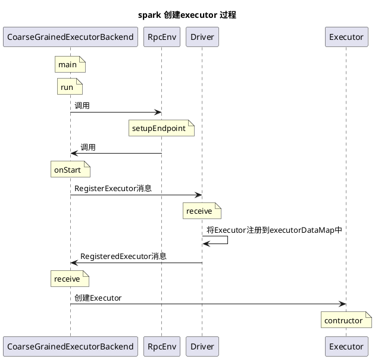
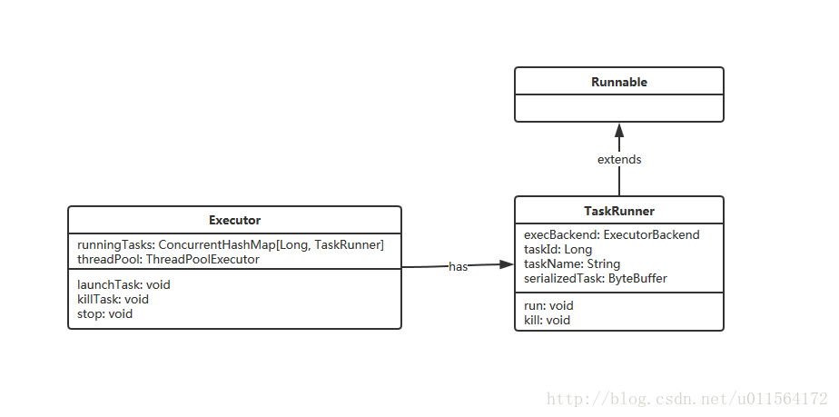

# spark 创建executor 过程

[TOC]

## 一、uml 图

下面的简单过程是 

1. CoarseGrainedExecutorBackend 介绍Executor 给Drive
2. Drive注册完成Executor
3. CoarseGrainedExecutorBackend 创建Executor

注： Drive 在类CoarseGrainedSchedulerBackend.scala中


## 二、Executor

Executor运行在Worker节点，主要负责执行task和cache数据。 

### 2.1 Executor 类图



介绍TaskRunner和Executor的主要作用

1. **TaskRunner**: 运行期Executor收到Driver发送的task信息，将其封装为TaskRunner，同时，TaskRunner继承Runnable，Executor使用线程池threadpool调度TaskRunner。 
2. **Executor**: 有两个重要属性，runningTasks和threadPool，分别用于维护正在运行的TaskRunner和调度TaskRunner线程。将收到的task信息封装为TaskRunner及执行TaskRunner的行为发生在Executor的**launchTask**方法中。

```Scala
  def launchTask(context: ExecutorBackend, taskDescription: TaskDescription): Unit = {
    val tr = new TaskRunner(context, taskDescription)
    runningTasks.put(taskDescription.taskId, tr)
    threadPool.execute(tr)
  }
```
## 三、创建Executor过程

在启动 CoarseGrainedExecutorBackend 进程后，CoarseGrainedExecutorBackend会将自己注册到RpcEnv中，注册之后会调用CoarseGrainedExecutorBackend的`onStart`方法，该方法会向Driver发送`RegisterExecutor`消息。

CoarseGrainedExecutorBackend.scala

```scala
  override def onStart() {
    logInfo("Connecting to driver: " + driverUrl)
    rpcEnv.asyncSetupEndpointRefByURI(driverUrl).flatMap { ref =>
      // This is a very fast action so we can use "ThreadUtils.sameThread"
      driver = Some(ref)
      ref.ask[Boolean](RegisterExecutor(executorId, self, hostname, cores, extractLogUrls))
    }(ThreadUtils.sameThread).onComplete {
      // This is a very fast action so we can use "ThreadUtils.sameThread"
      case Success(msg) =>
        // Always receive `true`. Just ignore it
      case Failure(e) =>
        exitExecutor(1, s"Cannot register with driver: $driverUrl", e, notifyDriver = false)
    }(ThreadUtils.sameThread)
  }
```

查看Driver对该消息的处理(CoarseGrainedSchedulerBackend.scala)，Driver中先修改Executor信息有关的集合和变量，即**注册Executor到Driver**，Driver使用**executorDataMap**集合保存Executor信息。然后返回消息**RegisteredExecutor**给CoarseGrainedExecutorBackend。

CoarseGrainedSchedulerBackend.scala

```scala
 class DriverEndpoint(override val rpcEnv: RpcEnv, sparkProperties: Seq[(String, String)])
    extends ThreadSafeRpcEndpoint with Logging {
        .....
  override def receiveAndReply(context: RpcCallContext): PartialFunction[Any, Unit] = {

      case RegisterExecutor(executorId, executorRef, hostname, cores, logUrls) =>
        if (executorDataMap.contains(executorId)) {
          executorRef.send(RegisterExecutorFailed("Duplicate executor ID: " + executorId))
          context.reply(true)
        } else if (scheduler.nodeBlacklist != null &&
          scheduler.nodeBlacklist.contains(hostname)) {
          // If the cluster manager gives us an executor on a blacklisted node (because it
          // already started allocating those resources before we informed it of our blacklist,
          // or if it ignored our blacklist), then we reject that executor immediately.
          logInfo(s"Rejecting $executorId as it has been blacklisted.")
          executorRef.send(RegisterExecutorFailed(s"Executor is blacklisted: $executorId"))
          context.reply(true)
        } else {
          // If the executor's rpc env is not listening for incoming connections, `hostPort`
          // will be null, and the client connection should be used to contact the executor.
          // 修改Executor信息有关的集合和变量
          val executorAddress = if (executorRef.address != null) {
              executorRef.address
            } else {
              context.senderAddress
            }
          logInfo(s"Registered executor $executorRef ($executorAddress) with ID $executorId")
          addressToExecutorId(executorAddress) = executorId
          totalCoreCount.addAndGet(cores)
          totalRegisteredExecutors.addAndGet(1)
          val data = new ExecutorData(executorRef, executorRef.address, hostname,
            cores, cores, logUrls)
          // This must be synchronized because variables mutated
          // in this block are read when requesting executors
          CoarseGrainedSchedulerBackend.this.synchronized {
            executorDataMap.put(executorId, data)
            if (currentExecutorIdCounter < executorId.toInt) {
              currentExecutorIdCounter = executorId.toInt
            }
            if (numPendingExecutors > 0) {
              numPendingExecutors -= 1
              logDebug(s"Decremented number of pending executors ($numPendingExecutors left)")
            }
          }
          // 给 Executor 返回RegisteredExecutor消息
          executorRef.send(RegisteredExecutor)
          // Note: some tests expect the reply to come after we put the executor in the map
          context.reply(true)
          listenerBus.post(
            SparkListenerExecutorAdded(System.currentTimeMillis(), executorId, data))
          makeOffers()
        }
      ......
    }
     ....
}
```

查看CoarseGrainedExecutorBackend中对RegisteredExecutor消息的处理 ,CoarseGrainedExecutorBackend创建了Executor对象，创建完毕的Executord对象此后用于执行Driver发送的task。 

CoarseGrainedExecutorBackend.scala

```scala
 override def receive: PartialFunction[Any, Unit] = {
    case RegisteredExecutor =>
      logInfo("Successfully registered with driver")
      try {
        executor = new Executor(executorId, hostname, env, userClassPath, isLocal = false)
      } catch {
        case NonFatal(e) =>
          exitExecutor(1, "Unable to create executor due to " + e.getMessage, e)
      }
```

