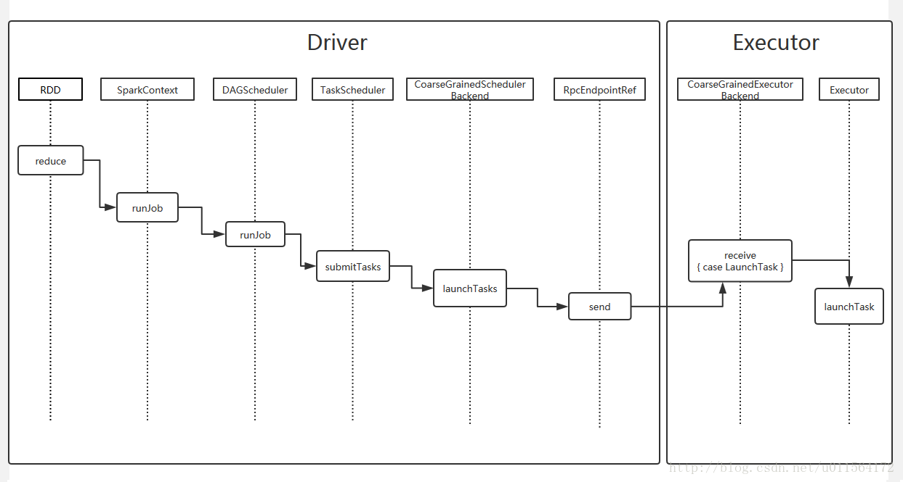

# 概要

本篇博客是[Spark 任务调度概述](http://blog.csdn.net/u011564172/article/details/65653617)详细流程中的第七部分，介绍Driver发送task到Executor的过程。

# 执行用户编写代码

[Spark 任务调度之Register App](http://blog.csdn.net/u011564172/article/details/69062339)中介绍了Driver中初始化SparkContext对象及注册APP的流程，SparkContext初始化完毕后，执行用户编写代码，仍以SparkPi为例，如下 

```scala
object SparkPi {
  def main(args: Array[String]) {
    val spark = SparkSession
      .builder
      .appName("Spark Pi")
      .getOrCreate()
    val slices = if (args.length > 0) args(0).toInt else 2
    val n = math.min(100000L * slices, Int.MaxValue).toInt // avoid overflow
    val count = spark.sparkContext.parallelize(1 until n, slices).map { i =>
      val x = random * 2 - 1
      val y = random * 2 - 1
      if (x*x + y*y <= 1) 1 else 0
    }.reduce(_ + _)
    println(s"Pi is roughly ${4.0 * count / (n - 1)}")
    spark.stop()
  }
} 
```

如上图，SparkPi中调用RDD的**reduce**，reduce中 
调用SparkContext.runJob方法提交任务，SparkContext.runJob方法调用DAGScheduler.runJob方法，如下

 ```scala
 def reduce(f: (T, T) => T): T = withScope {
    val cleanF = sc.clean(f)
    val reducePartition: Iterator[T] => Option[T] = iter => {
      if (iter.hasNext) {
        Some(iter.reduceLeft(cleanF))
      } else {
        None
      }
    }
    var jobResult: Option[T] = None
    val mergeResult = (index: Int, taskResult: Option[T]) => {
      if (taskResult.isDefined) {
        jobResult = jobResult match {
          case Some(value) => Some(f(value, taskResult.get))
          case None => taskResult
        }
      }
    }
    sc.runJob(this, reducePartition, mergeResult)
    // Get the final result out of our Option, or throw an exception if the RDD was empty
    jobResult.getOrElse(throw new UnsupportedOperationException("empty collection"))
  }
 ```

```scala
def runJob[T, U: ClassTag](
      rdd: RDD[T],
      func: (TaskContext, Iterator[T]) => U,
      partitions: Seq[Int],
      resultHandler: (Int, U) => Unit): Unit = {
    if (stopped.get()) {
      throw new IllegalStateException("SparkContext has been shutdown")
    }
    val callSite = getCallSite
    val cleanedFunc = clean(func)
    logInfo("Starting job: " + callSite.shortForm)
    if (conf.getBoolean("spark.logLineage", false)) {
      logInfo("RDD's recursive dependencies:\n" + rdd.toDebugString)
    }
    //生成task并提交
    dagScheduler.runJob(rdd, cleanedFunc, partitions, callSite, resultHandler, localProperties.get)
    progressBar.foreach(_.finishAll())
    rdd.doCheckpoint()
  }
```

# DAGScheduler生成task

DAGScheduler中，根据rdd的[Dependency](http://blog.csdn.net/u011564172/article/details/54312200)生成stage，stage分为ShuffleMapStage和ResultStage两种类型，根据stage类型生成对应的task，分别是ShuffleMapTask、ResultTask，最后调用TaskScheduler提交任务

# TaskScheduler提交task

TaskScheduler中使用**TaskSetManager**管理TaskSet，submitTasks方法最终调用**CoarseGrainedSchedulerBackend**的launchTasks方法将task发送到Executor，如下 

```scala
private def launchTasks(tasks: Seq[Seq[TaskDescription]]) {
      for (task <- tasks.flatten) {
        val serializedTask = TaskDescription.encode(task)
        if (serializedTask.limit() >= maxRpcMessageSize) {
          scheduler.taskIdToTaskSetManager.get(task.taskId).foreach { taskSetMgr =>
            try {
              var msg = "Serialized task %s:%d was %d bytes, which exceeds max allowed: " +
                "spark.rpc.message.maxSize (%d bytes). Consider increasing " +
                "spark.rpc.message.maxSize or using broadcast variables for large values."
              msg = msg.format(task.taskId, task.index, serializedTask.limit(), maxRpcMessageSize)
              taskSetMgr.abort(msg)
            } catch {
              case e: Exception => logError("Exception in error callback", e)
            }
          }
        }
        else {
          // executorDataMap 保存Executor的连接方式
          val executorData = executorDataMap(task.executorId)
          executorData.freeCores -= scheduler.CPUS_PER_TASK

          logDebug(s"Launching task ${task.taskId} on executor id: ${task.executorId} hostname: " +
            s"${executorData.executorHost}.")

          executorData.executorEndpoint.send(LaunchTask(new SerializableBuffer(serializedTask)))
        }
      }
    }
```

**executorDataMap**中保存了Executor的连接方式，关于Executor如何注册到**executorDataMap**中，参考[Spark 任务调度之创建Executor](http://blog.csdn.net/u011564172/article/details/69922241)。

# Executor接收Task

Worker节点的**CoarseGrainedExecutorBackend**进程接收Driver发送的task，交给Executor对象处理，如下 

```Scala
  case LaunchTask(data) =>
      if (executor == null) {
        exitExecutor(1, "Received LaunchTask command but executor was null")
      } else {
        val taskDesc = TaskDescription.decode(data.value)
        logInfo("Got assigned task " + taskDesc.taskId)
        executor.launchTask(this, taskDesc)
      }
```

Executor的创建过程请参考[Spark 任务调度之创建Executor](http://blog.csdn.net/u011564172/article/details/69922241)。

至此从RDD的action开始，至Executor对象接收任务的流程就结束了。

# 总结

介绍了从RDD的action开始，到Executor接收到task的流程，其中省略了DAG相关的部分，后续单独介绍，整理流程大致如下 

