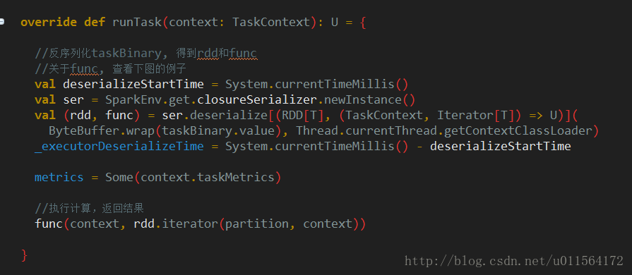
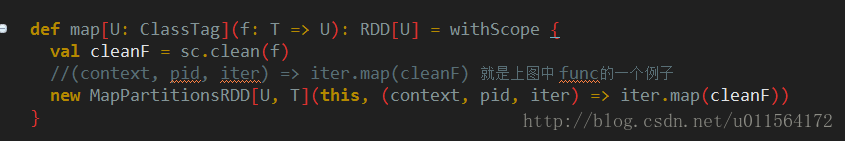
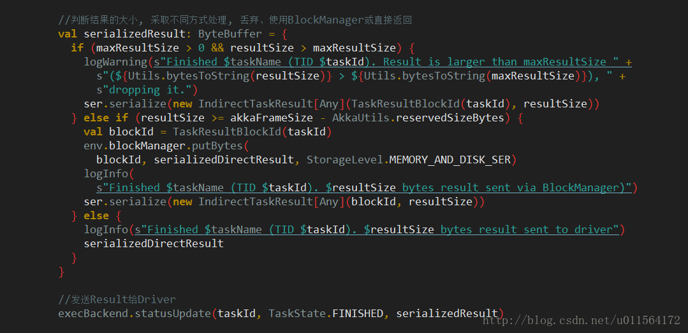

# 概要

本篇博客是[Spark 任务调度概述](http://blog.csdn.net/u011564172/article/details/65653617)详细流程中的最后一部分，介绍Executor执行task并返回result给Driver。

# receive task

上一篇博客[Spark 任务调度之Driver send Task](http://blog.csdn.net/u011564172/article/details/69706510)，最后讲到Executor接收Task，如下 

```scala
 case LaunchTask(data) =>
      if (executor == null) {
        exitExecutor(1, "Received LaunchTask command but executor was null")
      } else {
        val taskDesc = TaskDescription.decode(data.value)
        logInfo("Got assigned task " + taskDesc.taskId)
        executor.launchTask(this, taskDesc)
      }
```

Executor的launchTask方法将收到的信息封装为TaskRunner对象，TaskRunner继承自Runnable，Executor使用线程池threadPool调度TaskRunner，如下 

```scala
def launchTask(context: ExecutorBackend, taskDescription: TaskDescription): Unit = {
    val tr = new TaskRunner(context, taskDescription)
    runningTasks.put(taskDescription.taskId, tr)
    threadPool.execute(tr)
  }
```

接下来查看TaskRunner中run方法对应的逻辑，我将其分为**deserialize task**、**run task**、**sendback result**三部分。

# deserialize task

```scala
 override def run(): Unit = {
      threadId = Thread.currentThread.getId
      Thread.currentThread.setName(threadName)
      val threadMXBean = ManagementFactory.getThreadMXBean
     //taskMemoryManager 管理每个task的内存
      val taskMemoryManager = new TaskMemoryManager(env.memoryManager, taskId)
      val deserializeStartTime = System.currentTimeMillis()
      val deserializeStartCpuTime = if (threadMXBean.isCurrentThreadCpuTimeSupported) {
        threadMXBean.getCurrentThreadCpuTime
      } else 0L
      Thread.currentThread.setContextClassLoader(replClassLoader)
      val ser = env.closureSerializer.newInstance()
      logInfo(s"Running $taskName (TID $taskId)")
     //给Driver发送消息，通知task状态为运行中
      execBackend.statusUpdate(taskId, TaskState.RUNNING, EMPTY_BYTE_BUFFER)
      var taskStart: Long = 0
      var taskStartCpu: Long = 0
      startGCTime = computeTotalGcTime()

      try {
        // Must be set before updateDependencies() is called, in case fetching dependencies
        // requires access to properties contained within (e.g. for access control).
        Executor.taskDeserializationProps.set(taskDescription.properties)
        // 反序列化收到的task消息，结果为file和jar路劲，以及task对应的ByteBuffer
        // 从Driver下载相应的file和jar，并使用replClassLoader加载jar
        // 反序列化task对应的ByteBuffer，得到Task对象
        updateDependencies(taskDescription.addedFiles, taskDescription.addedJars)
        task = ser.deserialize[Task[Any]](
          taskDescription.serializedTask, Thread.currentThread.getContextClassLoader)
        task.localProperties = taskDescription.properties
        task.setTaskMemoryManager(taskMemoryManager)
```

如上图注释，反序列化得到Task对象。

# run task

```scala
 val value = try {
          val res = task.run(
            taskAttemptId = taskId,
            attemptNumber = taskDescription.attemptNumber,
            metricsSystem = env.metricsSystem)
          threwException = false
          res
        } finally {
          val releasedLocks = env.blockManager.releaseAllLocksForTask(taskId)
          val freedMemory = taskMemoryManager.cleanUpAllAllocatedMemory()

          if (freedMemory > 0 && !threwException) {
            val errMsg = s"Managed memory leak detected; size = $freedMemory bytes, TID = $taskId"
            if (conf.getBoolean("spark.unsafe.exceptionOnMemoryLeak", false)) {
              throw new SparkException(errMsg)
            } else {
              logWarning(errMsg)
            }
          }

          if (releasedLocks.nonEmpty && !threwException) {
            val errMsg =
              s"${releasedLocks.size} block locks were not released by TID = $taskId:\n" +
                releasedLocks.mkString("[", ", ", "]")
            if (conf.getBoolean("spark.storage.exceptionOnPinLeak", false)) {
              throw new SparkException(errMsg)
            } else {
              logInfo(errMsg)
            }
          }
        }
```


如上图注释，调用Task的run方法执行计算，Task是抽象类，其实现类有两个，**ShuffleMapTask**和**ResultTask**，分别对应shuffle和非shuffle任务。

Task的run方法调用其runTask方法执行task，我们以Task的子类**ResultTask**为例(ShuffleMapTask相比ResultTask多了一个步骤，使用**ShuffleWriter**将结果写到本地)，如下 

为了说明上图中的**func**，我们以RDD的map方法为例，如下 
 
至此，task的计算就完成了，task的run方法返回计算结果。

# sendback result


如上图注释，对计算结果进行序列化，再根据其大小采取相应方式处理，最后调用**CoarseGrainedExecutorBackend**的statusUpdate方法返回result给Driver。

# 总结

从


1. 上图①所示路径，执行task任务。
2. 上图②所示路径，将执行结果返回给Driver，后续Driver调用**TaskScheduler**处理返回结果，不再介绍。