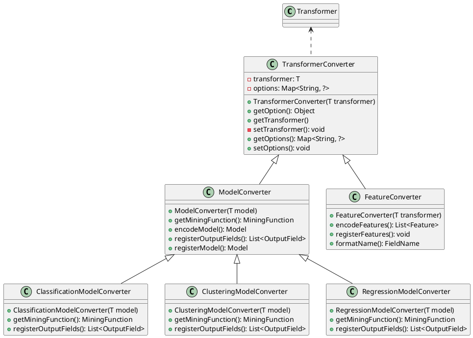

---

title: jpmml-sparkml源码结构介绍

date: 2019-03-13 16:50:00

categories: [jpmml,sparkml]

tags: [jpmml,sparkml]

---

<!--more-->

下图为 TransformerConverter 继承结构:

## TransformerConverter

TransformerConverter 有两个属性:

- transformer: 保存引用的模型或者数据转换器
- options

TransformerConverter 有两个子类:

- ModelConverter
- FeatureConverter

### ModelConverter

ModelConverter 子类的主要作用:

- registerModel(): 生成 pmml 的 miningModel。其中部分具体操作拆分成了 encodeModel()、encodeSchema()、registerOutputFields()
- getMiningFunction()抽象方法: 指定 ModelConverter 的 MiningFunction。如 CLASSIFICATION、REGRESSION等
- encodeModel()抽象方法: 生成 pmml 的 miningModel。
- encodeSchema(): 根据 MiningFunction 字段，生成不同类型的标签列，并将新生成的`标签列`和`特征列表`封装成一个schema
- registerOutputFields(): 根据是否包含 `HasProbabilityCol` 等，决定是否 新增 outputField 字段到 列表中。

#### ClassificationModelConverter

对分类模型的封装。

#### RegressionModelConverter

对回归模型的封装。

#### ClusteringModelConverter

对Clustering模型的封装。

### FeatureConverter

FeatureConverter 子类的主要作用:

- registerFeatures(): 根据transformer，填充SparkMLEncoder的columnFeatures属性。其中部分具体操作由抽象方法encodeFeatures()完成。
- encodeFeatures抽象方法: 

