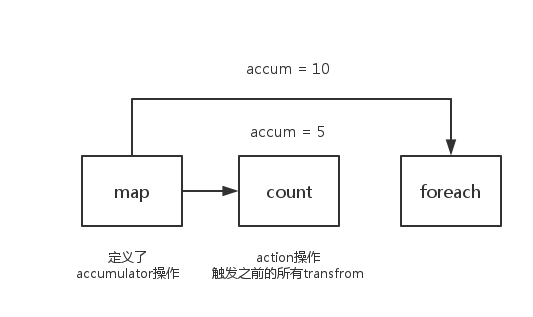
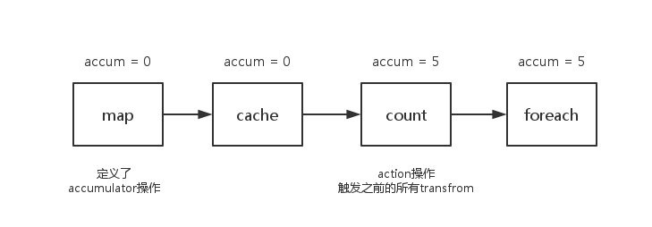

# 共享变量 -广播变量与累加器（转）

[TOC]

来源: [Spark学习笔记——广播变量与累加器](https://andone1cc.github.io/2017/03/02/Spark/%E5%B9%BF%E6%92%AD%E5%8F%98%E9%87%8F%E4%B8%8E%E7%B4%AF%E5%8A%A0%E5%99%A8/)

### 一、Spark 广播变量

#### **1.引入**

我们声明定义的变量是在Driver中产生,算子中的匿名函数是在Executor中执行的。也就是如果在Driver中定义的变量最终是要发送到task中去,task需要引用executor中线程池执行,而Executor是一个jvm进程，变量副本过多会占用jvm过多的堆内存，会引起频繁的GC、OOM。如果不使用广播变量，那么有多少个task就会在集群中有多少个变量副本。所以为了解决变量占用内存的问题，我们直接在executor层面保存一份变量即可。不用给每一个task都保存一份变量，只需要保存executor的个数那么多个。

#### **2.广播变量的原理**

task在执行的时候如果使用到了广播变量，它会找本地管理广播变量的组件(`BlockManager`)去要，如果本地的BlockManager中没有广播变量，BlockManager会去Driver端(有一个BlockManagerMaster组件)去拉取广播变量。

广播变量不是Driver主动发给executor的，而是等到哪个task执行使用到了广播变量，根据需要去取，免得浪费资源。

#### **3.使用流程**

Driver端：

```
val broadcast=sc.broatcast(变量) 广播的变量可以是基本类型和集合

```

Executor端：

```
broadcast.value

```

【注意事项】

1.广播变量只能在Driver端定义，不能在Executor端定义。

2.广播变量在Executor端不能修改。

#### **4.广播变量+map实现join算子**

因为join算子会产生shuffle,shuffle过程会有数据的移动,数据的读写I/O,占用过多的资源。所以我们在编写程序时尽量避免使用shuffle类的算子。

使用广播变量+map 实现join

适用场景：

```
一个RDD的数据量比较大，一个RDD的数据量比较小，适合用这种方式来取代join.
如果两个RDD的数据量都特别的大，那么会造成executor进程的OOM.
```

**[代码演示]**

```java
public class TestBroadCast {
 	public static void main(String[] args) {
     	SparkConf conf = new SparkConf()
                .setAppName("BroadCast")
                .setMaster("local")
                .set("spark.testing.memory", "2147480000");
        JavaSparkContext sc = new JavaSparkContext(conf);
        List<Tuple2<String, String>> nameList = Arrays.asList(
                new Tuple2<String, String>("1", "zhangsan"),
                new Tuple2<String, String>("2", "lisi"),
                new Tuple2<String, String>("3", "wangwu")
        );
        List<Tuple2<String, String>> scoreList = Arrays.asList(
                new Tuple2<String, String>("1", "90"),
                new Tuple2<String, String>("2", "80"),
                new Tuple2<String, String>("3", "89")
        );
       JavaPairRDD<String, String> nameRDD = sc.parallelizePairs(nameList);
       JavaPairRDD<String, String> scoreRDD = sc.parallelizePair(scoreList);
       List<Tuple2<String, String>> collect = nameRDD.collect();
        Map<String, String> nameMap = new HashMap<>();
        for (Tuple2<String, String> tuple2 : collect) {
            nameMap.put(tuple2._1, tuple2._2);
        }	
        final Broadcast<Map<String, String>> nMB =sc.broadcast(nameMap);
        scoreRDD.map(new Function<Tuple2<String,String>,String>(){
           private static final long serialVersionUID = 1L;
           @Override
           public String call(Tuple2<String, String> tuple) {	
                Map<String, String> nameMap = nMB.value();
                String id=tuple._1;
                String score=tuple._2;
                String name=nameMap.get(id);
                if(name != null){
                    System.out.println(id +" name:"+name +" score:"+score);
                }
                return null;
            }
        }).collect();
        sc.stop();
    }
}
```

**[执行结果]**

```
`id:1 name:zhangsan score:90
 id:2 name:lisi score:80
 id:3 name:wangwu score:89`
```

### 二、累加器

#### **1.什么是累加器？**

累加器可以看成是一个集群规模级别的一个大变量。

#### **2.累加器与广播变量比较**

`累加器`是在Driver端创建，在Driver端读取，在Executor端操作(累加操作)，在Executor端是不能读取的。

`广播变量`是在Driver端创建，在Executor端读取，在Executor端不能修改。

#### **3.利用累加器算文件的行数**

**[代码演示]**

```java
public class TestAccumulator {
    public static void main(String[] args) {
        SparkConf conf = new SparkConf()
                .setAppName("BroadCast")
                .setMaster("local")
                .set("spark.testing.memory", "2147480000");
       JavaSparkContext sc = new JavaSparkContext(conf);	
        final Accumulator<Integer> accumulator = sc.accumulator(0);	
        JavaRDD<String> userLogRDD = sc.textFile("cs");	
        userLogRDD.foreach(new VoidFunction<String>() {	
            private static final long serialVersionUID = 1L;	
            @Override
            public void call(String s) throws Exception {
                accumulator.add(1);
            }
        });
        System.out.println("line count:" + accumulator.value());
        sc.stop();
    }
}
```

#### **4.累加器的错误用法**

```scala
val accum= sc.accumulator(0, "Error Accumulator")
val data = sc.parallelize(1 to 10)	
//用accumulator统计偶数出现的次数，同时偶数返回0，奇数返回1	
val newData = data.map{x => {	
if(x%2 == 0){	
accum += 1	
0	
}else 1	
}}	
//使用action操作触发执行	
newData.count	
//此时accum的值为5，是我们要的结果	
accum.value	
//继续操作，查看刚才变动的数据,foreach也是action操作	
newData.foreach(println)	
//上个步骤没有进行累计器操作，可是累加器此时的结果已经是10了	
//这并不是我们想要的结果
accum.value
```


**原因分析**

官方对这个问题的解释如下描述:

> For accumulator updates performed inside actions only, Spark guarantees that each task’s update to the accumulator will only be applied once, i.e. restarted tasks will not update the value. In transformations, users should be aware of that each task’s update may be applied more than once if tasks or job stages are re-executed.

我们都知道，spark中的一系列transform操作会构成一串长的任务链，此时需要通过一个action操作来触发，accumulator也是一样。因此在一个action操作之前，你调用value方法查看其数值，肯定是没有任何变化的。

所以在第一次count(action操作)之后，我们发现累加器的数值变成了5，是我们要的答案。

之后又对新产生的的newData进行了一次foreach(action操作)，其实这个时候又执行了一次map(transform)操作，所以累加器又增加了5。最终获得的结果变成了10。



**解决办法**

看了上面的分析，大家都有这种印象了，那就是使用累加器的过程中只能使用一次action的操作才能保证结果的准确性。

事实上，还是有解决方案的，只要将任务之间的依赖关系切断就可以了。什么方法有这种功能呢？你们肯定都想到了，cache，persist。调用这个方法的时候会将之前的依赖切除，后续的累加器就不会再被之前的transfrom操作影响到了。



```scala
val accum= sc.accumulator(0, "Error Accumulator")
val data = sc.parallelize(1 to 10)
//代码和上方相同
val newData = data.map{x => {...}}
//使用cache缓存数据，切断依赖。
newData.cache.count
//此时accum的值为5
accum.value
newData.foreach(println)
//此时的accum依旧是5
accum.value
```


注：使用Accumulator时，为了保证准确性，只使用一次action操作。如果需要使用多次则使用cache或persist操作切断依赖。