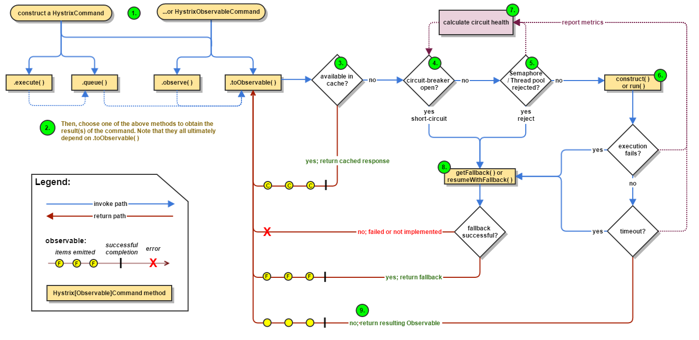
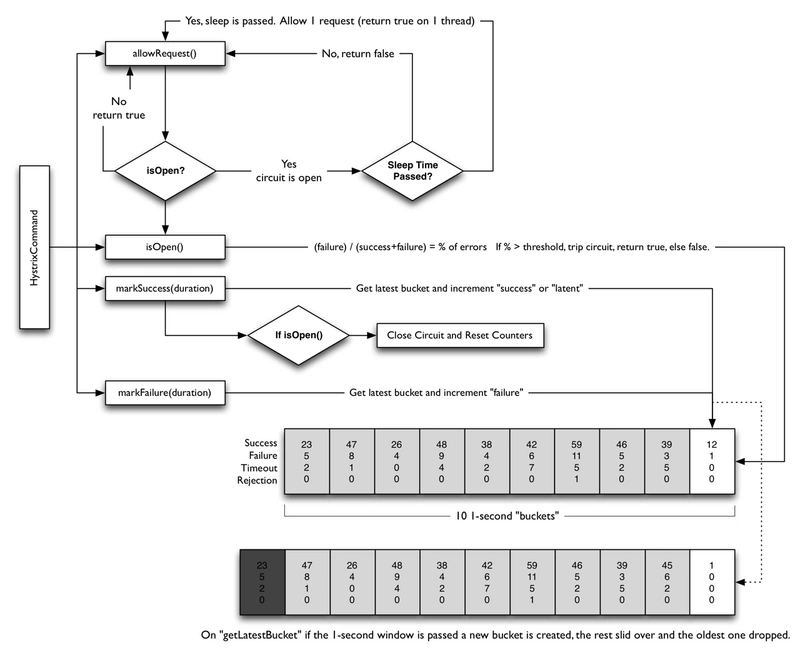
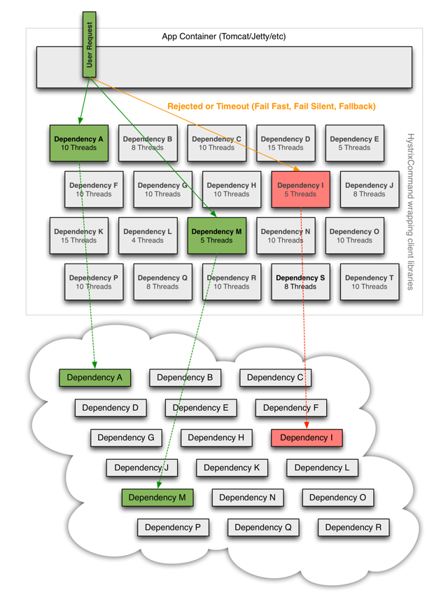

---

title: 微服务-Hystrix原理

date: 2019-03-28 13:48:00

categories: [spring,springcloud,hystrix]

tags: [spring,springcloud,hystrix]

---


Hystrix 原理 在 https://segmentfault.com/a/1190000012439580 非常详细。本文只做摘要。


<!--more-->

## 总流程



## 断路器 




## Command 

Hystrix 请求的发出 都需要 实现 HystrixCommand 或者 HystrixObservableCommand。

HystrixCommand 最常用的两个方法:

- execute() 同步执行，直接返回结果。实际是调用 `queue().get()`
- queue() 异步执行，返回Future。

HystrixObservableCommand 最常用的两个方法: 

- observe() 订阅一个从依赖请求中返回的代表响应的Observable对象
- toObservable() 返回一个Observable对象，只有当你订阅它时，它才会执行Hystrix命令并发射响应。

```text
K             value   = command.execute();
Future<K>     fValue  = command.queue();
Observable<K> ohValue = command.observe();         
Observable<K> ocValue = command.toObservable();    
```

execute() 实际调用 queue().get()
queue() 实际调用 toObservable().toBlocking().toFuture()

也就是说 任何 HystrixCommand 都是 通过 Observable 来实现的。

Observable 来自 [RxJava](https://github.com/ReactiveX/RxJava) 框架。


## 船舱隔离



## 相关文档

详细参见官方文档

https://github.com/Netflix/Hystrix/wiki/How-it-Works

中文翻译：

https://segmentfault.com/a/1190000012439580

动态时序图

https://design.codelytics.io/hystrix/how-it-works

超时机制

https://www.jianshu.com/p/60074fe1bd86