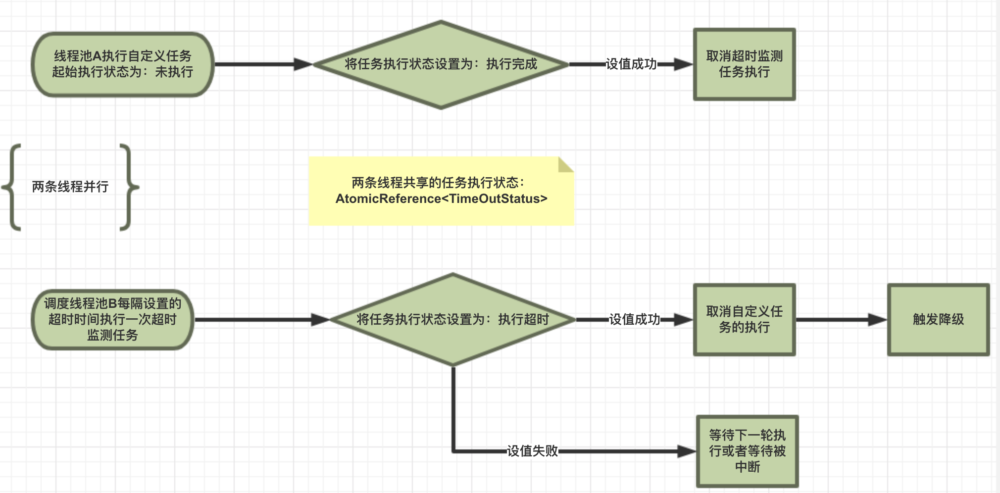

---

title: 微服务-Hystrix原理

date: 2019-03-28 13:48:00

categories: [spring,springcloud,hystrix]

tags: [spring,springcloud,hystrix]

---


Hystrix 原理 在 https://segmentfault.com/a/1190000012439580 非常详细。本文只做摘要。


<!--more-->

## 总流程


## 断路器 


## Command 

Hystrix 请求的发出 都需要 实现 HystrixCommand 或者 HystrixObservableCommand。

HystrixCommand 最常用的两个方法:

- execute() 同步执行，直接返回结果。实际是调用 `queue().get()`
- queue() 异步执行，返回Future。

HystrixObservableCommand 最常用的两个方法: 

- observe() 订阅一个从依赖请求中返回的代表响应的Observable对象
- toObservable() 返回一个Observable对象，只有当你订阅它时，它才会执行Hystrix命令并发射响应。

```text
K             value   = command.execute();
Future<K>     fValue  = command.queue();
Observable<K> ohValue = command.observe();         
Observable<K> ocValue = command.toObservable();    
```

execute() 实际调用 queue().get()
queue() 实际调用 toObservable().toBlocking().toFuture()

也就是说 任何 HystrixCommand 都是 通过 Observable 来实现的。

Observable 来自 [RxJava](https://github.com/ReactiveX/RxJava) 框架。


## 船舱隔离


## 执行超时部分源码

Hystrix 任务的执行 分为 两个部分: 业务线程和超时检测线程。这两个部分是并发执行的。
谁先更改任务执行的状态，就会主动停止另一方的执行。如下图:




### AbstractCommand.executeCommandAndObserve()

1. 并行执行业务代码和超时检测代码。
2. 设置服务降级
3. 等等

```java
abstract class AbstractCommand<R> implements HystrixInvokableInfo<R>, HystrixObservable<R> {
    // 忽略

    private Observable<R> executeCommandAndObserve(final AbstractCommand<R> _cmd) {
        // 忽略
        
        //命令执行过程中抛出异常时触发，实现降级
        final Func1<Throwable, Observable<R>> handleFallback = new Func1<Throwable, Observable<R>>() {
            @Override
            public Observable<R> call(Throwable t) {
                circuitBreaker.markNonSuccess();
                Exception e = getExceptionFromThrowable(t);
                executionResult = executionResult.setExecutionException(e);
                if (e instanceof RejectedExecutionException) {
                    return handleThreadPoolRejectionViaFallback(e);
                } else if (t instanceof HystrixTimeoutException) {
                    // 若为 超时异常，调用 超时fallBack
                    return handleTimeoutViaFallback();
                } else if (t instanceof HystrixBadRequestException) {
                    return handleBadRequestByEmittingError(e);
                } else {
                    // 忽略
                }
            }
        };
        // 忽略
       
        Observable<R> execution;
        //根据是否开启超时监测 来 创建被观察者
        if (properties.executionTimeoutEnabled().get()) {
            execution = executeCommandWithSpecifiedIsolation(_cmd)
                    .lift(new HystrixObservableTimeoutOperator<R>(_cmd));
        } else {
            execution = executeCommandWithSpecifiedIsolation(_cmd);
        }

        return execution.doOnNext(markEmits)
                .doOnCompleted(markOnCompleted)
                .onErrorResumeNext(handleFallback)
                .doOnEach(setRequestContext);
    }
    // 根据特定的策略执行命令: 线程池或者信号量
    private Observable<R> executeCommandWithSpecifiedIsolation(final AbstractCommand<R> _cmd) {
        // 线程池
        if (properties.executionIsolationStrategy().get() == ExecutionIsolationStrategy.THREAD) {
            // mark that we are executing in a thread (even if we end up being rejected we still were a THREAD execution and not SEMAPHORE)
            return Observable.defer(new Func0<Observable<R>>() {
                @Override
                public Observable<R> call() {
                    // 标记executionResult: 执行已发生
                    executionResult = executionResult.setExecutionOccurred();
                    // 将commandState设置为USER_CODE_EXECUTED。若设置失败，调用Observable.error方法返回Observable
                    if (!commandState.compareAndSet(CommandState.OBSERVABLE_CHAIN_CREATED, CommandState.USER_CODE_EXECUTED)) {
                        return Observable.error(new IllegalStateException("execution attempted while in state : " + commandState.get().name()));
                    }
                    metrics.markCommandStart(commandKey, threadPoolKey, ExecutionIsolationStrategy.THREAD);

                    //检查是否超时。若超时，调用Observable.error方法返回Observable
                    if (isCommandTimedOut.get() == TimedOutStatus.TIMED_OUT) {
                        return Observable.error(new RuntimeException("timed out before executing run()"));
                    }
                    
                    // 将 ThreadState 设置为 STARTED
                    if (threadState.compareAndSet(ThreadState.NOT_USING_THREAD, ThreadState.STARTED)) {
                        //增加 统计count
                        HystrixCounters.incrementGlobalConcurrentThreads();
                        threadPool.markThreadExecution();
                        // store the command that is being run
                        endCurrentThreadExecutingCommand = Hystrix.startCurrentThreadExecutingCommand(getCommandKey());
                        executionResult = executionResult.setExecutedInThread();

                        try {
                            executionHook.onThreadStart(_cmd);
                            executionHook.onRunStart(_cmd);
                            executionHook.onExecutionStart(_cmd);
                            return getUserExecutionObservable(_cmd);
                        } catch (Throwable ex) {
                            return Observable.error(ex);
                        }
                    } else {
                        //command has already been unsubscribed, so return immediately
                        return Observable.error(new RuntimeException("unsubscribed before executing run()"));
                    }
                }
            }).doOnTerminate(new Action0() {
                @Override
                public void call() {
                    if (threadState.compareAndSet(ThreadState.STARTED, ThreadState.TERMINAL)) {
                        handleThreadEnd(_cmd);
                    }
                    if (threadState.compareAndSet(ThreadState.NOT_USING_THREAD, ThreadState.TERMINAL)) {
                        //if it was never started and received terminal, then no need to clean up (I don't think this is possible)
                    }
                    //if it was unsubscribed, then other cleanup handled it
                }
            }).doOnUnsubscribe(new Action0() {
                @Override
                public void call() {
                    if (threadState.compareAndSet(ThreadState.STARTED, ThreadState.UNSUBSCRIBED)) {
                        handleThreadEnd(_cmd);
                    }
                    if (threadState.compareAndSet(ThreadState.NOT_USING_THREAD, ThreadState.UNSUBSCRIBED)) {
                        //if it was never started and was cancelled, then no need to clean up
                    }
                    //if it was terminal, then other cleanup handled it
                }
            }).subscribeOn(threadPool.getScheduler(new Func0<Boolean>() {
                @Override
                public Boolean call() {
                    return properties.executionIsolationThreadInterruptOnTimeout().get() && _cmd.isCommandTimedOut.get() == TimedOutStatus.TIMED_OUT;
                }
            }));
        } else {
        // 信号量 
        // 忽略
        }
    }
}
```


### HystrixObservableTimeoutOperator

1. 启动一个定时任务: 以 executionTimeoutInMilliseconds 为周期、延迟 executionTimeoutInMilliseconds 来执行。
一旦 tick() 进入 if 语句，则抛出 超时异常。
2. 添加一个观察者，当原任务执行完成后，取消 定时器。 

```java
private static class HystrixObservableTimeoutOperator<R> implements Operator<R, R> {
  // 忽略
  @Override
  public Subscriber<? super R> call(final Subscriber<? super R> child) {
    final CompositeSubscription s = new CompositeSubscription();
    child.add(s);
    final HystrixRequestContext hystrixRequestContext = HystrixRequestContext.getContextForCurrentThread();

    TimerListener listener = new TimerListener() {
      // 在延迟 executionTimeoutInMilliseconds 时间后，以executionTimeoutInMilliseconds为周期会执行 tick()
      @Override
      public void tick() {
		// 若设置成功，则取消原任务的执行 并 抛出 超时异常。
        if (originalCommand.isCommandTimedOut.compareAndSet(TimedOutStatus.NOT_EXECUTED, TimedOutStatus.TIMED_OUT)) {
          originalCommand.eventNotifier.markEvent(HystrixEventType.TIMEOUT, originalCommand.commandKey);

          //停止原来任务的执行
          s.unsubscribe();

          final HystrixContextRunnable timeoutRunnable = 
            new HystrixContextRunnable(
            		originalCommand.concurrencyStrategy, 
                hystrixRequestContext, 
                new Runnable() {

            @Override
            public void run() {
              //抛出超时异常，交由外围的onErrorResumeNext捕获触发fallback
              child.onError(new HystrixTimeoutException());
            }
          });

          timeoutRunnable.run();
        }
      }

      // 获取 外部配置的 Hystrix 调用超时间
      // 用来 作为 定时器的频率时间
      @Override
      public int getIntervalTimeInMilliseconds() {
        return originalCommand.properties.executionTimeoutInMilliseconds().get();
      }
    };

    // 以 executionTimeoutInMilliseconds 为频率，定时调用 tick()
    final Reference<TimerListener> tl = HystrixTimer.getInstance().addTimerListener(listener);

    // set externally so execute/queue can see this
    originalCommand.timeoutTimer.set(tl);

    // 在 原任务完成后，清除 定时器。
    Subscriber<R> parent = new Subscriber<R>() {

      @Override
      public void onCompleted() {
        if (isNotTimedOut()) {
          // 任务执行结束后，将TimerListener移除
          tl.clear();
          child.onCompleted();
        }
      }

      @Override
      public void onError(Throwable e) {
        if (isNotTimedOut()) {
          // 任务执行结束后，将TimerListener移除
          tl.clear();
          child.onError(e);
        }
      }

      @Override
      public void onNext(R v) {
        if (isNotTimedOut()) {
          child.onNext(v);
        }
      }

      private boolean isNotTimedOut() {
        // if already marked COMPLETED (by onNext) or succeeds in setting to COMPLETED
        return originalCommand.isCommandTimedOut.get() == TimedOutStatus.COMPLETED ||
          originalCommand.isCommandTimedOut.compareAndSet(TimedOutStatus.NOT_EXECUTED, TimedOutStatus.COMPLETED);
      }
    };

    // if s is unsubscribed we want to unsubscribe the parent
    s.add(parent);

    return parent;
  }

}
```


## 相关文档

详细参见官方文档

https://github.com/Netflix/Hystrix/wiki/How-it-Works

中文翻译：

https://segmentfault.com/a/1190000012439580

动态时序图

https://design.codelytics.io/hystrix/how-it-works

超时机制

https://www.jianshu.com/p/60074fe1bd86

**Hystrix yml属性配置详情**

https://github.com/Netflix/Hystrix/wiki/Configuration

[ppt](https://docs.google.com/presentation/d/1bF8PpsQjUCppsjqq70KtECQSPUtPHyG335OSc3vSLog/edit?usp=sharing)

Hystrix入门与分析（二）：依赖隔离之线程池隔离

https://www.cnblogs.com/haoxinyue/p/8260974.html