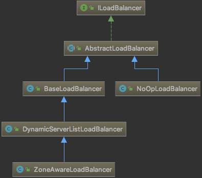
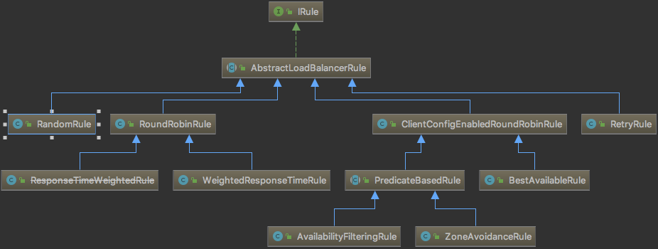

---

title: 微服务-Ribbon均衡规则

date: 2019-03-20 20:36:00

categories: [spring,springcloud]

tags: [spring,springcloud]

---


本节介绍 Ribbon 的均衡负载规则。


<!--more-->


## 均衡负载器




## 均衡规则

SpringCloud默认的均衡规则为 ZoneAvoidanceRule。



### RoundRobinRule

最多轮询10个服务实例(包括up和down)，遇到可使用(alive并且readyToServe)的实例就返回该实例，否则返回null。

```java
public Server choose(ILoadBalancer lb, Object key) {
    // 忽略
    Server server = null;
    int count = 0;
    while (server == null && count++ < 10) {
        List<Server> reachableServers = lb.getReachableServers();
        List<Server> allServers = lb.getAllServers();
        int upCount = reachableServers.size();
        int serverCount = allServers.size();
                    // 忽略
        int nextServerIndex = incrementAndGetModulo(serverCount);
        server = allServers.get(nextServerIndex);
                    // 忽略
        if (server.isAlive() && (server.isReadyToServe())) {
            return (server);
        }
        // Next.
        server = null;
    }
    // 忽略
    return server;
}

private int incrementAndGetModulo(int modulo) {
    for (;;) {
        int current = nextServerCyclicCounter.get();
        int next = (current + 1) % modulo;
        if (nextServerCyclicCounter.compareAndSet(current, next))
            return next;
    }
}
```

### RandomRule

1. 通过 `int index = rand.nextInt(serverCount);`获取 index。
2. 若 该index的实例为 alive 则返回该实例，否则 重复上面的步骤。

**RandomRule 可能出现卡死情况: 程序一直在 while 循环中 出不来。**

### RetryRule

在 `maxRetryMillis`时间内，尝试使用 RoundRobinRule 方式 获取 alive 的服务实例

### WeightedResponseTimeRule

根据实例的运行情况来计算权重，然后根据权重来挑选实例。

详细见 《spring Cloud微服务实战》113页。

### ClientConfigEnabledRoundRobinRule

该来内部直接使用 RoundRobinRule 来选择实例。没有做其他任何特别的操作。

**该来主要的作用是 作为其他高级策略的父类。**

### BestAvailableRule

选出最空闲的服务实例

### PredicateBasedRule

抽象策略：先过滤后，根据RoundRobinRule选择实例。

共两个方法:

- AbstractServerPredicate getPredicate()
- Server choose(Object key)

### AvailabilityFilteringRule

继承自 PredicateBasedRule。通过线性抽样的方式直接尝试寻找可用且叫空闲的实例来使用。

过滤方式`AvailabilityPredicate`为: 

1. 实例非故障，即断路器未断开
2. 实例的并发数小于阈值(默认 2^32 - 1)

### ZoneAvoidanceRule
该规则为默认规则。

继承自 PredicateBasedRule。使用了组合过滤方式，先`ZoneAvoidancePredicate`按区域过滤，后`AvailabilityPredicate`按可用性过滤。


## 其他

默认情况下Ribbon是懒加载的——首次请求Ribbon相关类才会初始化，这会导致首次请求过慢的问题，你可以配置饥饿加载，让Ribbon在应用启动时就初始化。

```yaml
ribbon:
  eager-load:
    enabled: true
    # 多个用,分隔
    clients: microservice-provider-user
```


## 相关文章

https://github.com/Netflix/ribbon/wiki/Working-with-load-balancers

http://www.itmuch.com/spring-cloud/finchley-8/