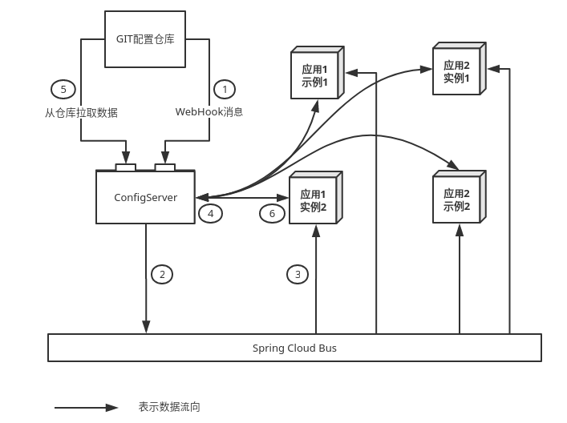
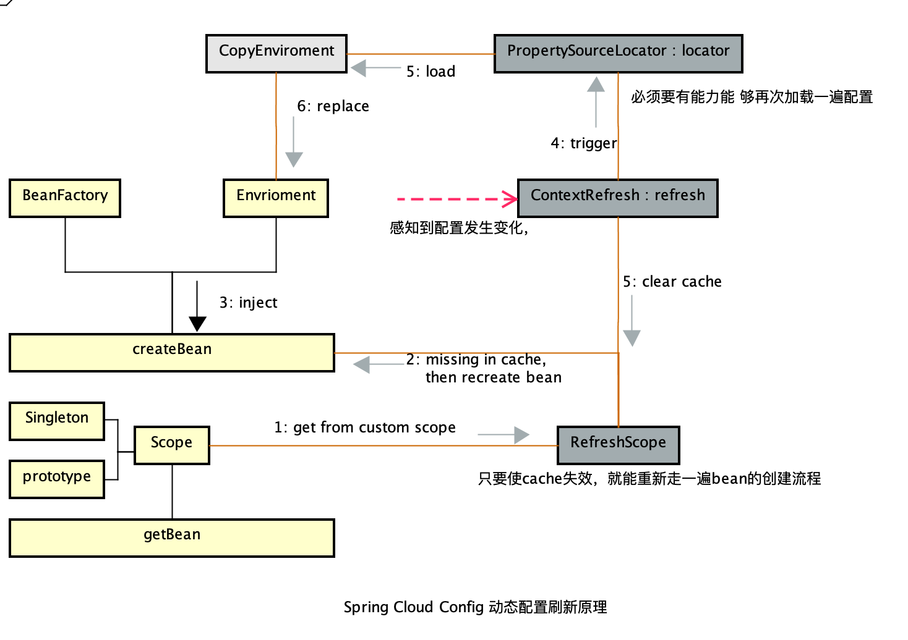

---

title: 微服务-config介绍

date: 2019-03-26 13:59:00

categories: [spring,springcloud,config]

tags: [spring,springcloud,config]

---


SpringCloudConfig 主要用于应用的配置热更新。本章主要介绍SpringCloudConfig的热更新原理

<!--more-->

## 数据流 

SpringCloudConfig 的 工作流程:



1. 将修改的配置信息提交到Git，触发 WebHook。WebHook用 Http 的形式向 ConfigServer 发送 refresh 请求。
2. ConfigServer 将这个消息发送给 spring cloud bus（用kafka或者rabbitMQ实现）
3. 每个应用实例中有一个 config-client，将会收到这个 refresh 消息
4. 如果 destination 和自己匹配，就执行刷新动作。 向 config-server 请求配置
5. config-server 拉取配置仓库中的最新配置文件并转成相应的json格式
6. 回传给 config-client，随后 config-client 将内容更新到上下文中。

## 配置刷新原理

当触发热更新的时候，会调用 ContextRefresher的 refresh()。方法的实现如下:

```java
public synchronized Set<String> refresh() {
    Set<String> keys = refreshEnvironment();
    this.scope.refreshAll();
    return keys;
}

public synchronized Set<String> refreshEnvironment() {
    //1
    Map<String, Object> before = extract(
            this.context.getEnvironment().getPropertySources());
    //2
    addConfigFilesToEnvironment();
    //3
    Set<String> keys = changes(before,
            extract(this.context.getEnvironment().getPropertySources())).keySet();
    //4
    this.context.publishEvent(new EnvironmentChangeEvent(this.context, keys));
    return keys;
}
```

### extract方法

这个方法接收了环境中所有的 PropertySource ，并将其中的`非标准属性源`的所有属性汇总到一个 Map 。

这里的`标准属性源`如下所示:

- systemProperties
- systemEnvironment
- servletContextInitParams
- servletConfigInitParams
- configurationProperties
- jndiProperties

StandardEnvironment 会注册系统变量（`System Properties`）和环境变量（`System Environment`）

StandardServletEnvironment 会注册 Servlet 环境下的 `Servlet Context` 和 Servlet Config 的初始参数（`Init Params`）和` JNDI` 的属性。

###addConfigFilesToEnvironment方法

`addConfigFilesToEnvironment()` 的实现逻辑:

- 创建新的SpingBoot来获取新的属性源
- 对比新旧数据源: 1、将旧的数据源替换成新的数据源；2、将全新的数据源添加到 this.context.getEnvironment中。

```java
 ConfigurableApplicationContext addConfigFilesToEnvironment() {
		ConfigurableApplicationContext capture = null;
		try {
      //复制得到的 environment 主要包含
      //systemProperties、systemEnvironment、refreshArgs和defaultProperties
			StandardEnvironment environment = copyEnvironment(
					this.context.getEnvironment());
      //利用SpringApplicationBuilder，重新加载最新的属性源
			SpringApplicationBuilder builder = new SpringApplicationBuilder(Empty.class)
					.bannerMode(Mode.OFF).web(WebApplicationType.NONE)
					.environment(environment);
			builder.application()
					.setListeners(Arrays.asList(new BootstrapApplicationListener(),
							new ConfigFileApplicationListener()));
			capture = builder.run();
			if (environment.getPropertySources().contains(REFRESH_ARGS_PROPERTY_SOURCE)) {
				environment.getPropertySources().remove(REFRESH_ARGS_PROPERTY_SOURCE);
			}
      //使用新加载的属性源替换原属性源。
			MutablePropertySources target = this.context.getEnvironment()
					.getPropertySources();
			String targetName = null;
			for (PropertySource<?> source : environment.getPropertySources()) {
				String name = source.getName();
				if (target.contains(name)) {
					targetName = name;
				}
				if (!this.standardSources.contains(name)) {
					if (target.contains(name)) {
						target.replace(name, source);
					}
					else {
						if (targetName != null) {
							target.addAfter(targetName, source);
						}
						else {
							// targetName was null so we are at the start of the list
							target.addFirst(source);
							targetName = name;
						}
					}
				}
			}
		}
		finally {
       //忽略
		}
		return capture;
	}
```

###属性源更新后处理

1. 通过 `changes方法` 收集发生改变的key集合。
2. 通过 `publishEvent方法` 发送[EnvironmentChangeEvent](#EnvironmentChangeEvent) 事件
3. 调用 [RefreshScope.refreshAll](#RefreshScope) 方法: 将refresh scope中的Bean 缓存失效,当再次从refresh scope中获取这个Bean时，发现取不到，就会重新触发一次Bean的初始化过程。

##EnvironmentChangeEvent

EnvironmentChangeEvent 主要触发两个行为:

1. 重新绑定上下文中所有使用了 `@ConfigurationProperties` 注解的 Spring Bean。
2. 如果 `logging.level.*` 配置发生了改变，重新设置日志级别。

这两段逻辑分别可以在 `ConfigurationPropertiesRebinder` 和 `LoggingRebinder` 中看到。

###ConfigurationPropertiesRebinder

ConfigurationPropertiesRebinder 类的监控方法`onApplicationEvent` 很简单，主要就是遍历每个 Bean，destroyBean和initializeBean每个bean。

需要注意的是: ConfigurationPropertiesRebinder的beans字段 只包含`@ConfigurationProperties`注解的Bean。因此配置的热更新只会影响 `@ConfigurationProperties`注解的Bean.

```java
@ManagedOperation
public void rebind() {
  this.errors.clear();
  // this.beans 表示的是包含@ConfigurationProperties注解的Bean。
  for (String name : this.beans.getBeanNames()) {
    rebind(name);
  }
}

@ManagedOperation
public boolean rebind(String name) {
  if (!this.beans.getBeanNames().contains(name)) {
    return false;
  }
  if (this.applicationContext != null) {
    try {
      Object bean = this.applicationContext.getBean(name);
      if (AopUtils.isAopProxy(bean)) {
        bean = ProxyUtils.getTargetObject(bean);
      }
      if (bean != null) {
        this.applicationContext.getAutowireCapableBeanFactory()
          .destroyBean(bean);
        this.applicationContext.getAutowireCapableBeanFactory()
          .initializeBean(bean, name);
        return true;
      }
    }
    catch (RuntimeException e) {
      this.errors.put(name, e);
      throw e;
    }
    catch (Exception e) {
      this.errors.put(name, e);
      throw new IllegalStateException("Cannot rebind to " + name, e);
    }
  }
  return false;
}
```

###LoggingRebinder

LoggingRebinder 的逻辑很简单，只是调用了 `LoggingSystem` 的方法重新设置了日志级别.

```java
@Override
public void onApplicationEvent(EnvironmentChangeEvent event) {
  if (this.environment == null) {
    return;
  }
  LoggingSystem system = LoggingSystem.get(LoggingSystem.class.getClassLoader());
  setLogLevels(system, this.environment);
}

protected void setLogLevels(LoggingSystem system, Environment environment) {
  Map<String, String> levels = Binder.get(environment)
    .bind("logging.level", STRING_STRING_MAP)
    .orElseGet(Collections::emptyMap);
  for (Entry<String, String> entry : levels.entrySet()) {
    setLogLevel(system, environment, entry.getKey(), entry.getValue().toString());
  }
}

private void setLogLevel(LoggingSystem system, Environment environment, String name,
                         String level) {
  try {
    if (name.equalsIgnoreCase("root")) {
      name = null;
    }
    level = environment.resolvePlaceholders(level);
    system.setLogLevel(name, LogLevel.valueOf(level.toUpperCase()));
  }
  catch (RuntimeException ex) {
    this.logger.error("Cannot set level: " + level + " for '" + name + "'");
  }
}
```

##RefreshScope

```java
public void refreshAll() {
  //清空Refresh Scope 中的缓存
  super.destroy();
  this.context.publishEvent(new RefreshScopeRefreshedEvent());
}
```

RefreshScope 是用来存放 scope 类型为 refresh 类型的 Bean（即: 使用RefreshScope注解标识的Bean）。

当一个 Bean 既不是 singleton 也不是 prototype 时，就会从自定义的 Scope 中去获取 Bean ( Spring 允许自定义 Scope )，然后调用Scope的get方法来获取一个实例。

Spring Cloud 扩展了Scope，从而控制了整个 Bean 的生命周期。当配置需要动态刷新的时候， 调用this.scope.refreshAll()这个方法，就会将整个RefreshScope的缓存清空，完成配置可动态刷新的可能。

[Scope 的相关介绍](<https://www.cnblogs.com/noahsark/p/spring-scope-analysis.html>)



## 参考

[Spring Cloud 是如何实现热更新的](http://www.scienjus.com/spring-cloud-refresh/)