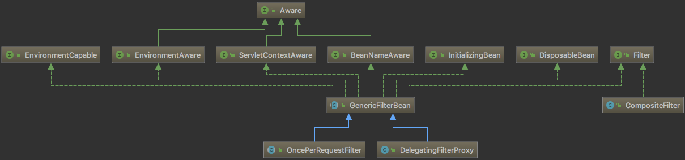

---

title: spring-5-filter

date: 2018-10-19 13:33:00

categories: [spring,springmvc]

tags: [springmvc,todo,filter]

---


spring 常见filter 

<!--more-->



spring实现了非常多的filter类。本章会介绍如下的 filter 实现:

- CompositeFilter 
- GenericFilterBean
- OncePerRequestFilter
- DelegatingFilterProxy


## filter 接口

接口定义如下:

```java
public interface Filter {

    public void init(FilterConfig filterConfig) throws ServletException;
    // doFilter 进行最重要的过滤工作
    public void doFilter(ServletRequest request, ServletResponse response,
            FilterChain chain) throws IOException, ServletException;
    public void destroy();

}
```


## CompositeFilter 类

CompositeFilter 实现了一个 filter 责任链: 用户可以实现多个 filter，然后将这些 filter 放入 CompositeFilter。
这样做的原因是: 开发人员只需 将 CompositeFilter 加入 spring 容器中，注册在CompositeFilter的所有filter 就能使用自动注入功能了，减少配置。

```java
public class CompositeFilter implements Filter {

	private List<? extends Filter> filters = new ArrayList<>();

	public void setFilters(List<? extends Filter> filters) {
		this.filters = new ArrayList<>(filters);
	}

	@Override
	public void init(FilterConfig config) throws ServletException {
		for (Filter filter : this.filters) {
			filter.init(config);
		}
	}

	@Override
	public void doFilter(ServletRequest request, ServletResponse response, FilterChain chain)
			throws IOException, ServletException {

		new VirtualFilterChain(chain, this.filters).doFilter(request, response);
	}

	@Override
	public void destroy() {
		for (int i = this.filters.size(); i-- > 0;) {
			Filter filter = this.filters.get(i);
			filter.destroy();
		}
	}

	private static class VirtualFilterChain implements FilterChain {

		private final FilterChain originalChain;

		private final List<? extends Filter> additionalFilters;

		private int currentPosition = 0;

		public VirtualFilterChain(FilterChain chain, List<? extends Filter> additionalFilters) {
			this.originalChain = chain;
			this.additionalFilters = additionalFilters;
		}

		@Override
		public void doFilter(final ServletRequest request, final ServletResponse response)
				throws IOException, ServletException {

			if (this.currentPosition == this.additionalFilters.size()) {
				this.originalChain.doFilter(request, response);
			}
			else {
				this.currentPosition++;
				Filter nextFilter = this.additionalFilters.get(this.currentPosition - 1);
				nextFilter.doFilter(request, response, this);
			}
		}
	}
}
```


## GenericFilterBean 抽象类

GenericFilterBean类是spring中非常基础的filter。GenericFilterBean类实现的接口如下:

- Filter:  Filter基础接口
- BeanNameAware: 设置Bean名称，便于容器管理
- EnvironmentAware: 设置环境变量
- EnvironmentCapable: 获取环境遍历
- ServletContextAware: 设置servlet上下文
- InitializingBean: bean初始化时设置完所有属性后，由BeanFactory调用该方法。
- DisposableBean: bean摧毁时，由BeanFactory调用该方法。


## OncePerRequestFilter 抽象类

基础Filter: 保证被实现的filter类, 一次请求仅执行过滤一次

```java
public abstract class OncePerRequestFilter extends GenericFilterBean {
    // 属性名: 过滤器名.FILTERED
    // 在执行该过滤器的 doFilterInternal(),会向Request中添加该属性(过滤器名.FILTERED)
	public static final String ALREADY_FILTERED_SUFFIX = ".FILTERED";
    //该方法确保仅执行一次 filter
	@Override
	public final void doFilter(ServletRequest request, ServletResponse response, FilterChain filterChain)
			throws ServletException, IOException {

		if (!(request instanceof HttpServletRequest) || !(response instanceof HttpServletResponse)) {
			throw new ServletException("OncePerRequestFilter just supports HTTP requests");
		}
		HttpServletRequest httpRequest = (HttpServletRequest) request;
		HttpServletResponse httpResponse = (HttpServletResponse) response;
        
		String alreadyFilteredAttributeName = getAlreadyFilteredAttributeName();
        // 判断 filter 已执行过。
		boolean hasAlreadyFilteredAttribute = request.getAttribute(alreadyFilteredAttributeName) != null;

		if (hasAlreadyFilteredAttribute || skipDispatch(httpRequest) || shouldNotFilter(httpRequest)) {
            // 已执行过filter、不需要filter 或者 skipDispatch
			filterChain.doFilter(request, response);
		}
		else {
			// 执行该filter
			request.setAttribute(alreadyFilteredAttributeName, Boolean.TRUE);
			try {
				doFilterInternal(httpRequest, httpResponse, filterChain);
			}
			finally {
				// Remove the "already filtered" request attribute for this request.
				request.removeAttribute(alreadyFilteredAttributeName);
			}
		}
	}


	private boolean skipDispatch(HttpServletRequest request) {
		if (isAsyncDispatch(request) && shouldNotFilterAsyncDispatch()) {
			return true;
		}
		if (request.getAttribute(WebUtils.ERROR_REQUEST_URI_ATTRIBUTE) != null && shouldNotFilterErrorDispatch()) {
			return true;
		}
		return false;
	}

    //在Servlet 3.0中引入的调度器类型{@code javax.servlet.DispatcherType.ASYNC}
    // 意味着一个过滤器可以在一个请求过程中在多个线程中被调用。
    // 如果过滤器当前在异步分派中执行，则此方法返回{true}。
	protected boolean isAsyncDispatch(HttpServletRequest request) {
		return WebAsyncUtils.getAsyncManager(request).hasConcurrentResult();
	}

    // 该过滤器真实过滤操作
	protected abstract void doFilterInternal(
			HttpServletRequest request, HttpServletResponse response, FilterChain filterChain)
			throws ServletException, IOException;
    // ..
    // ..
```


## DelegatingFilterProxy类

DelegatingFilterProxy类是一个filter的代理，用这个类的好处是可以通过spring容器来管理filter的生命周期。

```java
public class DelegatingFilterProxy extends GenericFilterBean {
	private String contextAttribute;
	private WebApplicationContext webApplicationContext;
    // 被代理的bean名称
	private String targetBeanName;
    // 是否管理 被代理的bean生命周期
	private boolean targetFilterLifecycle = false;
    // 被代理的bean
	private volatile Filter delegate;
    // 忽略上面几个字段的get、set方法
    
    //用于 锁
	private final Object delegateMonitor = new Object();

    //获取 web应用上下文
    //初始化 delegateFilter
	@Override
	protected void initFilterBean() throws ServletException {
		synchronized (this.delegateMonitor) {
			if (this.delegate == null) {
				if (this.targetBeanName == null) {
					this.targetBeanName = getFilterName();
				}
				WebApplicationContext wac = findWebApplicationContext();
				if (wac != null) {
					this.delegate = initDelegate(wac);
				}
			}
		}
	}
    @Nullable
	protected WebApplicationContext findWebApplicationContext() {
		if (this.webApplicationContext != null) {
			// 若wac没有refreshed，则 refresh
			if (this.webApplicationContext instanceof ConfigurableApplicationContext) {
				ConfigurableApplicationContext cac = (ConfigurableApplicationContext) this.webApplicationContext;
				if (!cac.isActive()) {
					cac.refresh();
				}
			}
			return this.webApplicationContext;
		}
        // 从 servlet 上下文中查找 wac
		String attrName = getContextAttribute();
		if (attrName != null) {
			return WebApplicationContextUtils.getWebApplicationContext(getServletContext(), attrName);
		}
		else {
			return WebApplicationContextUtils.findWebApplicationContext(getServletContext());
		}
	}

    //找到并初始化 被代理的filter
	protected Filter initDelegate(WebApplicationContext wac) throws ServletException {
		String targetBeanName = getTargetBeanName();
		Assert.state(targetBeanName != null, "No target bean name set");
		Filter delegate = wac.getBean(targetBeanName, Filter.class);
		if (isTargetFilterLifecycle()) {
			delegate.init(getFilterConfig());
		}
		return delegate;
	}
    
	@Override
	public void doFilter(ServletRequest request, ServletResponse response, FilterChain filterChain)
			throws ServletException, IOException {

		// Lazily initialize the delegate if necessary.
		Filter delegateToUse = this.delegate;
		if (delegateToUse == null) {
			synchronized (this.delegateMonitor) {
				delegateToUse = this.delegate;
				if (delegateToUse == null) {
					WebApplicationContext wac = findWebApplicationContext();
					if (wac == null) {
						throw new IllegalStateException("No WebApplicationContext found: " +
								"no ContextLoaderListener or DispatcherServlet registered?");
					}
					delegateToUse = initDelegate(wac);
				}
				this.delegate = delegateToUse;
			}
		}
        // invoke 被代理filter的dofilter()
		invokeDelegate(delegateToUse, request, response, filterChain);
	}

	protected void invokeDelegate(
			Filter delegate, ServletRequest request, ServletResponse response, FilterChain filterChain)
			throws ServletException, IOException {
		delegate.doFilter(request, response, filterChain);
	}

    @Override
	public void destroy() {
		Filter delegateToUse = this.delegate;
		if (delegateToUse != null) {
			destroyDelegate(delegateToUse);
		}
	}
	protected void destroyDelegate(Filter delegate) {
		if (isTargetFilterLifecycle()) {
			delegate.destroy();
		}
	}
}
```

DelegatingFilterProxy 的使用实例: SpringSecurityFilterChain 实现就用到了 DelegatingFilterProxy。


## 其他资料

[DelegatingFilterProxy源码分析](https://orchidflower.gitee.io/2017/06/02/The-source-code-of-DelegatingFilterProxy/)