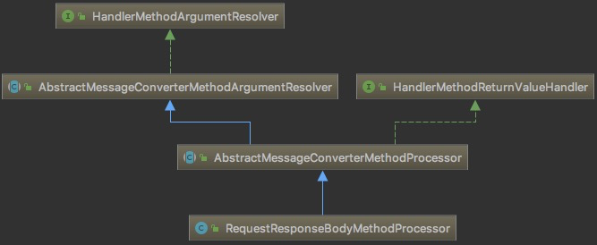

介绍 SpringMvc 如何处理参数解析 和 如何处理返回值的。

文章最后列举了HandlerMethodArgumentResolver 接口和 HandlerMethodReturnValueHandler 接口的实现类列表

<!--more-->

## SpringMVC请求过程

1. 前端请求 首先被 DispatcherServlet 截获，DispatcherServlet 通过 handlerMapping 获得HandlerExecutionChain，然后获得 HandlerAdapter。
2. HandlerAdapter 在内部对于每个请求，都会实例化一个 ServletInvocableHandlerMethod 进行处理，**ServletInvocableHandlerMethod 在进行处理的时候，会分两部分(参数值和返回值)分别对请求跟响应进行处理。**
3. 之后 HandlerAdapter 得到 ModelAndView ，然后做相应的处理。


## ServletInvocableHandlerMethod 分析

ServletInvocableHandlerMethod 在处理时，将 方法参数的处理 交给 HandlerMethodArgumentResolver 处理，而方法的返回值会交给 HandlerMethodReturnValueHandler 处理。

- HandlerMethodArgumentResolver 请求方法参数的处理
- HandlerMethodReturnValueHandler 响应返回值的处理

```java
public class ServletInvocableHandlerMethod extends InvocableHandlerMethod {
    //..
    
    //继承自 InvocableHandlerMethod
    //获得解析方法参数并执行controller方法。
    public Object invokeForRequest(
        NativeWebRequest request, 
        @Nullable ModelAndViewContainer mavContainer,
		Object... providedArgs) throws Exception {

		Object[] args = getMethodArgumentValues(request, mavContainer, providedArgs);
		if (logger.isTraceEnabled()) {
			logger.trace("Arguments: " + Arrays.toString(args));
		}
		return doInvoke(args);
	}
    //调用 invokeForRequest方法获取返回值，
    //处理 返回值
	public void invokeAndHandle(
        ServletWebRequest webRequest, 
        ModelAndViewContainer mavContainer,
		Object... providedArgs) throws Exception {
        
		Object returnValue = invokeForRequest(webRequest, mavContainer, providedArgs);
		setResponseStatus(webRequest);

		if (returnValue == null) {
			if (isRequestNotModified(webRequest) 
                || getResponseStatus() != null 
                || mavContainer.isRequestHandled()) {
				mavContainer.setRequestHandled(true);
				return;
			}
		}
		else if (StringUtils.hasText(getResponseStatusReason())) {
			mavContainer.setRequestHandled(true);
			return;
		}

		mavContainer.setRequestHandled(false);
		Assert.state(this.returnValueHandlers != null, "No return value handlers");
		try {
			this.returnValueHandlers.handleReturnValue(
					returnValue, getReturnValueType(returnValue), mavContainer, webRequest);
		}
		catch (Exception ex) {
			if (logger.isTraceEnabled()) {
				logger.trace(formatErrorForReturnValue(returnValue), ex);
			}
			throw ex;
		}
	}
```


## RequestResponseBodyMethodProcessor详解

本文以 RequestResponseBodyMethodProcessor 为例讲解 。




### HandlerMethodArgumentResolver接口

定义了两个方法:

```java
public interface HandlerMethodArgumentResolver {
    //判断是否支持 parameter参数
	boolean supportsParameter(MethodParameter parameter);
    //将Request中的输入解析为参数值
	@Nullable
	Object resolveArgument(
        MethodParameter parameter, 
        @Nullable ModelAndViewContainer mavContainer,
		NativeWebRequest webRequest, 
        @Nullable WebDataBinderFactory binderFactory) throws Exception;

}
```

### HandlerMethodReturnValueHandler接口

定义了两个方法:

```java
public interface HandlerMethodReturnValueHandler {
	//判断是否支持 parameter参数
	boolean supportsReturnType(MethodParameter returnType);
    //解析返回值
	void handleReturnValue(
        @Nullable Object returnValue, 
        MethodParameter returnType,
		ModelAndViewContainer mavContainer, 
        NativeWebRequest webRequest) throws Exception;

}
```

### AbstractMessageConverterMethodArgumentResolver 

HandlerMethodArgumentResolver接口的抽象类： 仅仅引入了HttpMessageConverter，即具体的转换工作由这些HttpMessageConverter来完成。 

**简单介绍AbstractMessageConverterMethodArgumentResolver中其他关联的类:** 

- HttpMessageConverter : 消息转换器。将 Request的 body 转换为想要的结果。常接触到的例子。**FastJsonHttpMessageConverter** 将 json字符串转换为对应的类对象。
- RequestBodyAdvice: 在消息转换器的作用前后执行。常用于 请求的加解密，与ControllerAdvice注解同时使用。

AbstractMessageConverterMethodArgumentResolver源码:

```java
public abstract class AbstractMessageConverterMethodArgumentResolver implements HandlerMethodArgumentResolver {
   //..
   // 
   @Nullable
   protected <T> Object readWithMessageConverters(
        HttpInputMessage inputMessage, 
        MethodParameter parameter,
		Type targetType) 
        throws IOException, HttpMediaTypeNotSupportedException, HttpMessageNotReadableException {

		MediaType contentType;
		boolean noContentType = false;
        //获取 Request 支持的 contentType
		try {
			contentType = inputMessage.getHeaders().getContentType();
		}
		catch (InvalidMediaTypeException ex) {
			throw new HttpMediaTypeNotSupportedException(ex.getMessage());
		}
		if (contentType == null) {
			noContentType = true;
			contentType = MediaType.APPLICATION_OCTET_STREAM;
		}

		Class<?> contextClass = parameter.getContainingClass();
		Class<T> targetClass = (targetType instanceof Class ? (Class<T>) targetType : null);
		if (targetClass == null) {
			ResolvableType resolvableType = ResolvableType.forMethodParameter(parameter);
			targetClass = (Class<T>) resolvableType.resolve();
		}
        // 获取 http-method
		HttpMethod httpMethod = (inputMessage instanceof HttpRequest ? ((HttpRequest) inputMessage).getMethod() : null);
		Object body = NO_VALUE;
        // 遍历messageConverters，若messageConverter能够处理，则进行处理
        // 正式处理 body前后，会调用 RequestResponseBodyAdviceChain
        // RequestResponseBodyAdviceChain 常用于 请求的加解密过程。
		EmptyBodyCheckingHttpInputMessage message;
		try {
			message = new EmptyBodyCheckingHttpInputMessage(inputMessage);

			for (HttpMessageConverter<?> converter : this.messageConverters) {
                
				Class<HttpMessageConverter<?>> converterType = (Class<HttpMessageConverter<?>>) converter.getClass();
				GenericHttpMessageConverter<?> genericConverter =
						(converter instanceof GenericHttpMessageConverter ? (GenericHttpMessageConverter<?>) converter : null);
				if (genericConverter != null ? genericConverter.canRead(targetType, contextClass, contentType) :
						(targetClass != null && converter.canRead(targetClass, contentType))) {
					if (message.hasBody()) {
						HttpInputMessage msgToUse =
								getAdvice().beforeBodyRead(message, parameter, targetType, converterType);
						body = (genericConverter != null ? genericConverter.read(targetType, contextClass, msgToUse) :
								((HttpMessageConverter<T>) converter).read(targetClass, msgToUse));
						body = getAdvice().afterBodyRead(body, msgToUse, parameter, targetType, converterType);
					}
					else {
						body = getAdvice().handleEmptyBody(null, message, parameter, targetType, converterType);
					}
					break;
				}
			}
		}
		catch (IOException ex) {
			throw new HttpMessageNotReadableException("I/O error while reading input message", ex, inputMessage);
		}

		if (body == NO_VALUE) {
			if (httpMethod == null || !SUPPORTED_METHODS.contains(httpMethod) ||
					(noContentType && !message.hasBody())) {
				return null;
			}
			throw new HttpMediaTypeNotSupportedException(contentType, this.allSupportedMediaTypes);
		}

		MediaType selectedContentType = contentType;
		Object theBody = body;
		LogFormatUtils.traceDebug(logger, traceOn -> {
			String formatted = LogFormatUtils.formatValue(theBody, !traceOn);
			return "Read \"" + selectedContentType + "\" to [" + formatted + "]";
		});

		return body;
	} 
}
```

### AbstractMessageConverterMethodProcessor抽象类

在 AbstractMessageConverterMethodArgumentResolver抽象类 的基础上，添加HandlerMethodReturnValueHandler接口。
因此 **AbstractMessageConverterMethodProcessor**类 不仅可以用来转换请求数据，也可以用来转换响应数据。 

### RequestResponseBodyMethodProcessor类

继承自 AbstractMessageConverterMethodProcessor，专注解析 包含@RequestBody 和 @ResponseBody注解的方法。

```java
public class RequestResponseBodyMethodProcessor 
    extends AbstractMessageConverterMethodProcessor {
    // 支持 (参数包含 RequestBody 注解)的方法
    @Override
	public boolean supportsParameter(MethodParameter parameter) {
		return parameter.hasParameterAnnotation(RequestBody.class);
	}
     // 支持 (方法上有 ResponseBody 注解)的方法
	@Override
	public boolean supportsReturnType(MethodParameter returnType) {
		return (AnnotatedElementUtils.hasAnnotation(returnType.getContainingClass(), ResponseBody.class) 
                || returnType.hasMethodAnnotation(ResponseBody.class));
	}
    
    @Override
	public Object resolveArgument(
        MethodParameter parameter, 
        @Nullable ModelAndViewContainer mavContainer,
		NativeWebRequest webRequest, 
        @Nullable WebDataBinderFactory binderFactory) throws Exception {
        //1. 若参数为 optional类型 则，返回参数的variant(变种，指向同一个参数)
        //2. 调用下面的readWithMessageConverters
        //3. 获取parameter变量名
        //4. 进行数据绑定工作 找时间再研究源码
        //5. 返回结果(若为 optional类型，会做一点节点的处理)
	}

	@Override
	protected <T> Object readWithMessageConverters(
        NativeWebRequest webRequest, 
        MethodParameter parameter,
		Type paramType) 
       throws IOException, HttpMediaTypeNotSupportedException,HttpMessageNotReadableException       
    {
    	// 1. 将 Request 转为 ServletServerHttpRequest
    	// 2. 调用 父类(AbstractMessageConverterMethodArgumentResolver)的 readWithMessageConverters 将 Request 的 body 转换为想要的结果。
        // 3. 判断 requestBody.required()，不满足就抛出异常
        // 4. 返回结果
	}

	@Override
	public void handleReturnValue(
        @Nullable Object returnValue, 
        MethodParameter returnType,
		ModelAndViewContainer mavContainer, 
        NativeWebRequest webRequest)
	throws IOException, HttpMediaTypeNotAcceptableException,HttpMessageNotWritableException {
    	//1. 标记Request已处理
        //2. 调用父类(AbstractMessageConverterMethodProcessor)的writeWithMessageConverters方法
        //3. 返回结果
	}
```

## 相关接口的实现类总览

### HandlerMethodArgumentResolver实现类

| 实现类                                   | 说明                                                         |
| ---------------------------------------- | ------------------------------------------------------------ |
| RequestParamMethodArgumentResolver       | 支持带有@RequestParam注解的参数或带有MultipartFile类型的参数 |
| RequestParamMapMethodArgumentResolver    | 支持带有@RequestParam注解的参数 && @RequestParam注解的属性value存在 && 参数类型是实现Map接口的属性 |
| PathVariableMethodArgumentResolver       | 支持带有@PathVariable注解的参数 且如果参数实现了Map接口，@PathVariable注解需带有value属性 |
| MatrixVariableMethodArgumentResolver     | 支持带有@MatrixVariable注解的参数 且如果参数实现了Map接口，@MatrixVariable注解需带有value属性 |
| RequestResponseBodyMethodProcessor       | 本章已分析过                                                 |
| ServletRequestMethodArgumentResolver     | 参数类型是实现或继承或是WebRequest、ServletRequest、MultipartRequest、HttpSession、Principal、Locale、TimeZone、InputStream、Reader、HttpMethod这些类。（这就是为何我们在Controller中的方法里添加一个HttpServletRequest参数，Spring会为我们自动获得HttpServletRequest对象的原因） |
| ServletResponseMethodArgumentResolver    | 参数类型是实现或继承或是ServletResponse、OutputStream、Writer这些类 |
| RedirectAttributesMethodArgumentResolver | 参数是实现了RedirectAttributes接口的类                       |
| HttpEntityMethodProcessor                | 参数类型是HttpEntity                                         |


### HandlerMethodReturnValueHandler实现类

| 实现类                               | 说明                             |
| ------------------------------------ | -------------------------------- |
| ModelAndViewMethodReturnValueHandler | 返回值类型是ModelAndView或其子类 |
| ModelMethodProcessor                 | 返回值类型是Model或其子类        |
| ViewMethodReturnValueHandler         | 返回值类型是View或其子类         |
| HttpHeadersReturnValueHandler        | 返回值类型是HttpHeaders或其子类  |
| ModelAttributeMethodProcessor        | 返回值有@ModelAttribute注解      |
| ViewNameMethodReturnValueHandler     | 返回值是void或String             |

### 接口总览小结

从名字我们也看的出来

- Resolver结尾的是实现了**HandlerMethodArgumentResolver**接口的类
- Handler结尾的是实现了**HandlerMethodReturnValueHandler**接口的类
- Processor结尾的是实现了**HandlerMethodArgumentResolver**和**HandlerMethodReturnValueHandler**的类

## 来源

https://www.cnblogs.com/fangjian0423/p/springMVC-request-param-analysis.html