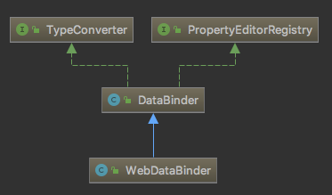

## 综述

Controller方法的参数类型可以是基本类型，也可以是封装后的普通Java类型。
若这个普通Java类型没有声明任何注解，则意味着它的每一个属性都需要到Request中去查找对应的请求参数。
众所周知，无论客户端传入的是什么类型的请求参数，最终都要以字节的形式传给服务端。
而服务端通过Request的getParameter方法取到的参数也都是字符串形式的结果。
所以，需要有一个把字符串形式的参数转换成服务端真正需要的类型的转换工具，在spring中这个转换工具为WebDataBinder。

## WebDataBinder 类图

## 参考

[SpringMVC中WebDataBinder的应用及原理](https://blog.csdn.net/qq_22985751/article/details/80885541)

