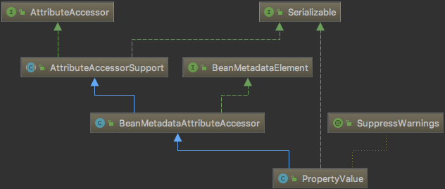

---

title: spring-7-bean

date: 2019-01-10 19:55:00

categories: [spring]

tags: [spring]

---

ff

<!--more-->

## PropertyValue

### AttributeAccessor接口

提供如下方法:

- void setAttribute(String name, Object value) 设置属性
- Object getAttribute(String name) 获取属性
- Object removeAttribute(String name) 移除属性
- boolean hasAttribute(String name) 是否包含该属性
- String[] attributeNames() 获取所有属性

### AttributeAccessorSupport 抽象类

基于 LinkedHashMap 实现了 AttributeAccessor接口。

### BeanMetadataElement 接口

用于获取 Bean的 配置源对象

就一个方法: `Object getSource();`

### BeanMetadataAttributeAccessor 对象

实现了 BeanMetadataElement 接口 和 AttributeAccessorSupport 抽象类。

保存有 Bean的key-value形式的配置信息 和 配置源对象

### PropertyValue 
PropertyValue 继承自 BeanMetadataAttributeAccessor。

主要有以下几个字段:

- name
- value
- optional
- converted
- convertedValue
- conversionNecessary
- resoledTokens
- source

待续。。。

BeanWrapper
ResourceLoader
Environment
MutablePropertyValues