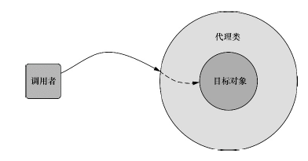

---

title: 面向切面的spring

date: 2018-10-25 12:30:00

categories: [spring]

tags: [spring]

---


即面向切面编程，横切关注点分离和织入。可以用于日志、事务处理权限控制等。


<!--more-->

## AOP相关定义

### 通知（Advice）

通知定义了切面是什么以及何时执行。
可以在通知方法中添加 JoinPoint 类型的参数, 从中可以访问到方法的签名和方法的参数.

#### 前置通知:

在目标方法执行之前执行 被@Before 标记的方法的方法体.

```java
@Before("execution(public int com.atguigu.spring.aop.ArithmeticCalculator.*(int, int))")
```

实例：

```java
public class AA{
	/**
	 * execution(* org.zttc.itat.spring.dao.*.add*(..))
	 * 第一个*表示任意返回值
	 * 第二个*表示 org.zttc.itat.spring.dao包中的所有类
	 * 第三个*表示以add开头的所有方法
	 * (..)表示任意参数
	 */
	@Before("execution(* org.zttc.itat.spring.dao.*.add*(..))||" +
			"execution(* org.zttc.itat.spring.dao.*.delete*(..))||" +
			"execution(* org.zttc.itat.spring.dao.*.update*(..))")
	public void logStart(JoinPoint jp) {
		//得到执行的对象
		System.out.println(jp.getTarget());
		//得到执行的方法
		System.out.println(jp.getSignature().getName());
		Logger.info("加入日志");
	}
}
```

#### 后置通知:
在目标方法执行之后（无论是否发生异常）执行的代码.

在后置通知中不能访问目标方法执行的结果

```java
@After("execution(public int com.atguigu.spring.aop.ArithmeticCalculator.*(int, int))")
```

#### 返回通知:
在方法**正常**结束后执行。

```java
@AfterReturning(value="execution(public int com.atguigu.spring.aop.ArithmeticCalculator.*(int, int))")
```

#### 异常通知:
在方法**异常**时执行，可以访问到异常对象，而且可以指定特定异常通知。

```java
@AfterThrowing(value="execution(public int com.atguigu.spring.aop.ArithmeticCalculator.*(int, int))")
```

#### 环绕通知:
环绕通知需要携带ProcessdingJoinPoint类型的参数。

```java
@Around("execution(public int com.atguigu.spring.aop.ArithmeticCalculator.*(int, int))")
```

### 连接点（Joinpoint）

连接点是在应用执行过程中能够插入切面的一个点。这个点可以是调用方法时、抛出异常时、甚至修改一个字段时.

### 切入点（Pointcut）

切入点是在程序运行中一个通知需要插入切面的一个或多个连接点。我们通常使用明确的类和方法名称，或是利用正则表达式定义所匹配的类和方法名称来指定这些切点

### 切面（Aspect）

切面由切入点和通知组成。通知和切点共同定义了切面的全部内容——它是什么，在何时和何处完成其功能。

### 引入（Introduction）

引入允许我们向现有的类添加新方法或属性。

### 目标对象（Target Object）

需要功能增强的方法。

### 织入（Weaving）

织入是把切面应用到目标对象并创建新的代理对象的过程。切面在指定的连接点被织入到目标对象中。

切面在应用运行的某个时刻被织入。一般情况下，在织入切面时，AOP容器会为目标对象动态地创建一个代理对象。

## springAOP代理

Spring的切面由包裹了目标对象的代理类实现。
代理类处理方法的调用，执行额外的切面逻辑，并调用目标方法。




## 通过切点选择连接点


继承自AspectJ 的指示器


|AspectJ指示器 |描　　述|
|-------|-----------------|
|arg()| 限制连接点匹配参数为指定类型的执行方法|
|@args()| 限制连接点匹配参数由指定注解标注的执行方法|
|execution() |用于匹配是连接点的执行方法|
|this()| 限制连接点匹配AOP代理的bean引用为指定类型的类|
|target |限制连接点匹配目标对象为指定类型的类|
|@target()| 限制连接点匹配特定的执行对象，这些对象对应的类要具有指定类型的注解|
|within() |限制连接点匹配指定的类型|
|@within()|限制连接点匹配指定注解所标注的类型（当使用Spring AOP时，方法定义在由指定的注解所标注的类里）|
|@annotation |限定匹配带有指定注解的连接点|

除了上表所列的指示器外，Spring还引入了一个新的bean()指示器。
bean()使用bean ID或bean名称作为参数来限制切点只匹配特定的bean。

## 创建切面

在切面类上添加 `@Aspect`注解即可。

真正激活切面需要在配置类上添加 `@EnableAspectJAutoProxy` 来启用自动代理功能。

## xml切面

详情见 《spring实战》章节4.4.

