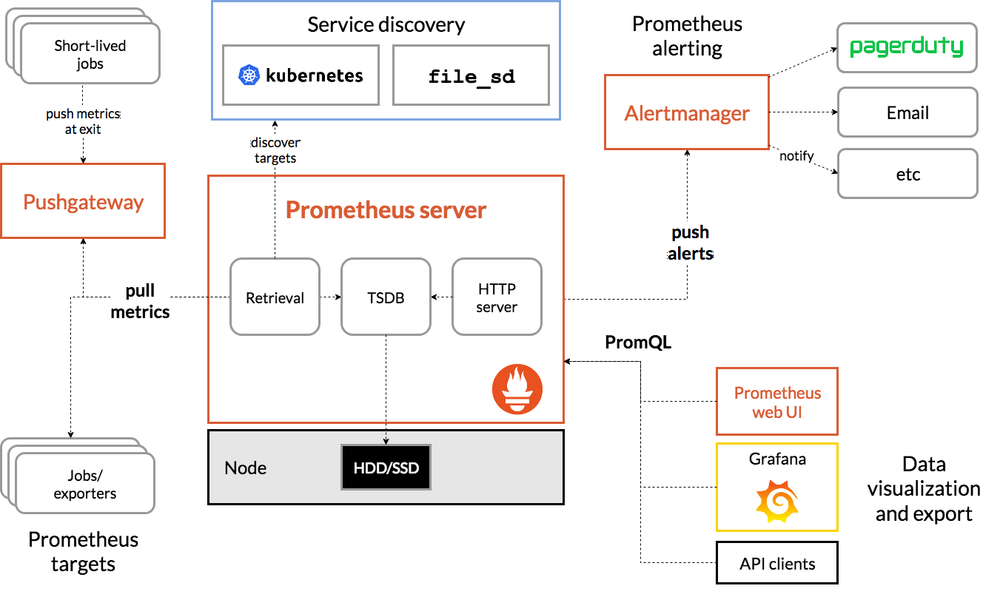

Prometheus 是一个开源系统监控和警报工具包。跟springboot 有很好的兼容性。

## 架构



## 最佳实践

### 直方图和摘要

Histograms和summaries都是样本观察，通常用于观察 request 的持续时间或响应大小。

Histograms和summaries 会维护观察对象(如request)的count(request的次数)与sum(request的总耗时)。

`*_count` 表示 观察对象的请求次数。
`*_sum` 表示 观察对象的值的总和。

通过这两个变量，我们可以计算出观察对象 一定时间的平均值。如:

request 在前五分钟的平均耗时

```text
rate(http_request_duration_seconds_sum[5m])
/
rate(http_request_duration_seconds_count[5m])
```

## 常用函数

### rate

基于 区间的`全部`数据点，计算区间的平均值(秒)

```text
每个时间序列: 在过去5分钟内的每秒HTTP请求率

rate(http_requests_total{job="api-server"}[5m])
```

### irate

基于 区间的`最后两个`数据点，计算区间的平均值(秒)

```text
每个时间序列: 基于过去5分钟的最后两个数据点，计算每秒HTTP请求率

irate(http_requests_total{job="api-server"}[5m])
```

### histogram_quantile

用于获取某一数值，小于该数值的观察对象占 指定百分位

```text
过去10分钟内，请求持续时间的 90th 百分位数(暂且称为A)。即 90% 的请求持续时间小于 A

histogram_quantile(0.9, rate(http_request_duration_seconds_bucket[10m]))
```


## 参考资料

[直方图和摘要](https://prometheus.io/docs/practices/histograms/)

[Prometheus查询函数](https://prometheus.io/docs/prometheus/latest/querying/functions/#rate)