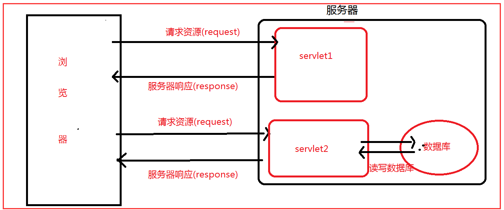

[TOC]

Servlet 运行在服务端的Java小程序，是sun公司提供一套规范（接口），用来处理客户端请求、响应给浏览器的动态资源。但servlet的实质就是java代码，通过java的API 动态的向客户端输出内容。

<!--more-->

## servlet 概述

Servlet是Java Web的三大组件（Servlet,Filter,Listener）之一，属于动态资源 ,运行在 Web 服务器或应用服务器上的程序作用为处理请求，服务器会把接收的请求交给Servlet来处理，在Servlet中通常需要：

> 接受请求数据、处理请求、完成响应



## 实现 servlet 

- 实现javax.servlet.Servlet接口
- 继承javax.servlet.GenericServlet类
- 继承javax.servlet.http.HttpServlet类(用得较多)

例子:

```java
public class Servlet extends HttpServlet {

    protected void doPost(HttpServletRequest request, HttpServletResponse response) throws ServletException, IOException {
        System.out.println("doPost()...");
    }
    protected void doGet(HttpServletRequest request, HttpServletResponse response) throws ServletException, IOException {
        System.out.println("doGet()...");
    }
}
```

## 线程安全问题

由于一个 servlet 是一个实例对象，因此需要注意 servlet 的线程问题。

- 尽量不要在 servlet 中创建成员变量。
- 若实在需要，可以创建无状态成员 或者 只读成员

## servlet 生命周期

1. 创建实例：
	- 第一次请求servlet
	- 启动时立即创建，即load-on-startup servlet
2. 初始化：调用init()方法
3. 响应请求：调用service()方法, 根据请求方法选择 doGet 或 doPost
5. 实例销毁：调用destroy()方法,在servlet容器停止或者重新启动时发生

## servlet调用图


Servlet访问的过程：

> Http请求---->web.xml-------->  url -pattern----->servlet-name----->servlet-class----->   QuickStratServlet(对应的Class文件)

## 其他类介绍

### ServletConfig

用于封装servlet的配置信息:

- ServletName: 当前Servlet在web.xml中配置的名字
- ServletContext: 当前web应用的ServletContext对象
- InitParameter: 当前Servlet指定名称的初始化参数的值
- InitParameterNames: 当前Servlet所有初始化参数的名字组成的枚举


### ServletContext

WEB容器在启动时，它会为每个WEB应用程序都创建一个对应的ServletContext对象，它代表当前web应用。

#### 不同 servlet 之间共享数据
由于一个WEB应用中的所有Servlet共享同一个ServletContext对象，因此Servlet对象之间可以通过ServletContext对象来实现通讯。

```java
//A servlet 中设置属性
class ServletA extends HttpServlet {
    public void doGet(HttpServletRequest request, HttpServletResponse response)
            throws ServletException, IOException {
       ServletContext context = this.getServletContext();
        context.setAttribute("name", "smyhvae");
    }
    public void doPost(HttpServletRequest request, HttpServletResponse response)
            throws ServletException, IOException {
        doGet(request, response);
    }
}

//B servlet 中设置属性
class ServletB extends HttpServlet {
    public void doGet(HttpServletRequest request, HttpServletResponse response)
            throws ServletException, IOException {
       ServletContext context = this.getServletContext();
       String myName = (String) context.getAttribute("name");
       System.out.println(myName);
    }
    public void doPost(HttpServletRequest request, HttpServletResponse response)
            throws ServletException, IOException {
        doGet(request, response);
    }
}

```

#### 设置初始化参数

在web.xml中使用<context-param>标签（与Servlet标签并列）为整个Web应用配置属性

```java
public class ServletTest03 extends HttpServlet {

    public void doGet(HttpServletRequest request, HttpServletResponse response)
            throws ServletException, IOException {
        ServletContext context = this.getServletContext(); // 得到上下文对象

        // 获取单个的Context里面的初始化参数
        String value1 = context.getInitParameter("username");
        String value2 = context.getInitParameter("password");
        System.out.println(value1 + ";" + value2);

        // 一次性获取Context里所有的初始化参数
        Enumeration enumeration = context.getInitParameterNames();
        while (enumeration.hasMoreElements()) {
            String name = (String) enumeration.nextElement();
            String value = context.getInitParameter(name);
            System.out.println(name + ";" + value);

        }

    }

    public void doPost(HttpServletRequest request, HttpServletResponse response)
            throws ServletException, IOException {
        doGet(request, response);
    }

}
```
#### 转发

- 请求重定向: 302+Location（两次请求两次响应）
- 请求转发: 服务器内不进行资源流转 （一次请求一次响应，来实现资源流转）

```java
public class ServletTest04 extends HttpServlet {

    public void doGet(HttpServletRequest request, HttpServletResponse response)
            throws ServletException, IOException {
        RequestDispatcher dispatcher = this.getServletContext().getRequestDispatcher("/servlet/ServletTest05");// 参数中写虚拟路径
        dispatcher.forward(request, response); // 执行完这一行代码后，将会跳到ServletTest05中去执行。
    }

    public void doPost(HttpServletRequest request, HttpServletResponse response)
            throws ServletException, IOException {
        doGet(request, response);
    }

}
```

#### 获取 资源

```java
InputStream input = servletContext.getResourceAsStream("/index.jsp"); 
```

对于 tomcat 应用。
上述代码中，"/" 代表的是 web content root。即下面的web文件夹。

```
YourWebProject
 |-- src
 |    :
 |
 |-- web
 |    |-- META-INF
 |    |    `-- MANIFEST.MF
 |    |-- WEB-INF
 |    |    `-- web.xml
 |    |-- index.jsp
 |    `-- login.jsp
 : 
```

## 参考

https://www.cnblogs.com/zhangyinhua/p/7625851.html
https://www.cnblogs.com/smyhvae/p/4140877.html
https://www.cnblogs.com/zhangyinhua/p/7629099.html