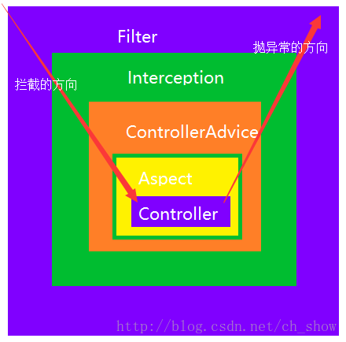

---

title: web请求处理流程

date: 2019-03-21 10:37:00

categories: [web]

tags: [web]

---


介绍 从浏览器发送出的请求，服务器的处理流程.

本文针对 springboot 应用。


<!--more-->


## 总览




```text
浏览器请求 -> filter过滤器 -> Interceptor拦截器 -> ControllerAdvice -> Aspect 切片 -> Controller 
浏览器请求 <- filter过滤器 <- Interceptor拦截器 <- ControllerAdvice <- Aspect 切片 <- Controller  
```

4种方式对比:

- Filter: Servlet 规定的组件。只能处理 ServletRequest 和 ServletResponse。
- Interceptor: Spring 自己实现的。不仅能处理 HttpServletRequest和HttpServletResponse，还能获取 对应的Controller方法 。
- ControllerAdvice: 通常用来做 统一异常处理
- Aspect: 自定义要切入的类或者方法。粒度最小。

## filter过滤器

filter过滤器 属于 Servlet 规则中的组件。
最重要的方法是 doFilter()。


下面的代码简单展示了 ApplicationFilterChain 的处理过程。


```java
public final class ApplicationFilterChain implements FilterChain {
    // 省略
    public void doFilter(ServletRequest request, ServletResponse response) throws IOException, ServletException {
        if (Globals.IS_SECURITY_ENABLED) {
             //省略
        } else {
            this.internalDoFilter(request, response);
        }
    }

    private void internalDoFilter(ServletRequest request, ServletResponse response) throws IOException, ServletException {
        if (this.pos < this.n) {
            // 遍历执行 调用链
        } else {
            // 调用对应的 HttpServlet 类的 service(request, response)方法
        }
    }
}
```


流程为:

```text
浏览器 -> ApplicationFilterChain -> DispatcherServlet 
浏览器 <- ApplicationFilterChain <- DispatcherServlet 
```

## Interceptor 拦截器

Interceptor 拦截器是动态拦截Action调用的对象，它提供了一种机制可以使开发者在一个Action执行的前后执行一段代码，
也可以在一个Action执行前阻止其执行，同时也提供了一种可以提取Action中可重用部分代码的方式。

**拦截器 的优点**:

- 持有 HttpServletRequest
- 持有 HttpServletResponse
- **持有一个 handler**: 包含了 Controller 实例、处理请求的方法和参数等信息

**拦截器接口**

```java
public interface HandlerInterceptor {
    
    /**
    * 
    * @param request
    * @param response
    * @param handler 通常是 HandlerMethod: 包含了 Controller实例，处理请求的方法和参数等信息
    * @return  继续执行返回true
    * @throws Exception
    */
    default boolean preHandle(HttpServletRequest request, HttpServletResponse response, Object handler) throws Exception {
        return true;
    }

    default void postHandle(HttpServletRequest request, HttpServletResponse response, Object handler, @Nullable ModelAndView modelAndView) throws Exception {
    }

    default void afterCompletion(HttpServletRequest request, HttpServletResponse response, Object handler, @Nullable Exception ex) throws Exception {
    }
}
```


spring 拦截器的生效代码在 DispatcherServlet 和 HandlerExecutionChain中:

```java
public class DispatcherServlet extends FrameworkServlet {
    //忽略其他
    protected void doDispatch(HttpServletRequest request, HttpServletResponse response) throws Exception {
        //忽略..
        try {
            try {
                //忽略..
                try {
                    //忽略..
                    //遍历 Interceptor，并执行 Interceptor的preHandle()方法
                    if (!mappedHandler.applyPreHandle(processedRequest, response)) {
                        return;
                    }
                    // controller 处理
                    mv = ha.handle(processedRequest, response, mappedHandler.getHandler());
                    //忽略..
                    //遍历 Interceptor，并执行 Interceptor的 postHandle()方法
                    mappedHandler.applyPostHandle(processedRequest, response, mv);
                }  catch (Throwable var21) {
                   //忽略..
                }
               //忽略..
            } catch (Throwable var23) {
             //忽略..
            }
        } finally {
            //忽略..
        }
    }
}
```

```java
public class HandlerExecutionChain {
    //遍历 Interceptor，并执行 Interceptor的preHandle()方法
    boolean applyPreHandle(HttpServletRequest request, HttpServletResponse response) throws Exception {
        HandlerInterceptor[] interceptors = this.getInterceptors();
        if (!ObjectUtils.isEmpty(interceptors)) {
            for(int i = 0; i < interceptors.length; this.interceptorIndex = i++) {
                HandlerInterceptor interceptor = interceptors[i];
                if (!interceptor.preHandle(request, response, this.handler)) {
                    this.triggerAfterCompletion(request, response, (Exception)null);
                    return false;
                }
            }
        }
        return true;
    }
    //遍历 Interceptor，并执行 Interceptor的 postHandle()方法
    void applyPostHandle(HttpServletRequest request, HttpServletResponse response, @Nullable ModelAndView mv) throws Exception {
        HandlerInterceptor[] interceptors = this.getInterceptors();
        if (!ObjectUtils.isEmpty(interceptors)) {
            for(int i = interceptors.length - 1; i >= 0; --i) {
                HandlerInterceptor interceptor = interceptors[i];
                interceptor.postHandle(request, response, this.handler, mv);
            }
        }
    }
    //遍历 已执行过的Interceptor，并执行 Interceptor的afterCompletion()方法
    void triggerAfterCompletion(HttpServletRequest request, HttpServletResponse response, @Nullable Exception ex) throws Exception {
        HandlerInterceptor[] interceptors = this.getInterceptors();
        if (!ObjectUtils.isEmpty(interceptors)) {
            for(int i = this.interceptorIndex; i >= 0; --i) {
                HandlerInterceptor interceptor = interceptors[i];
                try {
                    interceptor.afterCompletion(request, response, this.handler, ex);
                } catch (Throwable var8) {
                    logger.error("HandlerInterceptor.afterCompletion threw exception", var8);
                }
            }
        }
    }
}
```


流程为:

```text
DispatcherServlet -> HandlerExecutionChain -> HandlerInterceptor 
DispatcherServlet <- HandlerExecutionChain <- HandlerInterceptor 
```

## ControllerAdvice

ControllerAdvice 是 controller的增强。可以 与 (ModelAttribute、InitBinder和 ExceptionHandler 配合)。

最常用的组合是 ControllerAdvice 和 ExceptionHandler。用于Controller 异常处理:

```java
@ControllerAdvice  
public class ControllerAdviceTest {  
    
    @ExceptionHandler(CustomException.class)
    @ResponseStatus(value = HttpStatus.BAD_REQUEST)
    public @ResponseBody
    HashMap<String, Object> handleCustomException(Exception e) {
        logger.error(e.getMessage(), e);
        return genErrorMap(e);
    }
}  
```

@ExceptionHandler 流程为:

请求来到 DispatcherServlet 中后，经过 具体的Controller 处理后，返回的结果如出现异常。 返回结果会依次经过 `DispatcherServlet.processDispatchResult()`和`DispatcherServlet.processHandlerException()`。
过程如下:

```text
DispatcherServlet.processDispatchResult() -> DispatcherServlet.processHandlerException() -> HandlerExceptionResolver -> ExceptionHandlerExceptionResolver
DispatcherServlet.processDispatchResult() <- DispatcherServlet.processHandlerException() <- HandlerExceptionResolver <- ExceptionHandlerExceptionResolver
```

HandlerExceptionResolver 的具体介绍自行查询。


## aspect 切片
详见 面向切面编程。


