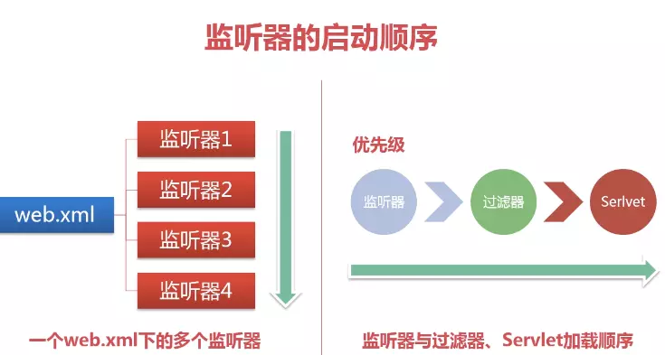

---

title: web三大组件-listener

date: 2018-09-06 17:42:00

categories: [web,web三大组件]

tags: [web,listener]

---

JavaWeb中的监听器是Servlet规范中定义的一种特殊类，它用于监听web应用程序中的ServletContext、HttpSession和 ServletRequest这三大域对象的创建、销毁事件以及监听这些域对象中的属性发生修改的事件。

<!--more-->

## 概述

JavaWeb中的监听器 主要有8个.
从域对象方面又分为3类: 

- ServletContext
- HttpSession
- ServletRequest

事件区分:

- 生命周期监听: 对象的创建和销毁事件
- 属性监听: 对象的属性添加和删除事件
- 感知监听: 监听绑定到HttpSession域中的某个对象的状态

## 启动顺序



## 生命周期监听

### ServletContext 
当Servlet 容器启动或终止Web 应用时，会触发ServletContextEvent 事件，该事件由ServletContextListener 来处理。

```java
@WebListener
public class AListener implements ServletContextListener{    
    //在项目启动时调用    
    public void contextInitialized(ServletContextEvent sce) {   
    }    
    //在项目关闭时调用    
    public void contextDestroyed(ServletContextEvent sce) {      
    }
}
```

ServletContextListener用处:

1. 当使用quartz时，将原先未完成的或者缺失的 job 添加进 quartz中。
2. 其他需要在tomcat启动时处理的逻辑

### HttpSession 

HttpSessionListener是对Session的监听，在Session生成或销毁后被调用。

```java
@WebListener
public class AListener implements HttpSessionListener{  
    //当浏览器第一次访问应用时      
    public void sessionCreated(HttpSessionEvent sce) {      
    }   
     //1. 手动注销session.invalidate() 
     //2. 会话超时，自动注销
     public void sessionDestroyed(HttpSessionEvent sce) {      
    }
}
```

用处: 

1. 记录用户在线人数 等
2. 记录访问日志

### ServletRequestListener

ServletRequestListener 接口用于监听Web应用程序中ServletRequest对象的创建和销毁。

```java
@WebListener()
public class testListener implements ServletRequestListener{
       //request创建时(发送请求)调用
       @Override
       public void requestInitialized(ServletRequestEvent servletRequestEvent){
            System.out.println("requestCreated");
       }

        //request处理完毕销毁时调用
        @Override
        public void requestDestroyed(ServletRequestEvent servletRequestEvent){ 
            System.out.println("requestDestroyed");
       }
}
```

用途: 

统计 web 访问量指标

## 属性监听

### ServletContextAttributeListener

```java
@WebListener()
public class testListener implements ServletContextAttributeListener{
       //添加属性
       @Override
       public void attributeAdded(ServletContextAttributeEvent e){
            System.out.println("attributeAdded"+e.getName());
       }

       //删除属性
       @Override
       public void attributeRemoved(ServletContextAttributeEvent e){
            System.out.println("attributeRemoved"+e.getName());
       }

       //修改属性
       @Override
       public void attributeReplaced(ServletContextAttributeEvent e){ 
            System.out.println("attributeReplaced"+e.getName());
       }
}
```

### HttpSessionAttributeListener

```java
@WebListener()
public class testListener implements HttpSessionAttributeListener{
       //session.setAttribute()
       @Override
       public void attributeAdded(HttpSessionBindingEvent e){
            System.out.println("attributeAdded"+e.getName());
       }

       //session.removeAttribute()
       @Override
       public void attributeRemoved(HttpSessionBindingEvent e){
            System.out.println("attributeRemoved"+e.getName());
       }

       //session.replaceAttribute()
       @Override
       public void attributeReplaced(HttpSessionBindingEvent e){ 
            System.out.println("attributeReplaced"+e.getName());
       }
}
```
### ServletRequestAttributeListener

```java
@WebListener()
public class testListener implements ServletRequestAttributeListener{
        //request.setAttribute()
       @Override
       public void attributeAdded(HttpSessionBindingEvent e){
            System.out.println("attributeAdded"+e.getName());
       }

        //request.removeAttribute();
        @Override
        public void attributeRemoved(HttpSessionBindingEvent e){
            System.out.println("attributeRemoved"+e.getName());
       }

        //对已经存在于request中的属性再次调用request.setAttribute("user", "bbb")
        //如request.setAttribute("user", "aaa");request.setAttribute("user", "bbb");
        @Override
        public void attributeReplaced(HttpSessionBindingEvent e){ 
            System.out.println("attributeReplaced"+e.getName());
       }
}
```
## 感知监听

HttpSession中的对象状态：①钝化→活化 ②绑定→解除绑定  

### 钝化与活化

- 钝化：将session对象持久化到存储设备上；
- 活化：将session从存储设备上恢复

Session正常是放到服务器内存当中的，服务器会对每一个在线用户创建一个Session对象，如果当前用户很多，Session内存的开销是非常大的，影响性能。而Session的钝化机制可以解决这个问题。

钝化的本质就是把一部分比较长时间没有变动的Session暂时序列化到系统文件或者数据库系统当中，等该Session的用户重新使用的时候，服务器在内存中找不到Session，就会到磁盘中去找，然后把Session反序列化到内存中。整个过程由服务器自动完成。

注意，Session只有可以被序列化才能被钝化。Session序列化时，服务器会把Session保存到硬盘中,以sessionID命名，以“.session”作为扩展名。
  Session钝化机制由SessionManager管理，Tomcat有两种Session管理器：

#### StandardManager(标准会话管理器)

> <Manager className="org.apache.catalina.session.StandardManager" 
     maxInactiveInterval="7200"/>
     
Tomcat6的默认会话管理器，用于非集群环境中对单个处于运行状态的Tomcat实例会话进行管理。
当运行Tomcat时，StandardManager实例负责在内存中管理Session；但当服务器关闭时，会将当前内存中的Session写入到磁盘上的一个名叫SESSION.ser的文件，等服务器再次启动时，会重新载入这些Session。
另一种情况是Web应用程序被重新加载时，内存中的Session对象也会被钝化到服务器的文件系统中。
钝化后的文件默认被保存在Tomcat的安装路径$CATALINA_HOME/work/Catalina/<hostname>/<webapp-name>/下的SESSIONS.ser文件中。

#### PersistentManager(持久会话管理器)

PersistentManager和StandardManager的区别在于PersistentManager自己实现了Store类，使Session可以被保存到不同地方(Database,Redis等)，而不局限于只保存在SESSION.ser文件中。Store表示了管理session对的二级存储设备。

```xml
<Manager className="org.apache.catalina.session.PersistentManager" debug="0" saveOnRestart="true" maxActiveSession="-1" minIdleSwap="0" 
maxIdleSwap="0" maxIdleBackup="-1" >
         <!--保存在Reids中-->
         <Store className="com.cdai.test.RedisStore" host="192.168.1.1" port="6379"/>
</Manager>
```

**Manager 标签属性**

    <!--当Tomcat正常停止及重启动时，是否要储存及重载会话。-->
    saveOnRestart="true"
    <!--可容许现行最大会话的最大数，-1代表无限制-->
    maxActiveSession="-1"
    <!--在调换会话至磁盘之前，此会话必须闲置的最小时间-->
    minIdleSwap="0"
    <!--在文件交换之前，此会话可以闲置的最大时间(以秒为单位)。-1表示会话不应该被强迫调换至文件。-->
    maxIdleSwap="0"
    <!--在备份之前，此会话必须闲置的最大时间。-1表示不进行备份-->
    maxIdleBackup="-1" 


PersistentManager支持两种钝化驱动类：org.apache.Catalina.FileStore和org.apache.Catalina.JDBCStore，分别支持将会话保存至文件存储(FileStore)或JDBC存储(JDBCStore)中。

```xml
<!--保存到文件中-->
<Manager className="org.apache.catalina.session.PersistentManager" 
 saveOnRestart="true"> 
<!--每个用户的会话会被保存至directory指定的目录中的文件中-->
 <Store className="org.apache.catalina.session.FileStore" 
         directory="/data/tomcat-sessions"/> 
</Manager>
```

```xml
<!--保存到JDBCStore中-->
<Manager className="org.apache.catalina.session.PersistentManager" 
 saveOnRestart="true"> 
 <Store className="org.apache.catalina.session.JDBCStore" 
         driverName="com.mysql.jdbc.Driver" 
         connectionURL="jdbc:mysql://localhost:3306/mydb?user=root;password=123"/> 
</Manager>
```

在持久化管理器中，session可以被备份或换出到存储器中。

- 换出：当内存中有过多的session对象时，持久化管理器会直接将session对象换出，直到当前活动对象等于maxActiveSession指定的值。
- 备份：不是所有的session都会备份，PersistentManager只会将那些空闲时间超过maxIdleBackup的session备份到文件或数据库中。该任务由processMaxIdleBackups方法完成。

此时Tomcat只是在下面三种情况会将Session通过Store保存起来。

- 当Session的空闲时间超过minIdleSwap和maxIdleSwap时，会将Session换出
- 当Session的空闲时间超过maxIdleBackup时，会将Session备份出去
- 当Session总数大于maxActiveSession时，会将超出部分的空闲Session换出

### HttpSessionBindingListener 和 HttpSessionActivationListener

保存在Session域中的对象可以有多种状态：
- 绑定(session.setAttribute(“bean”,Object))到Session中, 随Session对象持久化到一个存储设备中
- 从Session域中解除(session.removeAttribute(“bean”))绑定, 随Session对象从一个存储设备中恢复

servlet规范中提供的两种接口用以监听session内的对象：

```
HttpSessionBindingListener                 HttpSessionActivationListener
          |                                             |
         / \                                           / \
valueBound  valueUnBound            sessionWillPassivate sessionDidActivate
  (绑定)     (解除绑定)                    (钝化)             (活化)
```

**以上接口皆不需要在web容器中注册。**

#### 绑定和解绑接口
实现了HttpSessionBindingListener接口的JavaBean对象可以感知自己被绑定到Session中和 Session中删除的事件。

```java

public class User implements HttpSessionBindingListener{
       private String userName;
       private String password;

       //对象被放进session时触发，如session.setAttribute("user",user);
       @Override
       public void valueBound(HttpSessionBindingEvent e){ 
          //getName()方法可以取得属性设定或移除时指定的名称
          System.out.println(this + "被绑定到session \"" + e.getSession.getId() + "\"的" +e.getName()+ "属性上");
       }

        //从session移除后触发，session.removeAttribute()等
        @Override
        public void valueUnBound(HttpSessionBindingEvent e){ 
          System.out.println(this + "被从session \"" + e.getSession.getId() + "\"的" +e.getName()+ "属性上移除");       
       }

       //此处省略getter和setter
}
```

valueUnbound方法将被以下任一条件触发：

a. 执行session.setAttribute("uocl", 非uocl对象) 时。
b. 执行session.removeAttribute("uocl") 时。
c. 执行session.invalidate()时。
d. session超时后。

#### 钝化和活化接口
实现了HttpSessionActivationListener接口的JavaBean对象可以感知自己被活化(反序列化)和钝化(序列化)的事件。

当绑定到HttpSession对象中的javabean对象将要随HttpSession对象被钝化(序列化)之前，web服务器调用该javabean对象的 sessionWillPassivate(HttpSessionEvent event) 方法。这样javabean对象就可以知道自己将要和HttpSession对象一起被序列化(钝化)到硬盘中。
当绑定到HttpSession对象中的javabean对象将要随HttpSession对象被活化(反序列化)之后，web服务器调用该javabean对象的 sessionDidActive(HttpSessionEvent event)方法。这样javabean对象就可以知道自己将要和 HttpSession对象一起被反序列化(活化)回到内存中。

需要注意的是: javabean随着HttpSession对象一起被活化的前提 **该javabean对象除了实现该接口外还应该实现Serialize接口**

```java

//要注意只有实现Serializable接口才能被钝化
public class User implements HttpSessionActivationListener, Serializable{
       private String userName;
       private String password;

       //被钝化时调用
       @Override
       public void sessionWillPassivate(HttpSessionEvent e){
          System.out.println(this + "即将保存到硬盘。sessionId: " + e.getSession.getId());       
       }

        //被活化时调用
        @Override
       public void sessionDidActivate(HttpSessionEvent e){ 
          System.out.println(this + "已经成功从硬盘中加载。sessionId: " + e.getSession.getId());      
       }

       //此处省略getter和setter
}
```

测试的时候先把Tomcat关掉，就会发现控制台输出了

> sessionWillPassivate org.apache.catalina.session.StandardSessionFacade@4f2d26d2

也就是session已经被钝化了，此时在Tomcat安装路径下会发现SESSION.er文件。然后我们再来重启Tomcat，发现控制台输出：

> sessionDidActivate org.apache.catalina.session.StandardSessionFacade@4f2d26d2

此时会发现在Tomcat安装路径下的SESSION.er文件消失了，也就说明session已经被活化了。

同样的，如果我们设定了maxIdleeSwap="1"，当用户开着浏览器一分钟不操作页面的话服务器就会将session钝化，将session生成文件放在tomcat工作目录下，直到再次访问才会被激活。


## 来源
https://www.jianshu.com/p/b85c535dc5fd
https://www.jianshu.com/p/931d9dc34fa0