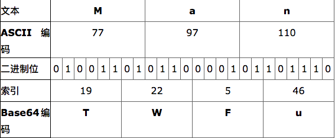
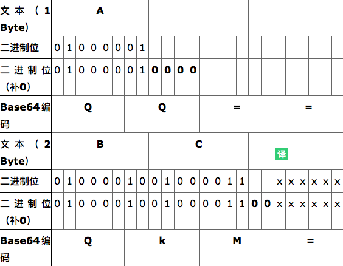

---

title: base64

date: 2018-11-14 10:34:00

categories: [加解密]

tags: [加解密]

---

Base64编码，是我们程序开发中经常使用到的编码方法。它是一种基于用64个可打印字符来表示二进制数据的表示方法。它通常用作存储、传输一些二进制数据编码方法！也是MIME（多用途互联网邮件扩展，主要用作电子邮件标准）中一种可打印字符表示二进制数据的常见编码方法！它其实只是定义用可打印字符传输内容一种方法，并不会产生新的字符集！有时候，我们学习转换的思路后，我们其实也可以结合自己的实际需要，构造一些自己接口定义编码方式。好了，我们一起看看，它的转换思路吧！

<!--more-->

## Base64实现转换原理

它是用 64个可打印字符 表示 二进制所有数据方法。
由于2的6次方等于64，所以可以用每6个位元为一个单元，对应某个可打印字符。
我们知道三个字节有24个位元，就可以刚好对应于4个Base64单元，即3个字节需要用4个Base64的可打印字符来表示。
在Base64中的可打印字符包括字母A-Z、a-z、数字0-9 ，这样共有62个字符，此外两个可打印符号在不同的系统中一般有所不同。
但是，我们经常所说的Base64另外2个字符是：“+/”。

这64个字符，所对应表如下:

| 编号 | 字符  | 编号 | 字符 | 编号 | 字符|编号 | 字符 |
|------|------|----|------|------|---|------|------|
| 0    | A    | 16 | Q    | 32   | g | 48   | w    |
| 1    | B    | 17 | R    | 33   | h | 49   | x    |
| 2    | C    | 18 | S    | 34   | i | 50   | y    |
| 3    | D    | 19 | T    | 35   | j | 51   | z    |
| 4    | E    | 20 | U    | 36   | k | 52   | 0    |
| 5    | F    | 21 | V    | 37   | l | 53   | 1    |
| 6    | G    | 22 | W    | 38   | m | 54   | 2    |
| 7    | H    | 23 | X    | 39   | n | 55   | 3    |
| 8    | I    | 24 | Y    | 40   | o | 56   | 4    |
| 9    | J    | 25 | Z    | 41   | p | 57   | 5    |
| 10   | K    | 26 | a    | 42   | q | 58   | 6    |
| 11   | L    | 27 | b    | 43   | r | 59   | 7    |
| 12   | M    | 28 | c    | 44   | s | 60   | 8    |
| 13   | N    | 29 | d    | 45   | t | 61   | 9    |
| 14   | O    | 30 | e    | 46   | u | 62   | +    |
| 15   | P    | 31 | f    | 47   | v | 63   | /    |

转换的时候，将三个byte的数据，先后放入一个24bit的缓冲区中，先来的byte占高位。数据不足3byte的话，于缓冲区中剩下的bit用0补足。
然后，每次取出6个bit，按照其值选择上面表格中的字符作为编码后的输出。不断进行，直到全部输入数据转换完成。

如果最后剩下两个输入数据，在编码结果后加1个“=”；如果最后剩下一个输入数据，编码结果后加2个“=”；如果没有剩下任何数据，就什么都不要加，这样才可以保证资料还原的正确性。

编码后的数据比原始数据略长，为原来的4/3。无论什么样的字符都会全部被编码，因此不像Quoted-printable 编码，还保留部分可打印字符。所以，它的可读性不如Quoted-printable 编码！

M的Ascii码是77,前六位对应值为19，对应base64字符是T，如此类推。其它字符编码就可以自动转换得到！我们看看另外不是刚好是3个字节的情况！

## 来源

[Base64 编码介绍、Base64编码转换原理、算法](http://blog.chacuo.net/719.html)